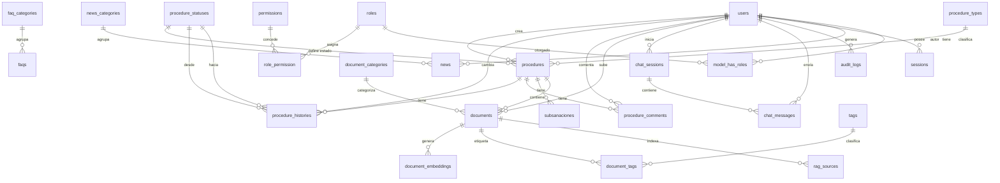

# 06 — Modelo Entidad-Relación (MySQL)

## Diagrama ER General



---

## Tablas del Sistema

### 1. users

| Columna | Tipo | Nulo | Default | Descripción |
|---------|------|------|---------|-------------|
| `id` | `BIGINT UNSIGNED AUTO_INCREMENT` | No | — | Clave primaria |
| `dni` | `CHAR(8)` | No | — | DNI peruano (único) |
| `email` | `VARCHAR(255)` | No | — | Correo electrónico (único) |
| `phone` | `VARCHAR(20)` | Sí | `NULL` | Teléfono celular |
| `full_name` | `VARCHAR(255)` | No | — | Nombre completo |
| `password` | `VARCHAR(255)` | No | — | Hash bcrypt |
| `role` | `VARCHAR(50)` | No | `'ASEG'` | Rol principal heredado (backward compat) |
| `is_active` | `TINYINT(1)` | No | `1` | Cuenta activa/inactiva |
| `failed_login_attempts` | `SMALLINT UNSIGNED` | No | `0` | Intentos fallidos consecutivos |
| `locked_until` | `TIMESTAMP` | Sí | `NULL` | Fecha/hora de desbloqueo |
| `last_login_at` | `TIMESTAMP` | Sí | `NULL` | Último inicio de sesión exitoso |
| `last_login_ip` | `VARCHAR(45)` | Sí | `NULL` | IP del último login |
| `email_verified_at` | `TIMESTAMP` | Sí | `NULL` | Verificación de email |
| `password_changed_at` | `TIMESTAMP` | Sí | `NULL` | Último cambio de contraseña |
| `created_at` | `TIMESTAMP` | No | `CURRENT_TIMESTAMP` | Fecha de creación |
| `updated_at` | `TIMESTAMP` | No | `CURRENT_TIMESTAMP` | Fecha de actualización |
| `deleted_at` | `TIMESTAMP` | Sí | `NULL` | Soft delete |

**Índices:**
- `PRIMARY KEY (id)`
- `UNIQUE INDEX uq_users_dni (dni)`
- `UNIQUE INDEX uq_users_email (email)`
- `INDEX idx_users_role (role)`
- `INDEX idx_users_is_active (is_active)`
- `INDEX idx_users_locked_until (locked_until)`
- `INDEX idx_users_created_at (created_at)`
- `FULLTEXT INDEX ft_users_name (full_name)`

---

### 2. sessions (personal_access_tokens de Sanctum)

| Columna | Tipo | Nulo | Default | Descripción |
|---------|------|------|---------|-------------|
| `id` | `BIGINT UNSIGNED AUTO_INCREMENT` | No | — | Clave primaria |
| `tokenable_type` | `VARCHAR(255)` | No | — | Tipo de modelo (App\Models\User) |
| `tokenable_id` | `BIGINT UNSIGNED` | No | — | ID del usuario |
| `name` | `VARCHAR(255)` | No | — | Nombre del token |
| `token` | `VARCHAR(64)` | No | — | Hash SHA-256 del token |
| `abilities` | `TEXT` | Sí | `NULL` | Habilidades del token (JSON) |
| `last_used_at` | `TIMESTAMP` | Sí | `NULL` | Último uso del token |
| `expires_at` | `TIMESTAMP` | Sí | `NULL` | Expiración del token |
| `created_at` | `TIMESTAMP` | No | `CURRENT_TIMESTAMP` | — |
| `updated_at` | `TIMESTAMP` | No | `CURRENT_TIMESTAMP` | — |

**Índices:**
- `PRIMARY KEY (id)`
- `UNIQUE INDEX uq_sessions_token (token)`
- `INDEX idx_sessions_tokenable (tokenable_type, tokenable_id)`
- `INDEX idx_sessions_last_used (last_used_at)`

---

### 3. procedures

| Columna | Tipo | Nulo | Default | Descripción |
|---------|------|------|---------|-------------|
| `id` | `BIGINT UNSIGNED AUTO_INCREMENT` | No | — | Clave primaria |
| `user_id` | `BIGINT UNSIGNED` | No | — | FK → users.id (asegurado creador) |
| `procedure_type_id` | `BIGINT UNSIGNED` | No | — | FK → procedure_types.id |
| `procedure_status_id` | `BIGINT UNSIGNED` | No | — | FK → procedure_statuses.id (estado actual) |
| `current_assignee_id` | `BIGINT UNSIGNED` | Sí | `NULL` | FK → users.id (operador asignado) |
| `data` | `JSON` | No | — | Datos dinámicos del trámite |
| `idempotency_key` | `CHAR(36)` | No | — | UUID v4 para prevenir duplicados |
| `submitted_at` | `TIMESTAMP` | Sí | `NULL` | Fecha de envío |
| `completed_at` | `TIMESTAMP` | Sí | `NULL` | Fecha de resolución final |
| `created_at` | `TIMESTAMP` | No | `CURRENT_TIMESTAMP` | — |
| `updated_at` | `TIMESTAMP` | No | `CURRENT_TIMESTAMP` | — |
| `deleted_at` | `TIMESTAMP` | Sí | `NULL` | Soft delete |

**Índices:**
- `PRIMARY KEY (id)`
- `UNIQUE INDEX uq_procedures_idempotency_key (idempotency_key)`
- `INDEX idx_procedures_user_id (user_id)`
- `INDEX idx_procedures_type (procedure_type_id)`
- `INDEX idx_procedures_status (procedure_status_id)`
- `INDEX idx_procedures_assignee (current_assignee_id)`
- `INDEX idx_procedures_user_status (user_id, procedure_status_id)`
- `INDEX idx_procedures_submitted_at (submitted_at)`
- `INDEX idx_procedures_completed_at (completed_at)`

**Llaves foráneas:**
```sql
FOREIGN KEY (user_id)              REFERENCES users(id)             ON DELETE RESTRICT
FOREIGN KEY (procedure_type_id)    REFERENCES procedure_types(id)   ON DELETE RESTRICT
FOREIGN KEY (procedure_status_id)  REFERENCES procedure_statuses(id) ON DELETE RESTRICT
FOREIGN KEY (current_assignee_id)  REFERENCES users(id)             ON DELETE SET NULL
```

---

### 4. procedure_types

| Columna | Tipo | Nulo | Default | Descripción |
|---------|------|------|---------|-------------|
| `id` | `BIGINT UNSIGNED AUTO_INCREMENT` | No | — | Clave primaria |
| `code` | `VARCHAR(20)` | No | — | Código único (AFILIACION, SUBSIDIO, etc.) |
| `name` | `VARCHAR(255)` | No | — | Nombre descriptivo |
| `description` | `TEXT` | Sí | `NULL` | Descripción detallada |
| `requirements` | `JSON` | No | — | Requisitos documentarios requeridos |
| `max_days_resolution` | `SMALLINT UNSIGNED` | No | `30` | Días máximo para resolver |
| `is_active` | `TINYINT(1)` | No | `1` | Tipo activo/inactivo |
| `created_at` | `TIMESTAMP` | No | `CURRENT_TIMESTAMP` | — |
| `updated_at` | `TIMESTAMP` | No | `CURRENT_TIMESTAMP` | — |

**Índices:**
- `PRIMARY KEY (id)`
- `UNIQUE INDEX uq_procedure_types_code (code)`
- `INDEX idx_procedure_types_active (is_active)`

---

### 5. procedure_statuses

| Columna | Tipo | Nulo | Default | Descripción |
|---------|------|------|---------|-------------|
| `id` | `BIGINT UNSIGNED AUTO_INCREMENT` | No | — | Clave primaria |
| `code` | `VARCHAR(30)` | No | — | Código único (BORRADOR, PENDIENTE, etc.) |
| `name` | `VARCHAR(100)` | No | — | Nombre legible |
| `description` | `TEXT` | Sí | `NULL` | Descripción del estado |
| `is_terminal` | `TINYINT(1)` | No | `0` | ¿Es estado final? |
| `created_at` | `TIMESTAMP` | No | `CURRENT_TIMESTAMP` | — |
| `updated_at` | `TIMESTAMP` | No | `CURRENT_TIMESTAMP` | — |

**Índices:**
- `PRIMARY KEY (id)`
- `UNIQUE INDEX uq_procedure_statuses_code (code)`
- `INDEX idx_procedure_statuses_terminal (is_terminal)`

**Datos semilla (`procedure_statuses`):**
| code | name | is_terminal |
|------|------|-------------|
| `BORRADOR` | Borrador | 0 |
| `PENDIENTE` | Pendiente | 0 |
| `EN_REVISION` | En Revisión | 0 |
| `SUBSANACION` | Subsanación | 0 |
| `APROBADO` | Aprobado | 1 |
| `RECHAZADO` | Rechazado | 1 |
| `CANCELADO` | Cancelado | 1 |

---

### 6. procedure_histories

| Columna | Tipo | Nulo | Default | Descripción |
|---------|------|------|---------|-------------|
| `id` | `BIGINT UNSIGNED AUTO_INCREMENT` | No | — | Clave primaria |
| `procedure_id` | `BIGINT UNSIGNED` | No | — | FK → procedures.id |
| `from_status_id` | `BIGINT UNSIGNED` | Sí | `NULL` | FK → procedure_statuses.id (estado anterior) |
| `to_status_id` | `BIGINT UNSIGNED` | No | — | FK → procedure_statuses.id (nuevo estado) |
| `changed_by` | `BIGINT UNSIGNED` | No | — | FK → users.id (quién realizó el cambio) |
| `comment` | `TEXT` | Sí | `NULL` | Comentario del cambio |
| `created_at` | `TIMESTAMP` | No | `CURRENT_TIMESTAMP` | — |

**Índices:**
- `PRIMARY KEY (id)`
- `INDEX idx_history_procedure (procedure_id)`
- `INDEX idx_history_from_status (from_status_id)`
- `INDEX idx_history_to_status (to_status_id)`
- `INDEX idx_history_changed_by (changed_by)`
- `INDEX idx_history_created (procedure_id, created_at)`

**Llaves foráneas:**
```sql
FOREIGN KEY (procedure_id)    REFERENCES procedures(id)         ON DELETE CASCADE
FOREIGN KEY (from_status_id)  REFERENCES procedure_statuses(id) ON DELETE RESTRICT
FOREIGN KEY (to_status_id)    REFERENCES procedure_statuses(id) ON DELETE RESTRICT
FOREIGN KEY (changed_by)      REFERENCES users(id)              ON DELETE RESTRICT
```

---

### 7. procedure_comments

| Columna | Tipo | Nulo | Default | Descripción |
|---------|------|------|---------|-------------|
| `id` | `BIGINT UNSIGNED AUTO_INCREMENT` | No | — | Clave primaria |
| `procedure_id` | `BIGINT UNSIGNED` | No | — | FK → procedures.id |
| `user_id` | `BIGINT UNSIGNED` | No | — | FK → users.id |
| `comment` | `TEXT` | No | — | Contenido del comentario |
| `is_internal` | `TINYINT(1)` | No | `0` | Solo visible para operadores/supervisores |
| `created_at` | `TIMESTAMP` | No | `CURRENT_TIMESTAMP` | — |
| `updated_at` | `TIMESTAMP` | No | `CURRENT_TIMESTAMP` | — |

**Índices:**
- `PRIMARY KEY (id)`
- `INDEX idx_comments_procedure (procedure_id, created_at)`
- `INDEX idx_comments_user (user_id)`

**Llaves foráneas:**
```sql
FOREIGN KEY (procedure_id) REFERENCES procedures(id) ON DELETE CASCADE
FOREIGN KEY (user_id)      REFERENCES users(id)      ON DELETE RESTRICT
```

---

### 8. subsanaciones

| Columna | Tipo | Nulo | Default | Descripción |
|---------|------|------|---------|-------------|
| `id` | `BIGINT UNSIGNED AUTO_INCREMENT` | No | — | Clave primaria |
| `procedure_id` | `BIGINT UNSIGNED` | No | — | FK → procedures.id |
| `attempt_number` | `TINYINT UNSIGNED` | No | — | Número de intento (1-3) |
| `requested_by` | `BIGINT UNSIGNED` | No | — | FK → users.id (operador que solicita) |
| `requested_comment` | `TEXT` | No | — | Motivo de subsanación |
| `responded_at` | `TIMESTAMP` | Sí | `NULL` | Fecha de respuesta del asegurado |
| `response_comment` | `TEXT` | Sí | `NULL` | Respuesta del asegurado |
| `deadline` | `TIMESTAMP` | No | — | Fecha límite (15 días desde solicitud) |
| `is_fulfilled` | `TINYINT(1)` | Sí | `NULL` | ¿Subsanó correctamente? |
| `created_at` | `TIMESTAMP` | No | `CURRENT_TIMESTAMP` | — |
| `updated_at` | `TIMESTAMP` | No | `CURRENT_TIMESTAMP` | — |

**Índices:**
- `PRIMARY KEY (id)`
- `INDEX idx_subsanaciones_procedure (procedure_id, attempt_number)`
- `INDEX idx_subsanaciones_deadline (deadline)`
- `INDEX idx_subsanaciones_fulfilled (is_fulfilled)`

**Llaves foráneas:**
```sql
FOREIGN KEY (procedure_id) REFERENCES procedures(id) ON DELETE CASCADE
FOREIGN KEY (requested_by)  REFERENCES users(id)      ON DELETE RESTRICT
```

---

### 9. documents

| Columna | Tipo | Nulo | Default | Descripción |
|---------|------|------|---------|-------------|
| `id` | `BIGINT UNSIGNED AUTO_INCREMENT` | No | — | Clave primaria |
| `user_id` | `BIGINT UNSIGNED` | No | — | FK → users.id (quién subió) |
| `procedure_id` | `BIGINT UNSIGNED` | Sí | `NULL` | FK → procedures.id (trámite asociado) |
| `category_id` | `BIGINT UNSIGNED` | No | — | FK → document_categories.id |
| `original_name` | `VARCHAR(255)` | No | — | Nombre original del archivo |
| `stored_path` | `VARCHAR(500)` | No | — | Ruta en disco local |
| `mime_type` | `VARCHAR(100)` | No | — | MIME type |
| `file_size` | `INT UNSIGNED` | No | — | Tamaño en bytes |
| `version` | `SMALLINT UNSIGNED` | No | `1` | Número de versión |
| `ocr_text` | `LONGTEXT` | Sí | `NULL` | Texto extraído por OCR |
| `is_validated` | `TINYINT(1)` | No | `0` | Validado por GESDOC |
| `validated_by` | `BIGINT UNSIGNED` | Sí | `NULL` | FK → users.id |
| `validated_at` | `TIMESTAMP` | Sí | `NULL` | Fecha de validación |
| `minio_path` | `VARCHAR(500)` | Sí | `NULL` | Ruta en MinIO (S3) |
| `created_at` | `TIMESTAMP` | No | `CURRENT_TIMESTAMP` | — |
| `updated_at` | `TIMESTAMP` | No | `CURRENT_TIMESTAMP` | — |
| `deleted_at` | `TIMESTAMP` | Sí | `NULL` | Soft delete |

**Índices:**
- `PRIMARY KEY (id)`
- `INDEX idx_documents_user (user_id)`
- `INDEX idx_documents_procedure (procedure_id)`
- `INDEX idx_documents_category (category_id)`
- `INDEX idx_documents_validated (is_validated)`
- `FULLTEXT INDEX ft_documents_ocr (ocr_text)`
- `FULLTEXT INDEX ft_documents_name (original_name)`
- `INDEX idx_documents_created (created_at)`

**Llaves foráneas:**
```sql
FOREIGN KEY (user_id)       REFERENCES users(id)              ON DELETE RESTRICT
FOREIGN KEY (procedure_id)  REFERENCES procedures(id)         ON DELETE SET NULL
FOREIGN KEY (category_id)   REFERENCES document_categories(id) ON DELETE RESTRICT
FOREIGN KEY (validated_by)  REFERENCES users(id)              ON DELETE SET NULL
```

---

### 10. document_categories

| Columna | Tipo | Nulo | Default | Descripción |
|---------|------|------|---------|-------------|
| `id` | `BIGINT UNSIGNED AUTO_INCREMENT` | No | — | Clave primaria |
| `code` | `VARCHAR(30)` | No | — | Código único (DNI, RECIBO, etc.) |
| `name` | `VARCHAR(150)` | No | — | Nombre de la categoría |
| `description` | `TEXT` | Sí | `NULL` | Descripción |
| `is_active` | `TINYINT(1)` | No | `1` | Activo |
| `created_at` | `TIMESTAMP` | No | `CURRENT_TIMESTAMP` | — |
| `updated_at` | `TIMESTAMP` | No | `CURRENT_TIMESTAMP` | — |

**Índices:**
- `PRIMARY KEY (id)`
- `UNIQUE INDEX uq_doc_categories_code (code)`

---

### 11. document_embeddings

| Columna | Tipo | Nulo | Default | Descripción |
|---------|------|------|---------|-------------|
| `id` | `BIGINT UNSIGNED AUTO_INCREMENT` | No | — | Clave primaria |
| `document_id` | `BIGINT UNSIGNED` | No | — | FK → documents.id |
| `chunk_index` | `SMALLINT UNSIGNED` | No | — | Índice del chunk (0, 1, 2...) |
| `content` | `TEXT` | No | — | Texto del chunk |
| `embedding` | `JSON` | Sí | `NULL` | Vector de embedding (1536 dimensiones) |
| `qdrant_point_id` | `CHAR(36)` | Sí | `NULL` | ID del punto en Qdrant |
| `created_at` | `TIMESTAMP` | No | `CURRENT_TIMESTAMP` | — |
| `updated_at` | `TIMESTAMP` | No | `CURRENT_TIMESTAMP` | — |

**Índices:**
- `PRIMARY KEY (id)`
- `INDEX idx_embeddings_document (document_id, chunk_index)`
- `UNIQUE INDEX uq_embeddings_qdrant (qdrant_point_id)`

**Llave foránea:**
```sql
FOREIGN KEY (document_id) REFERENCES documents(id) ON DELETE CASCADE
```

---

### 12. tags

| Columna | Tipo | Nulo | Default | Descripción |
|---------|------|------|---------|-------------|
| `id` | `BIGINT UNSIGNED AUTO_INCREMENT` | No | — | Clave primaria |
| `name` | `VARCHAR(100)` | No | — | Nombre de la etiqueta |
| `slug` | `VARCHAR(100)` | No | — | Slug único |

**Índices:**
- `PRIMARY KEY (id)`
- `UNIQUE INDEX uq_tags_slug (slug)`

---

### 13. document_tags (pivot)

| Columna | Tipo | Nulo | Default | Descripción |
|---------|------|------|---------|-------------|
| `document_id` | `BIGINT UNSIGNED` | No | — | FK → documents.id |
| `tag_id` | `BIGINT UNSIGNED` | No | — | FK → tags.id |

**Índices:**
- `PRIMARY KEY (document_id, tag_id)`
- `INDEX idx_doc_tags_tag (tag_id)`

**Llaves foráneas:**
```sql
FOREIGN KEY (document_id) REFERENCES documents(id) ON DELETE CASCADE
FOREIGN KEY (tag_id)      REFERENCES tags(id)      ON DELETE CASCADE
```

---

### 14. chat_sessions

| Columna | Tipo | Nulo | Default | Descripción |
|---------|------|------|---------|-------------|
| `id` | `BIGINT UNSIGNED AUTO_INCREMENT` | No | — | Clave primaria |
| `user_id` | `BIGINT UNSIGNED` | No | — | FK → users.id |
| `title` | `VARCHAR(255)` | No | — | Título generado automáticamente |
| `is_active` | `TINYINT(1)` | No | `1` | Sesión activa |
| `message_count` | `SMALLINT UNSIGNED` | No | `0` | Contador de mensajes |
| `created_at` | `TIMESTAMP` | No | `CURRENT_TIMESTAMP` | — |
| `updated_at` | `TIMESTAMP` | No | `CURRENT_TIMESTAMP` | — |

**Índices:**
- `PRIMARY KEY (id)`
- `INDEX idx_chat_sessions_user (user_id, is_active)`
- `INDEX idx_chat_sessions_updated (updated_at)`

**Llave foránea:**
```sql
FOREIGN KEY (user_id) REFERENCES users(id) ON DELETE CASCADE
```

---

### 15. chat_messages

| Columna | Tipo | Nulo | Default | Descripción |
|---------|------|------|---------|-------------|
| `id` | `BIGINT UNSIGNED AUTO_INCREMENT` | No | — | Clave primaria |
| `session_id` | `BIGINT UNSIGNED` | No | — | FK → chat_sessions.id |
| `role` | `ENUM('user','assistant','system')` | No | — | Rol del emisor |
| `content` | `TEXT` | No | — | Contenido del mensaje |
| `message_type` | `ENUM('text','faq_response','rag_response','gpt_response','escalation')` | No | `'text'` | Tipo de respuesta |
| `sources` | `JSON` | Sí | `NULL` | Fuentes utilizadas (RAG chunks) |
| `confidence` | `DECIMAL(5,4)` | Sí | `NULL` | Nivel de confianza (0.0000-1.0000) |
| `latency_ms` | `SMALLINT UNSIGNED` | Sí | `NULL` | Latencia en milisegundos |
| `feedback_helpful` | `TINYINT(1)` | Sí | `NULL` | Feedback: ¿fue útil? |
| `feedback_comment` | `TEXT` | Sí | `NULL` | Comentario de feedback |
| `created_at` | `TIMESTAMP` | No | `CURRENT_TIMESTAMP` | — |

**Índices:**
- `PRIMARY KEY (id)`
- `INDEX idx_chat_messages_session (session_id, created_at)`
- `INDEX idx_chat_messages_role (role)`
- `INDEX idx_chat_messages_type (message_type)`

**Llave foránea:**
```sql
FOREIGN KEY (session_id) REFERENCES chat_sessions(id) ON DELETE CASCADE
```

---

### 16. faq_categories

| Columna | Tipo | Nulo | Default | Descripción |
|---------|------|------|---------|-------------|
| `id` | `BIGINT UNSIGNED AUTO_INCREMENT` | No | — | Clave primaria |
| `name` | `VARCHAR(150)` | No | — | Nombre de la categoría |
| `description` | `TEXT` | Sí | `NULL` | Descripción |
| `icon` | `VARCHAR(50)` | Sí | `NULL` | Ícono Font Awesome |
| `sort_order` | `SMALLINT UNSIGNED` | No | `0` | Orden de visualización |
| `created_at` | `TIMESTAMP` | No | `CURRENT_TIMESTAMP` | — |
| `updated_at` | `TIMESTAMP` | No | `CURRENT_TIMESTAMP` | — |

**Índices:**
- `PRIMARY KEY (id)`
- `INDEX idx_faq_categories_sort (sort_order)`

---

### 17. faqs

| Columna | Tipo | Nulo | Default | Descripción |
|---------|------|------|---------|-------------|
| `id` | `BIGINT UNSIGNED AUTO_INCREMENT` | No | — | Clave primaria |
| `category_id` | `BIGINT UNSIGNED` | No | — | FK → faq_categories.id |
| `question` | `TEXT` | No | — | Pregunta |
| `answer` | `LONGTEXT` | No | — | Respuesta (HTML) |
| `keywords` | `JSON` | Sí | `NULL` | Palabras clave para búsqueda |
| `source_document` | `VARCHAR(500)` | Sí | `NULL` | Documento fuente de referencia |
| `is_active` | `TINYINT(1)` | No | `1` | Visible |
| `view_count` | `INT UNSIGNED` | No | `0` | Contador de vistas |
| `helpful_count` | `INT UNSIGNED` | No | `0` | Votos "útil" |
| `not_helpful_count` | `INT UNSIGNED` | No | `0` | Votos "no útil" |
| `created_at` | `TIMESTAMP` | No | `CURRENT_TIMESTAMP` | — |
| `updated_at` | `TIMESTAMP` | No | `CURRENT_TIMESTAMP` | — |

**Índices:**
- `PRIMARY KEY (id)`
- `INDEX idx_faqs_category (category_id, is_active)`
- `INDEX idx_faqs_views (view_count)`
- `FULLTEXT INDEX ft_faqs_question_answer (question, answer)`

**Llave foránea:**
```sql
FOREIGN KEY (category_id) REFERENCES faq_categories(id) ON DELETE RESTRICT
```

---

### 18. news

| Columna | Tipo | Nulo | Default | Descripción |
|---------|------|------|---------|-------------|
| `id` | `BIGINT UNSIGNED AUTO_INCREMENT` | No | — | Clave primaria |
| `title` | `VARCHAR(255)` | No | — | Título |
| `content` | `LONGTEXT` | No | — | Contenido (HTML) |
| `excerpt` | `TEXT` | Sí | `NULL` | Extracto/resumen |
| `image_url` | `VARCHAR(500)` | Sí | `NULL` | Imagen destacada |
| `category_id` | `BIGINT UNSIGNED` | No | — | FK → news_categories.id |
| `author_id` | `BIGINT UNSIGNED` | No | — | FK → users.id |
| `published_at` | `TIMESTAMP` | Sí | `NULL` | Fecha de publicación |
| `is_active` | `TINYINT(1)` | No | `1` | Visible |
| `created_at` | `TIMESTAMP` | No | `CURRENT_TIMESTAMP` | — |
| `updated_at` | `TIMESTAMP` | No | `CURRENT_TIMESTAMP` | — |

**Índices:**
- `PRIMARY KEY (id)`
- `INDEX idx_news_category (category_id)`
- `INDEX idx_news_author (author_id)`
- `INDEX idx_news_published (published_at, is_active)`
- `FULLTEXT INDEX ft_news_title_content (title, content)`

**Llaves foráneas:**
```sql
FOREIGN KEY (category_id) REFERENCES news_categories(id) ON DELETE RESTRICT
FOREIGN KEY (author_id)   REFERENCES users(id)            ON DELETE RESTRICT
```

---

### 19. news_categories

| Columna | Tipo | Nulo | Default | Descripción |
|---------|------|------|---------|-------------|
| `id` | `BIGINT UNSIGNED AUTO_INCREMENT` | No | — | Clave primaria |
| `name` | `VARCHAR(150)` | No | — | Nombre |
| `slug` | `VARCHAR(150)` | No | — | Slug único |
| `is_active` | `TINYINT(1)` | No | `1` | Activo |
| `created_at` | `TIMESTAMP` | No | `CURRENT_TIMESTAMP` | — |
| `updated_at` | `TIMESTAMP` | No | `CURRENT_TIMESTAMP` | — |

**Índices:**
- `PRIMARY KEY (id)`
- `UNIQUE INDEX uq_news_categories_slug (slug)`

---

### 20. rag_sources

| Columna | Tipo | Nulo | Default | Descripción |
|---------|------|------|---------|-------------|
| `id` | `BIGINT UNSIGNED AUTO_INCREMENT` | No | — | Clave primaria |
| `document_id` | `BIGINT UNSIGNED` | No | — | FK → documents.id |
| `title` | `VARCHAR(500)` | No | — | Título de la fuente |
| `source_url` | `VARCHAR(500)` | Sí | `NULL` | URL original |
| `category` | `VARCHAR(100)` | Sí | `NULL` | Categoría de la fuente |
| `is_active` | `TINYINT(1)` | No | `1` | Fuente activa |
| `total_chunks` | `SMALLINT UNSIGNED` | No | `0` | Cantidad de chunks indexados |
| `last_indexed_at` | `TIMESTAMP` | Sí | `NULL` | Última indexación |
| `created_at` | `TIMESTAMP` | No | `CURRENT_TIMESTAMP` | — |
| `updated_at` | `TIMESTAMP` | No | `CURRENT_TIMESTAMP` | — |

**Índices:**
- `PRIMARY KEY (id)`
- `INDEX idx_rag_sources_document (document_id)`
- `INDEX idx_rag_sources_active (is_active, last_indexed_at)`

**Llave foránea:**
```sql
FOREIGN KEY (document_id) REFERENCES documents(id) ON DELETE CASCADE
```

---

### 21. audit_logs

| Columna | Tipo | Nulo | Default | Descripción |
|---------|------|------|---------|-------------|
| `id` | `BIGINT UNSIGNED AUTO_INCREMENT` | No | — | Clave primaria |
| `user_id` | `BIGINT UNSIGNED` | Sí | `NULL` | FK → users.id (NULL si acción anónima) |
| `action` | `VARCHAR(50)` | No | — | Acción: created, updated, deleted, login, etc. |
| `model_type` | `VARCHAR(255)` | Sí | `NULL` | Clase del modelo (App\Models\Procedure) |
| `model_id` | `BIGINT UNSIGNED` | Sí | `NULL` | ID del registro afectado |
| `old_values` | `JSON` | Sí | `NULL` | Valores antes del cambio |
| `new_values` | `JSON` | Sí | `NULL` | Valores después del cambio |
| `ip_address` | `VARCHAR(45)` | Sí | `NULL` | Dirección IP |
| `user_agent` | `TEXT` | Sí | `NULL` | User agent del navegador |
| `created_at` | `TIMESTAMP` | No | `CURRENT_TIMESTAMP` | — |

**Índices:**
- `PRIMARY KEY (id)`
- `INDEX idx_audit_user (user_id)`
- `INDEX idx_audit_model (model_type, model_id)`
- `INDEX idx_audit_action (action)`
- `INDEX idx_audit_created (created_at)`

**Llave foránea:**
```sql
FOREIGN KEY (user_id) REFERENCES users(id) ON DELETE SET NULL
```

---

## Tablas de Spatie/laravel-permission

### 22. roles

| Columna | Tipo | Nulo | Default |
|---------|------|------|---------|
| `id` | `BIGINT UNSIGNED AUTO_INCREMENT` | No | — |
| `name` | `VARCHAR(255)` | No | — |
| `guard_name` | `VARCHAR(255)` | No | `'web'` |
| `created_at` | `TIMESTAMP` | No | `CURRENT_TIMESTAMP` |
| `updated_at` | `TIMESTAMP` | No | `CURRENT_TIMESTAMP` |

**Índices:** `PRIMARY KEY (id)`, `UNIQUE INDEX uq_roles_name_guard (name, guard_name)`

---

### 23. permissions

| Columna | Tipo | Nulo | Default |
|---------|------|------|---------|
| `id` | `BIGINT UNSIGNED AUTO_INCREMENT` | No | — |
| `name` | `VARCHAR(255)` | No | — |
| `guard_name` | `VARCHAR(255)` | No | `'web'` |
| `created_at` | `TIMESTAMP` | No | `CURRENT_TIMESTAMP` |
| `updated_at` | `TIMESTAMP` | No | `CURRENT_TIMESTAMP` |

**Índices:** `PRIMARY KEY (id)`, `UNIQUE INDEX uq_permissions_name_guard (name, guard_name)`

---

### 24. model_has_roles (pivot polymorphic)

| Columna | Tipo | Nulo | Default |
|---------|------|------|---------|
| `role_id` | `BIGINT UNSIGNED` | No | — |
| `model_type` | `VARCHAR(255)` | No | `'App\Models\User'` |
| `model_id` | `BIGINT UNSIGNED` | No | — |

**Índices:** `PRIMARY KEY (role_id, model_type, model_id)`, `INDEX idx_model_has_roles_model (model_type, model_id)`

---

### 25. model_has_permissions (pivot polymorphic)

| Columna | Tipo | Nulo | Default |
|---------|------|------|---------|
| `permission_id` | `BIGINT UNSIGNED` | No | — |
| `model_type` | `VARCHAR(255)` | No | `'App\Models\User'` |
| `model_id` | `BIGINT UNSIGNED` | No | — |

**Índices:** `PRIMARY KEY (permission_id, model_type, model_id)`, `INDEX idx_mhp_model (model_type, model_id)`

---

### 26. role_has_permissions (pivot)

| Columna | Tipo | Nulo | Default |
|---------|------|------|---------|
| `permission_id` | `BIGINT UNSIGNED` | No | — |
| `role_id` | `BIGINT UNSIGNED` | No | — |

**Índices:** `PRIMARY KEY (permission_id, role_id)`, `INDEX idx_rhp_role (role_id)`

---

## Resumen de relaciones

| Tabla origen | Tabla destino | Relación | FK |
|--------------|---------------|----------|-----|
| users | sessions | 1:N | tokenable_id |
| users | procedures | 1:N | user_id |
| users | procedures | 1:N | current_assignee_id |
| users | procedure_histories | 1:N | changed_by |
| users | procedure_comments | 1:N | user_id |
| users | subsanaciones | 1:N | requested_by |
| users | documents | 1:N | user_id |
| users | documents | 1:N | validated_by |
| users | chat_sessions | 1:N | user_id |
| users | news | 1:N | author_id |
| users | audit_logs | 1:N | user_id |
| procedure_types | procedures | 1:N | procedure_type_id |
| procedure_statuses | procedures | 1:N | procedure_status_id |
| procedure_statuses | procedure_histories | 1:N | from_status_id, to_status_id |
| procedures | procedure_histories | 1:N | procedure_id |
| procedures | procedure_comments | 1:N | procedure_id |
| procedures | subsanaciones | 1:N | procedure_id |
| procedures | documents | 1:N | procedure_id |
| document_categories | documents | 1:N | category_id |
| documents | document_embeddings | 1:N | document_id |
| documents | document_tags | 1:N | document_id |
| documents | rag_sources | 1:N | document_id |
| tags | document_tags | 1:N | tag_id |
| chat_sessions | chat_messages | 1:N | session_id |
| faq_categories | faqs | 1:N | category_id |
| news_categories | news | 1:N | category_id |

---

## Convenciones de nomenclatura

- **Tablas:** snake_case, en plural (users, procedures, chat_messages).
- **Llaves primarias:** `id` autoincremental BIGINT UNSIGNED.
- **Llaves foráneas:** `{tabla_singular}_id`.
- **Timestamps:** `created_at`, `updated_at` en todas las tablas.
- **Soft deletes:** `deleted_at` donde aplica.
- **JSON:** Campos dinámicos como `data`, `requirements`, `keywords`, `old_values`, `new_values`.
- **Booleanos:** `TINYINT(1)` con nombres `is_*`.
- **Texto largo:** `TEXT`, `LONGTEXT` para OCR extenso.
