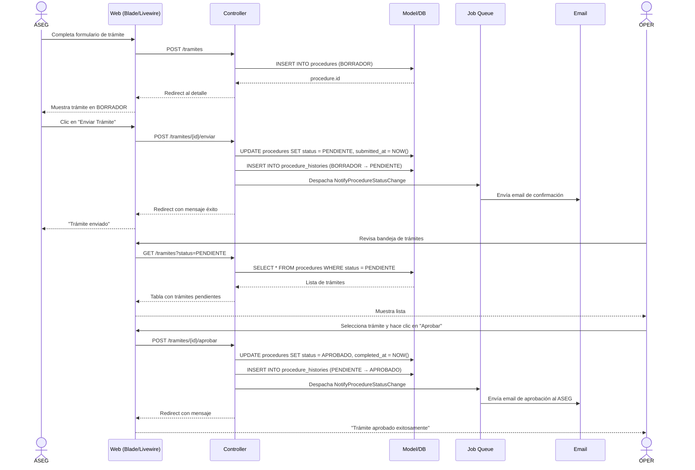
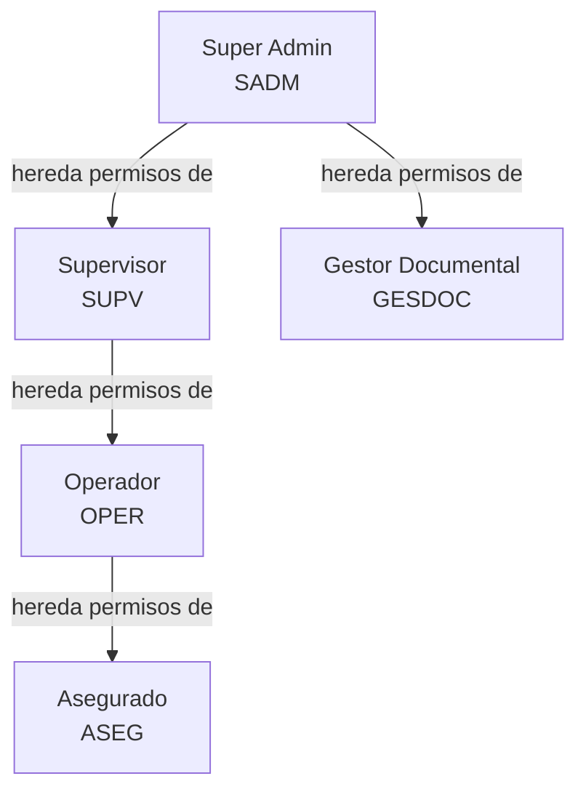

# 09 — Casos de Uso (UML)

## Diagrama General del Sistema

```mermaid
graph TB
    subgraph Actores
        ASEG[Asegurado<br/>ASEG]
        OPER[Operador<br/>OPER]
        SUPV[Supervisor<br/>SUPV]
        GESDOC[Gestor Documental<br/>GESDOC]
        SADM[Super Admin<br/>SADM]
    end

    subgraph "Sistema EsSalud v1.0"
        subgraph "Módulo Auth"
            UC1[Registrarse]
            UC2[Iniciar Sesión]
            UC3[Recuperar Contraseña]
            UC4[Verificar Email]
        end

        subgraph "Módulo Trámites"
            UC5[Crear Trámite]
            UC6[Ver Mis Trámites]
            UC7[Enviar Trámite]
            UC8[Subsanar Trámite]
            UC9[Aprobar Trámite]
            UC10[Rechazar Trámite]
            UC11[Solicitar Subsanación]
            UC12[Cancelar Trámite]
            UC13[Asignar Trámite]
            UC14[Ver Todos los Trámites]
        end

        subgraph "Módulo Documentos"
            UC15[Subir Documento]
            UC16[Validar Documento]
            UC17[Descargar Documento]
            UC18[Previsualizar PDF]
        end

        subgraph "Módulo Chatbot"
            UC19[Chatear con Asistente]
            UC20[Escalar a Operador]
            UC21[Dar Feedback]
        end

        subgraph "Módulo Contenido"
            UC22[Ver FAQ]
            UC23[Gestionar FAQ]
            UC24[Ver Noticias]
            UC25[Gestionar Noticias]
        end

        subgraph "Módulo Admin"
            UC26[Ver Dashboard KPIs]
            UC27[Exportar Reportes]
            UC28[Gestionar Usuarios]
            UC29[Ver Auditoría]
            UC30[Gestionar Fuentes RAG]
        end
    end

    ASEG --> UC1 & UC2 & UC3 & UC4 & UC5 & UC6 & UC7 & UC8 & UC12 & UC15 & UC17 & UC18 & UC19 & UC20 & UC21 & UC22 & UC24
    OPER --> UC2 & UC3 & UC4 & UC5 & UC6 & UC7 & UC8 & UC9 & UC10 & UC11 & UC12 & UC15 & UC17 & UC18 & UC19 & UC20 & UC21 & UC22 & UC24
    SUPV --> UC2 & UC3 & UC4 & UC5 & UC6 & UC7 & UC8 & UC9 & UC10 & UC11 & UC12 & UC13 & UC14 & UC15 & UC17 & UC18 & UC19 & UC20 & UC21 & UC22 & UC24 & UC26 & UC27 & UC29
    GESDOC --> UC2 & UC3 & UC4 & UC6 & UC15 & UC16 & UC17 & UC18 & UC19 & UC20 & UC21 & UC22 & UC23 & UC24 & UC25 & UC30
    SADM --> UC2 & UC3 & UC4 & UC5 & UC6 & UC7 & UC8 & UC9 & UC10 & UC11 & UC12 & UC13 & UC14 & UC15 & UC16 & UC17 & UC18 & UC19 & UC20 & UC21 & UC22 & UC23 & UC24 & UC25 & UC26 & UC27 & UC28 & UC29 & UC30
```

---

## 1. Módulo Auth

### CU-01: Registrarse

| Atributo | Valor |
|----------|-------|
| **ID** | CU-01 |
| **Nombre** | Registrarse en la plataforma |
| **Actor** | Asegurado (ASEG) |
| **Descripción** | Un ciudadano se registra en EsSalud proporcionando sus datos personales. |
| **Precondiciones** | El actor no tiene una cuenta en el sistema. |
| **Postcondiciones** | Usuario creado con rol ASEG, email de verificación enviado. |

**Flujo principal:**
1. El actor accede a la URL `/registro`.
2. El sistema muestra el formulario de registro con campos: DNI, email, teléfono, nombre completo, contraseña, confirmación de contraseña.
3. El actor completa todos los campos.
4. El actor envía el formulario.
5. El sistema valida el DNI (formato peruano + dígito verificador).
6. El sistema valida que el email y DNI no existan previamente.
7. El sistema valida la fortaleza de la contraseña.
8. El sistema crea el usuario con `is_active = 1`, `role = ASEG`.
9. El sistema dispara el evento `Registered`.
10. El sistema envía email de verificación.
11. El sistema redirige a la página de login con mensaje "Verifica tu email para continuar".

**Flujos alternativos:**
- **FA-01:** DNI inválido → El sistema muestra error "DNI no válido. Verifique el formato."
- **FA-02:** Email ya registrado → El sistema muestra error "El email ya está en uso."
- **FA-03:** DNI ya registrado → El sistema muestra error "Ya existe una cuenta con este DNI."
- **FA-04:** Contraseña débil → El sistema muestra los requisitos de contraseña no cumplidos.
- **FA-05:** Error de conexión al enviar email → Se muestra advertencia pero el registro se completa.

---

### CU-02: Iniciar Sesión

| Atributo | Valor |
|----------|-------|
| **ID** | CU-02 |
| **Nombre** | Iniciar sesión en la plataforma |
| **Actor** | ASEG, OPER, SUPV, GESDOC, SADM |
| **Descripción** | Un usuario registrado accede a la plataforma con sus credenciales. |
| **Precondiciones** | Usuario registrado con email verificado. |
| **Postcondiciones** | Sesión iniciada, token Sanctum creado, último login registrado. |

**Flujo principal:**
1. El actor accede a la URL `/login`.
2. El sistema muestra formulario con campos email y contraseña.
3. El actor ingresa sus credenciales y envía.
4. El sistema verifica que el email existe.
5. El sistema verifica que la cuenta está activa (`is_active = 1`).
6. El sistema verifica que la cuenta no está bloqueada (`locked_until` no es futuro).
7. El sistema verifica la contraseña (bcrypt).
8. El sistema reinicia `failed_login_attempts = 0` y limpia `locked_until`.
9. El sistema registra `last_login_at` y `last_login_ip`.
10. El sistema redirige al dashboard correspondiente según el rol.

**Flujos alternativos:**
- **FA-01:** Credenciales incorrectas → Incrementa `failed_login_attempts + 1`. Si llega a 5, bloquea 30 min (`locked_until = now() + 30 min`).
- **FA-02:** Cuenta desactivada → Mensaje "Tu cuenta ha sido desactivada. Contacta al administrador."
- **FA-03:** Cuenta bloqueada → Mensaje "Cuenta bloqueada. Intenta de nuevo en X minutos."
- **FA-04:** Email no verificado → Redirige a pantalla de verificación.

---

### CU-03: Recuperar Contraseña

| Atributo | Valor |
|----------|-------|
| **ID** | CU-03 |
| **Nombre** | Recuperar contraseña olvidada |
| **Actor** | ASEG, OPER, SUPV, GESDOC, SADM |
| **Descripción** | Usuario solicita restablecer su contraseña mediante enlace enviado por email. |
| **Precondiciones** | El usuario tiene una cuenta activa con email verificado. |
| **Postcondiciones** | Contraseña actualizada, notificación enviada, `password_changed_at` registrado. |

**Flujo principal:**
1. El actor accede a `/recuperar-password`.
2. El sistema muestra formulario solicitando email.
3. El actor ingresa su email y envía.
4. El sistema verifica que el email está registrado.
5. El sistema genera un token de restablecimiento con expiración de 60 minutos.
6. El sistema envía email con enlace: `/reset-password/{token}`.
7. El actor abre el enlace desde su correo.
8. El sistema muestra formulario de nueva contraseña y confirmación.
9. El actor ingresa nueva contraseña y envía.
10. El sistema valida fortaleza de la nueva contraseña.
11. El sistema verifica que no sea igual a las últimas 3 contraseñas.
12. El sistema actualiza la contraseña y registra `password_changed_at`.
13. El sistema envía notificación de cambio de contraseña.
14. El sistema redirige al login con mensaje de éxito.

**Flujos alternativos:**
- **FA-01:** Email no registrado → El sistema muestra mensaje genérico "Si el email existe, recibirás un enlace" (no revela si existe).
- **FA-02:** Token expirado → Mensaje "El enlace ha expirado. Solicita uno nuevo."
- **FA-03:** Token inválido → Mensaje "Enlace inválido."
- **FA-04:** Contraseña repetida → Mensaje "No puedes usar una contraseña anterior."

---

## 2. Módulo Trámites

### CU-04: Crear Trámite

| Atributo | Valor |
|----------|-------|
| **ID** | CU-04 |
| **Nombre** | Crear un nuevo trámite administrativo |
| **Actor** | ASEG, OPER, SUPV, SADM |
| **Descripción** | El actor inicia un trámite seleccionando el tipo, completando datos requeridos y adjuntando documentos. |
| **Precondiciones** | Usuario autenticado y con email verificado. |
| **Postcondiciones** | Trámite creado en estado BORRADOR con `idempotency_key`. |

**Flujo principal:**
1. El actor accede a `/tramites/crear`.
2. El sistema muestra el wizard de 3 pasos.
3. **Paso 1 — Datos:** El sistema precarga datos del perfil del actor. El actor completa/confirma.
4. **Paso 2 — Tipo:** El sistema carga catálogo `procedure_types` activos. El actor selecciona uno.
5. El sistema muestra `requirements` (JSON) del tipo seleccionado.
6. **Paso 3 — Documentos:** El sistema muestra los documentos requeridos. El actor adjunta archivos.
7. El actor hace clic en "Guardar Borrador".
8. El sistema genera `idempotency_key` (UUID v4).
9. El sistema crea el trámite con `procedure_status_id = BORRADOR`.
10. El sistema asocia los documentos subidos.
11. El sistema redirige al detalle del trámite.

**Flujos alternativos:**
- **FA-01:** Enviar directamente → El actor hace clic en "Enviar" en lugar de "Guardar Borrador". Se ejecutan los pasos 8-10 y luego el CU-05.
- **FA-02:** Campos incompletos → Validación de campos requeridos según `data` del tipo de trámite.
- **FA-03:** Sin documentos → Advertencia "Se recomienda adjuntar los documentos requeridos."

---

### CU-05: Enviar Trámite

| Atributo | Valor |
|----------|-------|
| **ID** | CU-05 |
| **Nombre** | Enviar un trámite a revisión |
| **Actor** | ASEG, OPER, SUPV, SADM |
| **Descripción** | El actor envía un trámite en borrador para que sea revisado por un operador. |
| **Precondiciones** | Trámite en estado BORRADOR. El actor es el creador del trámite. |
| **Postcondiciones** | Trámite en estado PENDIENTE, `submitted_at` registrado, notificación enviada. |

**Flujo principal:**
1. El actor accede al detalle del trámite en estado BORRADOR.
2. El actor hace clic en "Enviar Trámite".
3. El sistema muestra modal de confirmación.
4. El actor confirma el envío.
5. El sistema valida que todos los documentos requeridos estén adjuntos.
6. El sistema cambia el estado a PENDIENTE.
7. El sistema registra `submitted_at = now()`.
8. El sistema crea entrada en `procedure_histories` (BORRADOR → PENDIENTE).
9. El sistema despacha job `NotifyProcedureStatusChange` (email al asegurado).
10. El sistema redirige al listado con mensaje "Trámite enviado exitosamente."

**Flujos alternativos:**
- **FA-01:** Documentos faltantes → El sistema muestra cuáles documentos requeridos no se han adjuntado.
- **FA-02:** Trámite no está en BORRADOR → Error 403 Forbidden.

---

### CU-06: Revisar y Resolver Trámite

| Atributo | Valor |
|----------|-------|
| **ID** | CU-06 |
| **Nombre** | Revisar, aprobar o rechazar un trámite |
| **Actor** | OPER, SUPV, SADM |
| **Descripción** | El operador revisa el trámite asignado y emite una resolución. |
| **Precondiciones** | Trámite en estado PENDIENTE, EN_REVISION o SUBSANACION. El operador tiene el trámite asignado (si es OPER). |
| **Postcondiciones** | Trámite en estado APROBADO o RECHAZADO, historial actualizado, notificación enviada. |

**Sub-flujo A: Aprobar**
1. El operador accede al detalle del trámite.
2. El sistema muestra toda la información, documentos y comentarios previos.
3. El operador revisa el trámite.
4. El operador hace clic en "Aprobar".
5. El sistema muestra modal solicitando comentario.
6. El operador ingresa comentario y confirma.
7. El sistema cambia estado a APROBADO.
8. El sistema registra `completed_at = now()`.
9. El sistema crea entrada en `procedure_histories` (estado_actual → APROBADO).
10. El sistema despacha notificación al asegurado.

**Sub-flujo B: Rechazar**
1. (Pasos 1-3 iguales)
2. El operador hace clic en "Rechazar".
3. El sistema muestra modal solicitando motivo (obligatorio).
4. El operador ingresa motivo y confirma.
5. El sistema cambia estado a RECHAZADO.
6. El sistema registra `completed_at = now()`.
7. El sistema crea entrada en `procedure_histories`.
8. El sistema despacha notificación al asegurado.

**Sub-flujo C: Solicitar Subsanación**
1. (Pasos 1-3 iguales)
2. El operador hace clic en "Solicitar Subsanación".
3. El sistema valida que no se hayan agotado 3 intentos.
4. El sistema muestra formulario: comentario de observaciones, documentos faltantes.
5. El operador completa y envía.
6. El sistema crea registro en `subsanaciones` con `deadline = now() + 15 días`.
7. El sistema cambia estado a SUBSANACION.
8. El sistema crea entrada en `procedure_histories`.
9. El sistema despacha notificación al asegurado.

**Flujos alternativos:**
- **FA-01:** Sin permisos → Error 403.
- **FA-02:** Trámite no asignado al OPER → Error 403.
- **FA-03:** Intentos de subsanación agotados → Mensaje "Se agotaron los 3 intentos de subsanación."

---

### CU-07: Subsanar Trámite

| Atributo | Valor |
|----------|-------|
| **ID** | CU-07 |
| **Nombre** | Responder a una solicitud de subsanación |
| **Actor** | ASEG |
| **Descripción** | El asegurado responde a las observaciones del operador y adjunta documentos corregidos. |
| **Precondiciones** | Trámite en estado SUBSANACION. El actor es el creador del trámite. |
| **Postcondiciones** | Subsanación registrada, trámite vuelve a PENDIENTE o se rechaza. |

**Flujo principal:**
1. El asegurado recibe notificación de subsanación.
2. El asegurado accede al detalle del trámite.
3. El sistema muestra las observaciones del operador y el deadline.
4. El asegurado completa el formulario de respuesta.
5. El asegurado adjunta documentos adicionales si es necesario.
6. El asegurado envía la respuesta.
7. El sistema actualiza el registro de subsanación: `responded_at`, `response_comment`.
8. El sistema cambia el estado del trámite a PENDIENTE.
9. El sistema crea entrada en `procedure_histories` (SUBSANACION → PENDIENTE).
10. El sistema notifica al operador asignado.

**Flujos alternativos:**
- **FA-01:** Deadline vencido → El sistema rechaza el trámite automáticamente (`is_fulfilled = 0`, estado → RECHAZADO).
- **FA-02:** Tercer intento fallido → Si después de 3 subsanaciones el operador rechaza, el trámite queda RECHAZADO.
- **FA-03:** Cancelar trámite → El asegurado puede cancelar durante subsanación (estado → CANCELADO).

---

## 3. Módulo Documentos

### CU-08: Gestionar Documentos

| Atributo | Valor |
|----------|-------|
| **ID** | CU-08 |
| **Nombre** | Subir, validar y gestionar documentos de un trámite |
| **Actor** | ASEG (subir), GESDOC (validar), OPER (ver) |
| **Descripción** | Flujo completo de gestión documental: subida, validación automática, OCR, revisión humana. |
| **Precondiciones** | Usuario autenticado. Para subir: trámite en estado que lo permita (BORRADOR o SUBSANACION). |
| **Postcondiciones** | Documento almacenado en disco local y MinIO, OCR procesado, embeddings generados si aplica. |

**Sub-flujo A: Subir documento**
1. El actor accede a la sección de documentos del trámite.
2. El sistema muestra la zona Dropzone.
3. El actor arrastra archivos o hace clic para seleccionar.
4. El sistema valida tipo (PDF, JPG, PNG) y tamaño (≤10 MB) en cliente.
5. El actor agrega los archivos a la cola.
6. El sistema sube los archivos con barra de progreso.
7. En servidor, el sistema valida MIME type real, tamaño e integridad.
8. El sistema almacena en `storage/app/documents/` y registra ruta en `stored_path`.
9. El sistema despacha job `ProcessOcr` para extraer texto.
10. El sistema despacha job `GenerateDocumentEmbeddings` si es documento RAG.
11. El sistema sincroniza con MinIO (`minio_path`).

**Sub-flujo B: Validar documento (GESDOC)**
1. El gestor documental accede a la lista de documentos pendientes de validación.
2. El gestor revisa el documento (previsualización PDF, OCR extraído).
3. El gestor aprueba: `is_validated = 1`, `validated_by = auth()->id()`, `validated_at = now()`.
4. El gestor rechaza: se notifica al asegurado con motivo.

**Sub-flujo C: Versionar documento**
1. El asegurado sube una nueva versión de un documento existente.
2. El sistema incrementa `version + 1`.
3. El sistema preserva las versiones anteriores con su `stored_path` original.

---

## 4. Módulo Chatbot

### CU-09: Interactuar con el Asistente Virtual

| Atributo | Valor |
|----------|-------|
| **ID** | CU-09 |
| **Nombre** | Chatear con el asistente virtual inteligente |
| **Actor** | ASEG, OPER, SUPV, GESDOC |
| **Descripción** | El usuario conversa con el asistente virtual para obtener respuestas sobre trámites y servicios. |
| **Precondiciones** | Usuario autenticado. |
| **Postcondiciones** | Mensaje registrado en `chat_messages`, respuesta generada y mostrada. |

**Flujo principal:**
1. El actor accede a `/chat`.
2. El sistema crea o recupera la sesión activa.
3. El sistema muestra la interfaz de chat con historial de la sesión.
4. El actor escribe un mensaje y lo envía.
5. El sistema registra el mensaje en `chat_messages` con `role = 'user'`.
6. El sistema inicia el pipeline de respuesta:

**Sub-flujo A: FAQ Local (Nivel 1)**
1. El sistema ejecuta `FaqMatcher` con el mensaje del usuario.
2. Busca coincidencias por keywords (JSON) y fuzzy matching en `faqs`.
3. Si score ≥ 80%, selecciona la mejor FAQ.
4. El sistema registra respuesta con `message_type = 'faq_response'`, `confidence`.

**Sub-flujo B: RAG con Qdrant (Nivel 2)**
1. (Si score FAQ < 80%)
2. El sistema genera embedding del mensaje con `text-embedding-3-small`.
3. El sistema consulta Qdrant: top-5 chunks más cercanos.
4. Si score RAG ≥ 60%, construye contexto con los chunks.
5. El sistema envía a OpenAI GPT-4 con el contexto para generar respuesta.
6. Registra respuesta con `message_type = 'rag_response'`, `sources` (JSON con chunks), `confidence`.

**Sub-flujo C: OpenAI Directo (Nivel 3)**
1. (Si score RAG < 60%)
2. El sistema envía mensaje a GPT-4 con system prompt de EsSalud.
3. Registra respuesta con `message_type = 'gpt_response'`, `confidence`.

**Sub-flujo D: Escalación (Nivel 4)**
1. (Si confidence final < 50%)
2. El sistema incluye en la respuesta: "¿Deseas que un operador te ayude?"
3. Si el actor confirma, el sistema crea ticket de escalación.
4. Registra mensaje con `message_type = 'escalation'`.

7. El sistema muestra la respuesta en la interfaz.
8. El sistema muestra botones de feedback (útil / no útil).
9. El actor puede calificar la respuesta.

**Flujos alternativos:**
- **FA-01:** Error en OpenAI API → Mensaje "El asistente no está disponible. Intenta de nuevo más tarde."
- **FA-02:** Error en Qdrant → Degradación a Nivel 3 (OpenAI directo).
- **FA-03:** Sesión expirada → Se crea nueva sesión automáticamente.
- **FA-04:** Rate limiting → Máximo 20 mensajes por minuto por usuario.

---

## 5. Módulo Admin

### CU-10: Gestionar el Sistema (Dashboard + Reportes + Usuarios + Auditoría)

| Atributo | Valor |
|----------|-------|
| **ID** | CU-10 |
| **Nombre** | Administrar y supervisar el sistema |
| **Actor** | SUPV, SADM |
| **Descripción** | Los administradores monitorean KPIs, generan reportes y gestionan usuarios. |
| **Precondiciones** | Usuario con rol SUPV o SADM autenticado. |
| **Postcondiciones** | Reportes generados, usuarios gestionados, logs de auditoría consultados. |

**Sub-flujo A: Ver Dashboard KPIs**
1. El actor accede a `/admin`.
2. El sistema consulta métricas agregadas:
   - `SELECT COUNT(*) FROM procedures WHERE procedure_status_id IN (SELECT id FROM procedure_statuses WHERE code = 'PENDIENTE')`
   - `SELECT AVG(TIMESTAMPDIFF(HOUR, submitted_at, completed_at)) FROM procedures WHERE completed_at IS NOT NULL AND submitted_at >= DATE_SUB(NOW(), INTERVAL 30 DAY)`
   - `SELECT COUNT(CASE WHEN ps.code = 'APROBADO' THEN 1 END) / COUNT(*) * 100 FROM procedures ...`
   - `SELECT COUNT(DISTINCT user_id) FROM personal_access_tokens WHERE last_used_at >= ...`
3. El sistema renderiza tarjetas KPI con valores y variación porcentual vs período anterior.
4. El sistema renderiza gráficos Chart.js:
   - Barras: trámites por estado (colores por estado).
   - Líneas: trámites creados vs resueltos por mes.
5. El sistema muestra tabla de operadores con carga de trabajo.
6. Livewire polling refresca los datos cada 60 segundos.

**Sub-flujo B: Exportar Reportes**
1. El actor accede a `/admin/reportes`.
2. El sistema muestra filtros: fechas, tipo de trámite, estado, operador.
3. El actor configura filtros y selecciona formato (PDF o Excel).
4. **PDF:** El sistema genera PDF con DomPDF incluyendo tablas y gráficos.
5. **Excel:** El sistema genera archivo .xlsx con PhpSpreadsheet.
6. Si el reporte es grande, se procesa en background (job) y se notifica al finalizar.
7. El sistema entrega archivo para descarga.

**Sub-flujo C: Gestionar Usuarios (SADM)**
1. El actor accede a `/admin/usuarios`.
2. El sistema muestra tabla con búsqueda, filtros y paginación.
3. **Ver usuario:** El actor hace clic en un usuario.
4. El sistema muestra: datos personales, roles, permisos, actividad reciente, trámites creados.
5. **Editar rol:** El actor cambia el rol mediante `syncRoles([$newRole])`.
6. **Activar/desactivar:** El actor alterna `is_active`.
7. **Desbloquear:** El actor limpia `locked_until` y `failed_login_attempts`.
8. El sistema registra cada cambio en `audit_logs`.

**Sub-flujo D: Ver Auditoría**
1. El actor accede a `/admin/auditoria`.
2. El sistema muestra tabla de logs con filtros: usuario, acción, modelo, fechas.
3. El actor hace clic en un log para ver detalle.
4. El sistema muestra diff: `old_values` vs `new_values` en formato legible.
5. El actor puede exportar logs filtrados a CSV/Excel.

---

## Ejemplo de Diagrama de Secuencia: Crear y Aprobar Trámite

---

## Jerarquía de Actores

**Nota:** En Spatie/laravel-permission no hay herencia real de roles; cada rol recibe explícitamente
los permisos correspondientes. El diagrama ilustra la jerarquía lógica de permisos acumulativos.

---

## Resumen de Casos de Uso

| ID | Caso de Uso | Actores | Complejidad |
|----|-------------|---------|:-----------:|
| CU-01 | Registrarse | ASEG | Baja |
| CU-02 | Iniciar Sesión | Todos | Baja |
| CU-03 | Recuperar Contraseña | Todos | Baja |
| CU-04 | Crear Trámite | ASEG, OPER, SUPV, SADM | Media |
| CU-05 | Enviar Trámite | ASEG, OPER, SUPV, SADM | Baja |
| CU-06 | Revisar y Resolver Trámite | OPER, SUPV, SADM | Alta |
| CU-07 | Subsanar Trámite | ASEG | Media |
| CU-08 | Gestionar Documentos | ASEG, GESDOC | Alta |
| CU-09 | Interactuar con Chatbot | Todos (excepto SADM) | Alta |
| CU-10 | Gestionar Sistema | SUPV, SADM | Alta |
