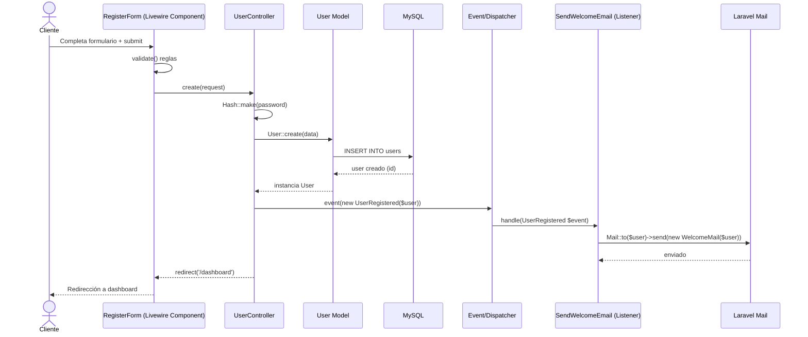
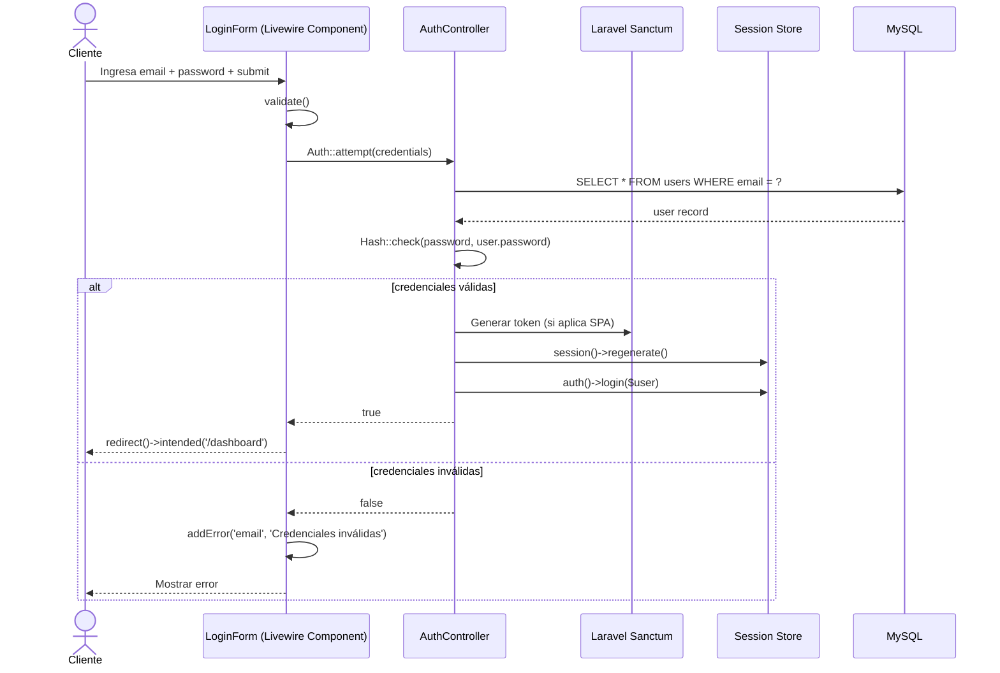
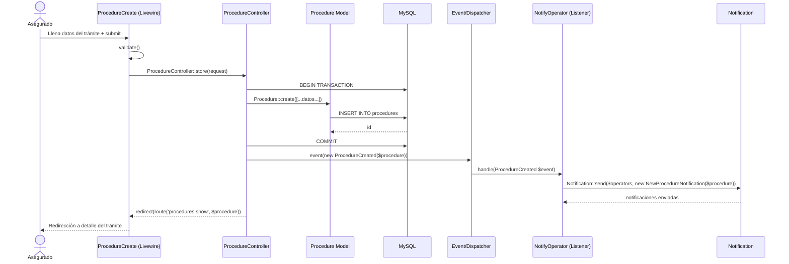
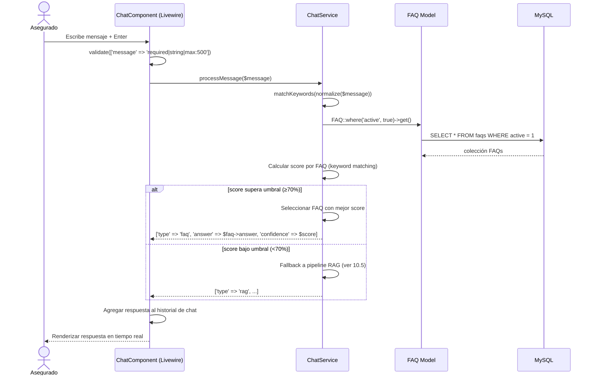
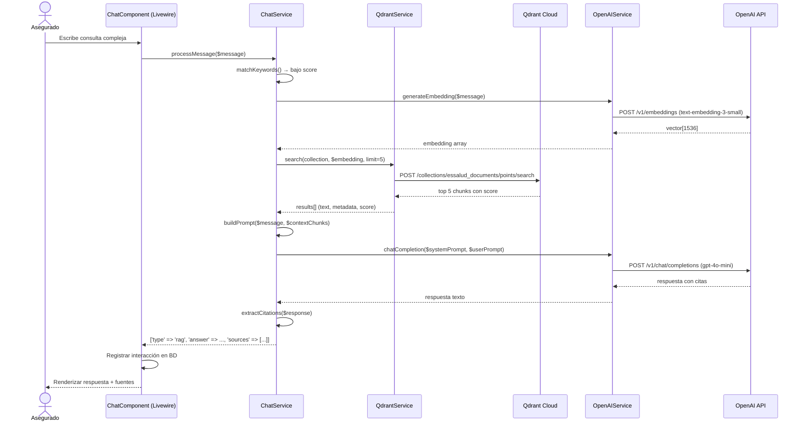
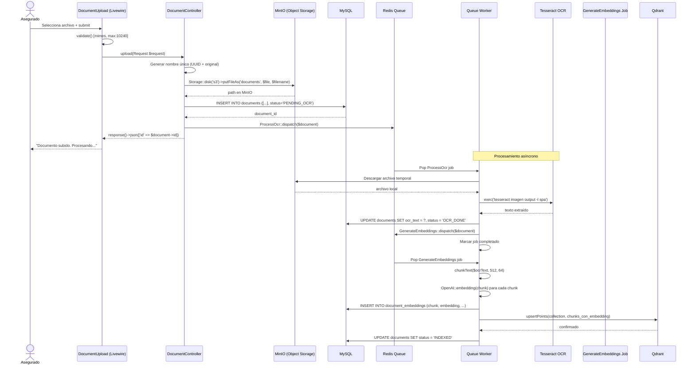
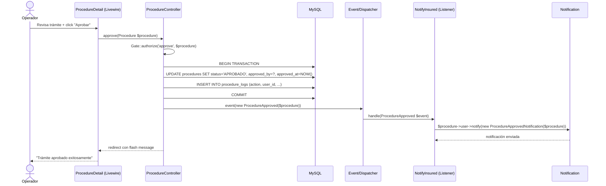
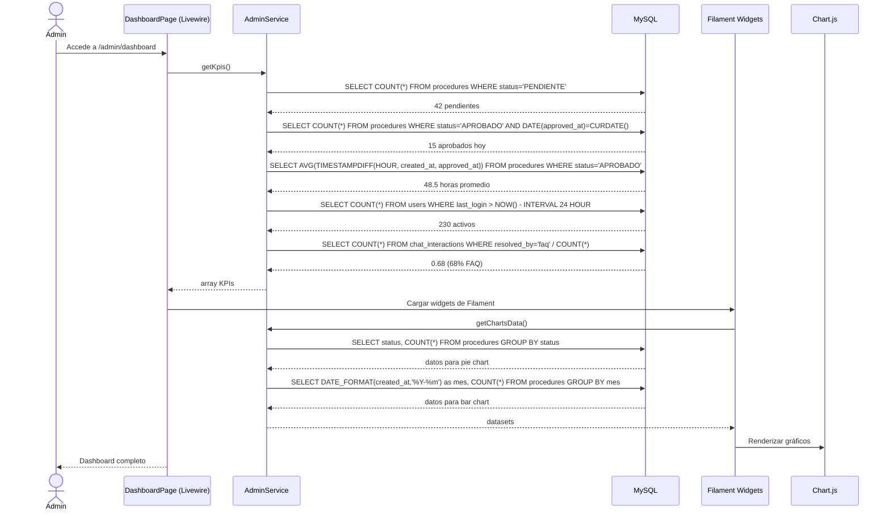

# 10. Diagramas de Secuencia — EsSalud (Laravel)

Este documento describe los flujos principales del sistema EsSalud mediante diagramas de secuencia en formato Mermaid. Cada diagrama representa la interacción entre los componentes del stack monolítico Laravel 11 + Livewire.

---

## 10.1 Registro de Usuario

**Explicación:**

1. El cliente llena el formulario de registro renderizado por el componente Livewire `RegisterForm`.
2. Livewire ejecuta validación en tiempo real (`$rules` en el componente) y en el servidor.
3. El `UserController::store()` recibe los datos validados, hashea la contraseña con `Hash::make()` y crea el registro mediante `User::create()`.
4. Se dispara el evento `UserRegistered` usando el sistema de eventos de Laravel.
5. El listener `SendWelcomeEmail` captura el evento y despacha un correo de bienvenida usando `Mail::to()` con un Mailable personalizado.
6. Finalmente se redirige al dashboard del usuario autenticado.

---

## 10.2 Login

**Explicación:**

1. El componente Livewire `LoginForm` captura email y contraseña, los valida y llama a `Auth::attempt()`.
2. Laravel busca al usuario en MySQL, verifica el hash de la contraseña con `Hash::check()`.
3. Si las credenciales son válidas, se regenera la sesión (protección contra session fixation) y se loguea al usuario con `auth()->login()`.
4. Si es un SPA, se genera token de Sanctum. Luego se redirige al dashboard (`intended()` respeta la URL original si el usuario fue redirigido al login).
5. Si las credenciales fallan, Livewire agrega un error de validación que se muestra en tiempo real sin recargar la página.

---

## 10.3 Crear Trámite

**Explicación:**

1. El asegurado completa el formulario en el componente Livewire `ProcedureCreate` que incluye tipo de trámite, descripción, documentos adjuntos.
2. Livewire valida los campos y llama al controlador `ProcedureController::store()`.
3. El controlador usa transacciones de base de datos (`DB::transaction()`) para garantizar atomicidad.
4. Se crea el registro `Procedure` con estado inicial `PENDIENTE` y se asocia al `user_id` del usuario autenticado.
5. Se dispara el evento `ProcedureCreated`. El listener `NotifyOperator` obtiene los operadores disponibles (rol `GESDOC`) y les envía una notificación usando el sistema de notificaciones de Laravel (puede ser database, mail, o broadcast).
6. El usuario es redirigido a la vista de detalle del trámite donde podrá hacer seguimiento.

---

## 10.4 Chatbot FAQ (Keyword Matching)

**Explicación:**

1. El asegurado escribe su consulta en el componente `ChatComponent` de Livewire.
2. El componente valida el mensaje y lo envía a `ChatService::processMessage()`.
3. `ChatService` primero normaliza el texto (lowercase, remover tildes, expandir abreviaturas comunes).
4. `matchKeywords()` itera sobre todas las FAQs activas y calcula un score basado en coincidencia de palabras clave. Cada FAQ tiene un campo `keywords` (JSON) con sinónimos y variantes.
5. Si el score supera el umbral del 70%, se devuelve la respuesta de la FAQ en tiempo real. Esto evita llamadas a OpenAI y reduce latencia.
6. Si el score es bajo, se escala automáticamente al pipeline RAG (diagrama 10.5).
7. La respuesta se agrega al array `$messages` del componente y se re-renderiza con scroll automático.

---

## 10.5 Chatbot RAG (Qdrant + OpenAI)

**Explicación:**

1. Cuando la consulta no encuentra match en FAQs (score <70%), `ChatService` inicia el pipeline RAG.
2. Primero genera el embedding del mensaje del usuario usando `OpenAIService::generateEmbedding()` con modelo `text-embedding-3-small` (1536 dimensiones).
3. El vector se envía a `QdrantService::search()` que consulta la colección `essalud_documents` por similitud coseno, recuperando los 5 chunks más relevantes.
4. `buildPrompt()` construye el prompt del sistema con instrucciones en español y adjunta los chunks como contexto.
5. Se llama a `OpenAIService::chatCompletion()` con `gpt-4o-mini` para generar la respuesta.
6. Se extraen las citas del response (formato `[Fuente: NombreDocumento]`) y se retornan junto con la respuesta.
7. Livewire registra la interacción en la tabla `chat_interactions` para analíticas posteriores.

---

## 10.6 Subir Documento + OCR Pipeline

**Explicación:**

1. El asegurado sube un documento mediante el componente Livewire `DocumentUpload` con soporte drag-and-drop (Dropzone.js).
2. Se valida tipo MIME, extensión y tamaño máximo (10MB). El archivo se almacena en MinIO usando el filesystem de Laravel con driver S3.
3. El registro se crea en MySQL con estado `PENDING_OCR` y se despacha el job `ProcessOcr` a la cola de Redis.
4. El worker descarga el archivo de MinIO y ejecuta Tesseract OCR (`thiagoalessio/tesseract_ocr`) en español para extraer texto.
5. El texto extraído se guarda en `documents.ocr_text` y se despacha un segundo job: `GenerateEmbeddings`.
6. `GenerateEmbeddings` divide el texto en chunks de 512 tokens con solapamiento de 64, genera embeddings con OpenAI y los almacena tanto en MySQL (`document_embeddings`) como en Qdrant mediante upsert.
7. El estado final es `INDEXED`, indicando que el documento ya es consultable vía RAG.

---

## 10.7 Aprobar Trámite

**Explicación:**

1. El operador accede al detalle del trámite (`ProcedureDetail` Livewire), revisa documentos y datos.
2. Al hacer clic en "Aprobar", se llama a `ProcedureController::approve()` que primero verifica autorización mediante `Gate::authorize()` (Policy de Laravel). Solo usuarios con rol `GESDOC` y trámites en estado `EN_REVISION` pueden ser aprobados.
3. En una transacción, se actualiza el estado a `APROBADO`, se registra `approved_by` (ID del operador) y `approved_at` (timestamp). Se inserta un log en `procedure_logs` para auditoría.
4. Se dispara el evento `ProcedureApproved`. El listener `NotifyInsured` envía una notificación al usuario creador del trámite usando el sistema de notificaciones de Laravel.
5. El operador recibe un flash message de confirmación y la vista se actualiza.

---

## 10.8 Dashboard KPIs (Admin)

**Explicación:**

1. El administrador accede al dashboard en `/admin/dashboard` construido con Filament 3 + Livewire widgets.
2. `AdminService::getKpis()` ejecuta queries agregadas para obtener los KPIs principales: trámites pendientes, aprobados hoy, tiempo promedio de resolución, usuarios activos (últimas 24h), tasa de resolución del chatbot.
3. Los widgets de Filament cargan datos adicionales para gráficos: distribución de trámites por estado (pie chart) y trámites por mes (bar chart) usando Chart.js.
4. Toda la lógica de agregación está encapsulada en `AdminService`, manteniendo los widgets delgados.
5. El dashboard se renderiza completamente en el servidor con Livewire, actualizando datos en cada carga de página. Puede añadirse polling (`wire:poll.60s`) para actualización en tiempo real.

---

## 10.9 Resumen de Componentes

| Componente | Tecnología | Rol |
|---|---|---|
| Frontend interactivo | Livewire 3 | Componentes reactivos sin salir de Laravel |
| Autenticación | Laravel Sanctum | SPA auth + API tokens |
| ORM | Eloquent | Modelos, relaciones, scopes |
| Base de datos | MySQL 8 | Datos transaccionales y operativos |
| Colas | Laravel Queue + Redis | Jobs asíncronos (OCR, embeddings) |
| Eventos | Laravel Events/Listeners | Desacoplamiento (notificaciones, logs) |
| Almacenamiento | MinIO (compatible S3) | Documentos y archivos |
| OCR | Tesseract via PHP wrapper | Extracción de texto |
| Búsqueda vectorial | Qdrant | RAG, búsqueda semántica |
| IA | OpenAI API | Embeddings + Chat Completion |
| Admin | Filament 3 | Panel administrativo |
| Monitoreo colas | Laravel Horizon | Dashboard de jobs |
