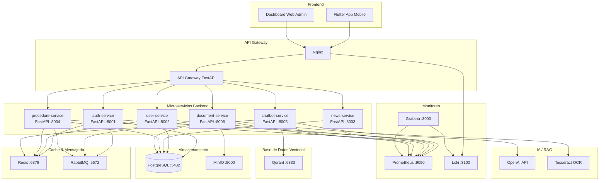
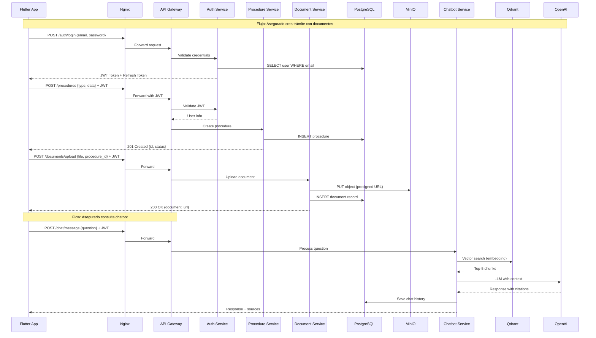
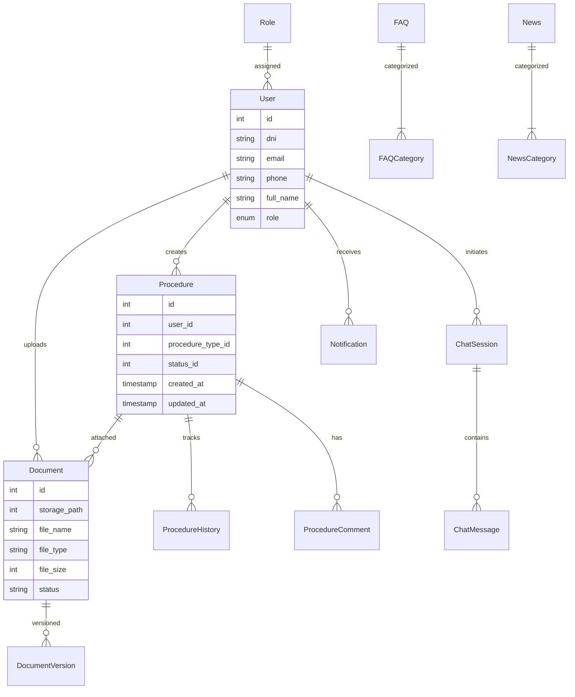

# DESIGN DETALLADO - Diseño Arquitectónico EsSalud v1.0 Empresarial

## 1. Diagrama de Arquitectura General



---

## 2. Decisiones Arquitectónicas (ADR)

### ADR-001: Microservicios vs Monolito

| Campo | Detalle |
|-------|---------|
| **Contexto** | Sistema de salud con múltiples dominios: autenticación, trámites, documentos, chatbot. Cada dominio tiene diferentes requisitos de escalabilidad y evolución. |
| **Decisión** | Arquitectura de microservicios con FastAPI |
| **Alternativas** | Monolito Django, Monolito NestJS |
| **Razón** | Independencia de despliegue, escalabilidad por servicio, aislamiento de fallos, equipos paralelos |
| **Consecuencias** | Mayor complejidad operativa, latencia de red entre servicios, necesidad de API Gateway |
| **Estado** | Aceptada |

### ADR-002: Framework Backend Python/FastAPI

| Campo | Detalle |
|-------|---------|
| **Contexto** | Se necesita un framework rápido, con soporte async, tipado fuerte y documentación OpenAPI automática |
| **Decisión** | FastAPI para todos los microservicios |
| **Alternativas** | Spring Boot (Java), NestJS (Node.js), Django REST (Python) |
| **Razón** | Rendimiento async nativo, validación Pydantic, docs automáticas OpenAPI, ecosistema Python para IA/ML |
| **Consecuencias** | Curva de aprendizaje para async Python, ecosistema de producción maduro pero en evolución |
| **Estado** | Aceptada |

### ADR-003: Base de Datos PostgreSQL

| Campo | Detalle |
|-------|---------|
| **Contexto** | Datos relacionales con integridad referencial, transacciones ACID, consultas complejas |
| **Decisión** | PostgreSQL 15 como base de datos principal |
| **Alternativas** | MySQL, MongoDB, MariaDB |
| **Razón** | JSONB para datos semi-estructurados, migraciones robustas, extensibilidad (pgvector para embeddings), madurez |
| **Consecuencias** | Cada servicio con su schema o base de datos propia |
| **Estado** | Aceptada |

### ADR-004: Base de Datos Vectorial Qdrant

| Campo | Detalle |
|-------|---------|
| **Contexto** | Búsqueda semántica en documentos, similitud vectorial, escalabilidad horizontal |
| **Decisión** | Qdrant como vector store |
| **Alternativas** | Pinecone (cloud), Weaviate (self-hosted), pgvector (PostgreSQL) |
| **Razón** | Self-hosted (datos sensibles de salud), rendimiento de búsqueda, payload filtering, Docker fácil |
| **Consecuencias** | Servicio adicional a operar, sincronización con PostgreSQL |
| **Estado** | Aceptada |

### ADR-005: Almacenamiento de Objetos MinIO

| Campo | Detalle |
|-------|---------|
| **Contexto** | Almacenamiento seguro de documentos PDF/imágenes con versionado y acceso controlado |
| **Decisión** | MinIO con buckets privados y presigned URLs |
| **Alternativas** | AWS S3, Google Cloud Storage, Azure Blob Storage |
| **Razón** | Self-hosted (datos sensibles), API compatible S3, versionado nativo, bajo costo |
| **Consecuencias** | Bucket sizing planning, backup strategy |
| **Estado** | Aceptada |

### ADR-006: Frontend Flutter con Riverpod

| Campo | Detalle |
|-------|---------|
| **Contexto** | Aplicación móvil multiplataforma (iOS/Android) con estado complejo, navegación y manejo de errores |
| **Decisión** | Flutter con Riverpod, GoRouter, Dio, Freezed |
| **Alternativas** | React Native, Kotlin Multiplatform, Flutter sin Riverpod |
| **Razón** | Single codebase, rendimiento nativo, Riverpod para DI/estado, GoRouter para navegación declarativa |
| **Consecuencias** | Overhead de boilerplate con Freezed, dependencia del ecosistema Flutter |
| **Estado** | Aceptada |

### ADR-007: Cache con Redis

| Campo | Detalle |
|-------|---------|
| **Contexto** | Reducción de latencia en consultas frecuentes, sesiones, rate limiting |
| **Decisión** | Redis para caché de sesiones, rate limiting, cache de FAQ, cola de Celery |
| **Alternativas** | Memcached, Hazelcast |
| **Razón** | Versatilidad (cache, colas, sesiones), persistencia opcional, pub/sub, ecosistema maduro |
| **Consecuencias** | Gestión de memoria, estrategia de expiración |
| **Estado** | Aceptada |

### ADR-008: Modelo RAG con LangChain

| Campo | Detalle |
|-------|---------|
| **Contexto** | Sistema de QA sobre documentos oficiales de EsSalud con capacidad de citación de fuentes |
| **Decisión** | LangChain + OpenAI embeddings + Qdrant + prompt templates |
| **Alternativas** | LlamaIndex, Haystack, RAG pipeline custom sin framework |
| **Razón** | Flexibilidad de chain, integración con Qdrant, prompt management, comunidad activa |
| **Consecuencias** | Costo de API OpenAI por consulta, latencia de LLM, dependencia de servicio externo |
| **Estado** | Aceptada |

### ADR-009: API Gateway con Nginx + FastAPI

| Campo | Detalle |
|-------|---------|
| **Contexto** | Punto único de entrada, rate limiting, SSL termination, routing a microservicios |
| **Decisión** | Nginx como reverse proxy + API Gateway FastAPI ligero para auth/rate-limiting |
| **Alternativas** | Kong, Traefik, AWS API Gateway |
| **Razón** | Nginx maduro y probado, FastAPI Gateway ligero y custom, sin costo de licencia |
| **Consecuencias** | Configuración manual de upstreams, escalado manual |
| **Estado** | Aceptada |

---

## 3. Patrones de Diseño

| Patrón | Uso | Justificación |
|--------|-----|---------------|
| **Repository Pattern** | Capa de datos en Flutter y Backend | Abstracción del almacenamiento, facilita testing con mocks |
| **Use Case Pattern** | Capa de dominio en Flutter | Separación de lógica de negocio, reutilizable entre providers |
| **Provider/Observer (Riverpod)** | State management Flutter | Reactividad, DI, lifecycle management |
| **Factory Pattern** | Creación de modelos Freezed | Inmutabilidad, JSON serialization, pattern matching |
| **Circuit Breaker** | Llamadas a servicios externos (OpenAI) | Prevención de cascada de fallos |
| **Retry Pattern** | Operaciones de red con backoff | Resiliencia en llamadas a APIs externas |
| **Saga Pattern** | Workflow de trámites multi-paso | Consistencia eventual entre microservicios |
| **CQRS** | Separación de lecturas y escrituras (chatbot) | Optimización de consultas read-heavy |
| **Event-Driven** | Notificaciones y actualizaciones de estado | Desacoplamiento de servicios |
| **Strategy Pattern** | Diferentes validadores de documentos | Polimorfismo en reglas de validación |
| **Template Method** | Pipeline de ingestión de documentos | Procesamiento extensible en etapas |
| **Singleton** | Clientes HTTP (Dio), conexiones DB | Reutilización de recursos pesados |

---

## 4. Flujo de Datos Principal



---

## 5. Modelo de Datos Resumido



---

## 6. Estrategia de Caché (Redis)

| Clave de Cache | Valor | TTL | Justificación |
|----------------|-------|-----|---------------|
| `session:{user_id}` | Datos de sesión + JWT info | 2h | Sesiones activas |
| `faq:{query_hash}` | Respuesta FAQ match | 1h | FAQ recurrentes |
| `procedure_type:{id}` | Tipo de trámite + requisitos | 24h | Catálogo estático |
| `news:feed:{page}` | Lista paginada de noticias | 5min | Feed actualizado |
| `user:{id}` | Perfil de usuario | 30min | Datos poco cambiantes |
| `rate_limit:{ip}:{endpoint}` | Contador de requests | 1min | Rate limiting |
| `category:list` | Categorías de FAQ | 24h | Datos estáticos |
| `config:system` | Configuración global | 1h | Parámetros del sistema |

### 6.1 Estrategia de Invalidación
- **Write-through**: Al crear/actualizar datos, se actualiza caché simultáneamente
- **TTL-based**: Expiración automática con tiempo máximo por clave
- **Event-driven**: Los servicios publican eventos de invalidación cuando los datos cambian
- **Lazy loading**: La caché se popula bajo demanda en el primer acceso

---

## 7. Estrategia de Almacenamiento de Archivos (MinIO)

### 7.1 Buckets

| Bucket | Visibilidad | Propósito | Versionado | Ciclo de Vida |
|--------|-------------|-----------|------------|---------------|
| `essalud-documents` | Privado | Documentos de trámites | Sí | Retención 5 años |
| `essalud-pdfs-source` | Privado | PDFs originales para RAG | Sí | Retención indefinida |
| `essalud-temp-uploads` | Privado | Cargas temporales en validación | No | Limpieza 24h |
| `essalud-public-assets` | Público | Assets estáticos (imágenes, iconos) | No | Retención indefinida |
| `essalud-backups` | Privado | Backups del sistema | Sí | Retención 90 días |

### 7.2 Presigned URLs

- **Operación**: GET (descarga), PUT (subida)
- **Expiración**: 15 minutos para subida, 1 hora para descarga
- **Auditoría**: Todas las operaciones con presigned URL se registran en audit_log

### 7.3 Estructura de Directorios en Buckets

```
essalud-documents/
├── {procedure_id}/
│   ├── {document_id}_v1.{ext}
│   ├── {document_id}_v2.{ext}
│   └── metadata.json

essalud-pdfs-source/
├── {category}/
│   ├── {doc_id}.pdf
│   └── {doc_id}_metadata.json

essalud-temp-uploads/
├── {user_id}/
│   ├── {uuid}.{ext}
│   └── validation_result.json
```

---

## 8. Referencias Cruzadas

| Archivo | Relación |
|---------|----------|
| [[04_ARQUITECTURA_C4.md]] | Modelo C4 completo (Niveles 1-4) |
| [[05_MICROSERVICIOS.md]] | Detalle de cada microservicio |
| [[06_MODELO_ER.md]] | Modelo entidad-relación completo |
| [[11_RAG_QDRANT.md]] | Arquitectura del sistema RAG |
| [[16_FLUTTER_ESTRUCTURA.md]] | Arquitectura Flutter |
| [[17_DOCKER_COMPOSE.md]] | Infraestructura Docker |

---

#design #arquitectura #essalud #adr #v1.0
