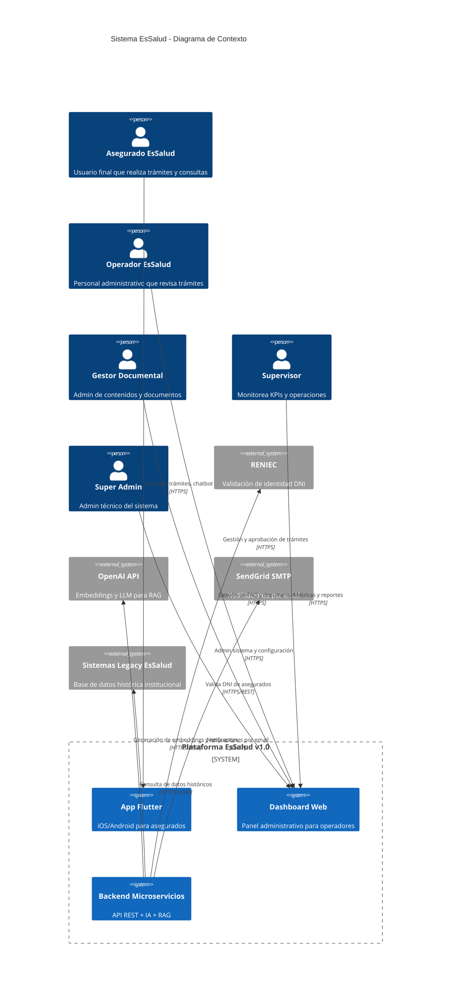
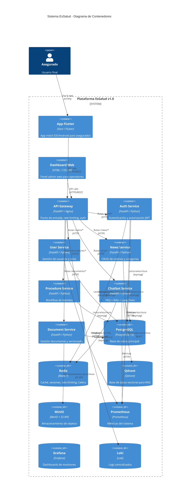

# ARQUITECTURA C4 - Plataforma EsSalud v1.0 Empresarial

## Introducción

Este documento describe la arquitectura del sistema utilizando el modelo C4 en sus 4 niveles: Contexto, Contenedores, Componentes y Código. Proporciona una visión jerárquica y progresiva de la plataforma.

---

## Nivel 1: Contexto del Sistema



### Descripción del Contexto

| Actor | Rol | Interacción |
|-------|-----|-------------|
| **Asegurado** | Usuario final (afiliado EsSalud) | App móvil para trámites, consultas y chatbot |
| **Operador** | Personal administrativo EsSalud | Dashboard para aprobar/rechazar trámites |
| **Gestor Documental** | Admin de contenidos | Gestión de FAQ, documentos y fuentes RAG |
| **Supervisor** | Monitoreo de operaciones | KPIs, reportes, asignación de tareas |
| **Super Admin** | Administración técnica | Configuración del sistema, usuarios, roles |

### Sistemas Externos

| Sistema | Propósito | Formato de Datos |
|---------|-----------|-----------------|
| **RENIEC** | Validación de DNI y datos personales | JSON via REST |
| **OpenAI** | Embeddings (text-embedding-3-small) + Chat (gpt-4o-mini) | JSON via REST |
| **SendGrid** | Envío de emails transaccionales | SMTP + API |
| **Legacy EsSalud** | Datos históricos de asegurados y trámites | XML/SOAP via bridge |

---

## Nivel 2: Diagrama de Contenedores



### Tecnologías por Contenedor

| Contenedor | Tecnología | Puerto | Lenguaje/Framework |
|------------|-----------|--------|-------------------|
| App Flutter | Flutter 3.x | - | Dart + Riverpod + GoRouter |
| API Gateway | Nginx 1.25 + FastAPI | 80/443 | Python + Uvicorn |
| Auth Service | FastAPI | 8001 | Python + PyJWT + passlib |
| User Service | FastAPI | 8002 | Python |
| News Service | FastAPI | 8003 | Python |
| Procedure Service | FastAPI | 8004 | Python |
| Chatbot Service | FastAPI | 8005 | Python + LangChain |
| Document Service | FastAPI | 8006 | Python + PyMuPDF + Tesseract |
| PostgreSQL | PostgreSQL 15 | 5432 | SQL |
| Redis | Redis 7 | 6379 | - |
| Qdrant | Qdrant 1.7 | 6333 | Rust |
| MinIO | MinIO 2024 | 9000 | Go |

---

## Nivel 3: Componentes

### 3.1 Auth Service — Componentes Internos

```
┌─────────────────────────────────────────────────────┐
│                  Auth Service                        │
│                                                      │
│  ┌──────────┐  ┌───────────┐  ┌─────────────────┐  │
│  │ Auth     │  │ Token     │  │ Rate Limiter    │  │
│  │ Router   │──│ Service   │  │ Middleware       │  │
│  └──────────┘  └───────────┘  └─────────────────┘  │
│       │              │                │              │
│  ┌────▼────┐   ┌────▼────┐      ┌─────▼─────┐      │
│  │ Auth    │   │ JWT     │      │ Redis      │      │
│  │ UseCase │   │ Manager │      │ Client     │      │
│  └────▲────┘   └────▲────┘      └─────▲─────┘      │
│       │              │                │              │
│  ┌────▼──────────┐   │                │              │
│  │ User          │   └────────────────┘              │
│  │ Repository    │                                   │
│  └────▲──────────┘                                   │
│       │                                              │
│  ┌────▼──────────┐                                   │
│  │ PostgreSQL    │                                   │
│  │ (asyncpg)     │                                   │
│  └───────────────┘                                   │
└─────────────────────────────────────────────────────┘
```

#### Auth Router
- `POST /auth/register` — Registro de nuevo usuario
- `POST /auth/login` — Login con credenciales
- `POST /auth/refresh` — Renovación de token
- `POST /auth/logout` — Cierre de sesión
- `POST /auth/forgot-password` — Solicitud de recuperación
- `POST /auth/reset-password` — Restablecimiento de contraseña

#### Token Service
- Generación de JWT (algoritmo RS256)
- Validación de tokens (expiración, firma, claims)
- Rotación de refresh tokens
- Blacklist de tokens invalidados (Redis)

#### JWT Manager
- Clave privada/pública para firma
- Claims estándar: sub, role, exp, iat, jti
- Claims custom: dni, email, permissions

### 3.2 Chatbot Service — Componentes Internos

```
┌─────────────────────────────────────────────────────────────┐
│                    Chatbot Service                            │
│                                                               │
│  ┌──────────┐  ┌──────────────┐  ┌──────────────────────┐   │
│  │ Chat     │  │ RAG Engine   │  │ FAQ Engine           │   │
│  │ Router   │──│ (LangChain)  │  │ (Semantic Match)     │   │
│  └──────────┘  └──────┬───────┘  └──────────┬───────────┘   │
│       │                │                      │               │
│  ┌────▼────┐    ┌──────▼───────┐      ┌──────▼────────┐    │
│  │ Chat    │    │ Embedding    │      │ FAQ Repository │    │
│  │ UseCase │    │ Service      │      │ (Redis + PG)   │    │
│  └────▲────┘    └──────┬───────┘      └──────▲─────────┘    │
│       │                │                      │               │
│  ┌────▼───┐      ┌─────▼──────┐              │               │
│  │ Chat   │      │ Qdrant     │              │               │
│  │ Repo   │      │ Client     │              │               │
│  └────▲───┘      └─────▲──────┘              │               │
│       │                │                      │               │
│  ┌────▼───┐      ┌─────┴──────┐              │               │
│  │ PG     │      │ OpenAI     │              │               │
│  │ (chat) │      │ Client     │              │               │
│  └────────┘      └────────────┘              │               │
└──────────────────────────────────────────────┘               │
```

#### Chat Router
- `POST /chat/message` — Envío de mensaje (FAQ o RAG)
- `GET /chat/history/{session_id}` — Historial de conversación
- `DELETE /chat/session/{session_id}` — Eliminar sesión
- `POST /chat/feedback` — Feedback sobre respuesta

#### RAG Engine (LangChain)
1. Recibe pregunta del usuario
2. Genera embedding con OpenAI text-embedding-3-small
3. Busca en Qdrant top-5 chunks relevantes (threshold 0.75)
4. Construye prompt con contexto + pregunta
5. Llama a OpenAI Chat (gpt-4o-mini) con el prompt
6. Procesa respuesta extrayendo citas de fuentes
7. Devuelve respuesta formateada con fuentes

#### FAQ Engine
1. Recibe pregunta del usuario
2. Genera embedding de la pregunta
3. Busca en Redis/cache de FAQ (usando embedding de pregunta)
4. Si match > 0.85, devuelve respuesta directa de FAQ
5. Si no hay match, deriva a RAG Engine
6. Si RAG confidence < 0.6, sugiere escalar a operador humano

### 3.3 Procedure Service — Componentes Internos

```
┌─────────────────────────────────────────────┐
│           Procedure Service                    │
│                                                │
│  ┌──────────┐  ┌────────────┐  ┌──────────┐  │
│  │ Procedure│  │ Workflow   │  │ Procedure│  │
│  │ Router   │──│ Engine     │──│ Validator │  │
│  └──────────┘  └─────┬──────┘  └──────────┘  │
│       │              │                         │
│  ┌────▼────┐   ┌─────▼──────┐                  │
│  │ Proc    │   │ Event      │                  │
│  │ UseCase │   │ Publisher  │                  │
│  └────▲────┘   └─────┬──────┘                  │
│       │              │                         │
│  ┌────▼───┐    ┌─────▼──────┐                  │
│  │ Proc   │    │ RabbitMQ   │                  │
│  │ Repo   │    │ (notific.) │                  │
│  └────▲───┘    └────────────┘                  │
│       │                                         │
│  ┌────▼───┐                                    │
│  │ PG     │                                    │
│  │ (proc) │                                    │
│  └────────┘                                    │
└─────────────────────────────────────────────────┘
```

---

## Nivel 4: Código (Clases/Módulos Principales)

### 4.1 Auth Service — Clases Principales

```python
# models/user.py
class User(BaseModel):
    id: int
    dni: str          # 8 dígitos
    email: str
    phone: str
    full_name: str
    password_hash: str  # bcrypt
    role: UserRole
    is_active: bool
    email_verified: bool
    created_at: datetime
    updated_at: datetime

# models/token.py
class TokenPayload(BaseModel):
    sub: str          # user_id
    role: str
    dni: str
    exp: datetime
    iat: datetime
    jti: str          # UUID único

# services/auth_service.py
class AuthService:
    async def register(user_data: RegisterDTO) -> User
    async def login(email: str, password: str) -> TokenResponse
    async def refresh(refresh_token: str) -> TokenResponse
    async def logout(access_token: str) -> None
    async def forgot_password(email: str) -> None
    async def reset_password(token: str, new_password: str) -> None
    async def verify_email(token: str) -> bool

# services/token_service.py
class TokenService:
    def create_access_token(user: User) -> str
    def create_refresh_token(user: User) -> str
    def validate_access_token(token: str) -> TokenPayload
    def revoke_token(jti: str) -> None
    def is_token_revoked(jti: str) -> bool

# repositories/user_repository.py
class UserRepository:
    async def find_by_id(id: int) -> User | None
    async def find_by_email(email: str) -> User | None
    async def find_by_dni(dni: str) -> User | None
    async def create(user: User) -> User
    async def update(user: User) -> User
    async def update_password(id: int, hash: str) -> None
```

### 4.2 Chatbot Service — Clases Principales

```python
# models/chat.py
class ChatMessage(BaseModel):
    id: int
    session_id: int
    user_id: int
    role: MessageRole  # user | assistant | system
    content: str
    sources: list[SourceCitation]
    confidence: float
    created_at: datetime

class SourceCitation(BaseModel):
    document_name: str
    page_number: int
    chunk_index: int
    similarity_score: float
    snippet: str

# engine/rag_engine.py
class RAGEngine:
    def __init__(self, qdrant_client, openai_client, embedding_model)
    
    async def generate_response(question: str, session_id: int) -> ChatMessage:
        # 1. Generate embedding
        embedding = await self.embed(question)
        # 2. Retrieve relevant chunks
        chunks = await self.retrieve(embedding, top_k=5, threshold=0.75)
        # 3. Build prompt with context
        prompt = self.build_prompt(question, chunks)
        # 4. Get LLM response
        response = await self.llm_complete(prompt)
        # 5. Extract citations
        citations = self.extract_citations(response, chunks)
        # 6. Save history
        return ChatMessage(sources=citations, ...)

    async def embed(text: str) -> list[float]
    async def retrieve(vector: list[float], top_k: int, threshold: float) -> list[Chunk]
    def build_prompt(question: str, chunks: list[Chunk]) -> str
    async def llm_complete(prompt: str) -> LLMResponse
    def extract_citations(response: LLMResponse, chunks: list[Chunk]) -> list[SourceCitation]
    def fallback_to_operator(question: str) -> ChatMessage

# engine/faq_engine.py
class FAQEngine:
    def __init__(self, redis_client, openai_client)
    
    async def find_answer(question: str) -> FAQMatch | None:
        embedding = await self.embed(question)
        return await self.search_faq(embedding)

    async def search_faq(embedding: list[float]) -> FAQMatch | None:
        # Search Redis vector similarity
        # Return match if similarity > 0.85

# services/chat_service.py
class ChatService:
    def __init__(self, rag_engine, faq_engine, chat_repo)
    
    async def process_message(user_id: int, question: str, session_id: int) -> ChatMessage:
        # 1. Try FAQ first
        faq = await self.faq_engine.find_answer(question)
        if faq:
            return ChatMessage(content=faq.answer, confidence=1.0)
        # 2. Fallback to RAG
        response = await self.rag_engine.generate_response(question, session_id)
        # 3. If low confidence, suggest escalation
        if response.confidence < 0.6:
            response.suggest_escalation = True
        return response
```

### 4.3 Procedure Service — Clases Principales

```python
# models/procedure.py
class Procedure(BaseModel):
    id: int
    user_id: int
    procedure_type_id: int
    status: ProcedureStatus  # BORRADOR, PENDIENTE, EN_REVISION, APROBADO, RECHAZADO, SUBSANACION, CANCELADO
    current_assignee_id: int | None
    created_at: datetime
    updated_at: datetime
    completed_at: datetime | None

# services/procedure_service.py
class ProcedureService:
    async def create(user_id: int, type_id: int, data: dict) -> Procedure
    async def get_by_id(procedure_id: int) -> Procedure
    async def list_by_user(user_id: int, page: int, size: int) -> Page[Procedure]
    async def list_all(filters: ProcedureFilters, page: int, size: int) -> Page[Procedure]
    async def update_status(procedure_id: int, new_status: ProcedureStatus, comment: str, user_id: int) -> Procedure
    async def assign(procedure_id: int, operator_id: int) -> Procedure
    async def request_subsanacion(procedure_id: int, comment: str) -> Procedure
    async def cancel(procedure_id: int, reason: str) -> Procedure

# services/workflow_engine.py
class WorkflowEngine:
    def __init__(self)
    
    VALID_TRANSITIONS = {
        ProcedureStatus.BORRADOR: [ProcedureStatus.PENDIENTE],
        ProcedureStatus.PENDIENTE: [ProcedureStatus.EN_REVISION],
        ProcedureStatus.EN_REVISION: [ProcedureStatus.APROBADO, ProcedureStatus.RECHAZADO, ProcedureStatus.SUBSANACION],
        ProcedureStatus.RECHAZADO: [ProcedureStatus.SUBSANACION],
        ProcedureStatus.SUBSANACION: [ProcedureStatus.EN_REVISION, ProcedureStatus.CANCELADO],
    }
    
    def can_transition(from_status: ProcedureStatus, to_status: ProcedureStatus) -> bool
    def get_allowed_next_states(current: ProcedureStatus) -> list[ProcedureStatus]
    async def execute_transition(procedure: Procedure, to_status: ProcedureStatus, user: User) -> Procedure
```

---

## 5. Tabla de Decisiones Tecnológicas

| Componente | Elegido | Alternativas | Razón de Elección |
|------------|---------|--------------|-------------------|
| Backend Framework | FastAPI | Spring Boot, NestJS, Django REST | Rendimiento async, tipado, docs automáticas, ecosistema Python |
| Frontend Mobile | Flutter | React Native, Kotlin Multiplatform | Single codebase, rendimiento, madurez, hot reload |
| State Management | Riverpod | Bloc, Provider, GetX | Testabilidad, DI nativa, sin context-dependency |
| ORM | SQLAlchemy async | Django ORM, Prisma | Async nativo, madurez, migraciones Alembic |
| Cache | Redis | Memcached | Versatilidad, pub/sub, colas, tipos de datos |
| Vector DB | Qdrant | Pinecone, Weaviate, pgvector | Self-hosted, rendimiento, Docker, payload filtering |
| Object Storage | MinIO | AWS S3, GCS | Self-hosted, API S3, datos sensibles en Perú |
| LLM | OpenAI gpt-4o-mini | Claude, Gemini, Ollama | Calidad/precio, baja latencia, ecosistema |
| Embeddings | OpenAI text-embedding-3-small | BGE, all-MiniLM (local) | Calidad de embeddings, bajo costo, facilidad |
| Monitoring | Prometheus + Grafana | Datadog, New Relic | Open source, self-hosted, flexible |
| Logs | Loki | ELK Stack, Datadog | Integración Grafana, bajo costo operativo |
| CI/CD | GitHub Actions | Jenkins, GitLab CI | Integración nativa con GitHub, ecosistema actions |
| Container Runtime | Docker Compose | Kubernetes, Nomad | Simplicidad para v1.0, migración a K8s planeada |

---

## 6. Referencias Cruzadas

| Archivo | Relación |
|---------|----------|
| [[03_DESIGN_DETALLADO.md]] | Decisiones arquitectónicas (ADR) detalladas |
| [[05_MICROSERVICIOS.md]] | Especificación de cada microservicio |
| [[06_MODELO_ER.md]] | Modelo de datos completo |
| [[17_DOCKER_COMPOSE.md]] | Infraestructura y deployment |
| [[11_RAG_QDRANT.md]] | Sistema RAG detallado |

---

#c4 #arquitectura #essalud #v1.0 #contexto #contenedores #componentes
