# MODELO ENTIDAD-RELACIÓN - EsSalud v1.0 Empresarial

## 1. Diagrama ER General

```mermaid
erDiagram
    %% Dominio Usuarios e Identidad
    users ||--o{ user_roles : has
    roles ||--o{ user_roles : has
    roles ||--o{ role_permissions : has
    permissions ||--o{ role_permissions : has
    users ||--o{ refresh_tokens : has
    users ||--o{ audit_log : generates
    users ||--o{ sessions : has

    %% Dominio Trámites
    users ||--o{ procedures : creates
    procedure_types ||--o{ procedures : classifies
    procedure_statuses ||--o{ procedures : has
    procedures ||--o{ procedure_documents : has
    documents ||--o{ procedure_documents : used_in
    procedures ||--o{ procedure_history : tracks
    procedures ||--o{ procedure_comments : has
    procedures ||--o{ subsanaciones : has

    %% Dominio Documentos
    documents ||--o{ document_versions : versions
    documents }o--|| document_categories : categorized
    documents ||--o{ document_tags : tagged
    tags ||--o{ document_tags : tagged
    documents ||--o{ document_embeddings : embedded

    %% Dominio Chatbot e IA
    users ||--o{ chat_sessions : starts
    chat_sessions ||--o{ chat_messages : contains
    faq_categories ||--o{ faq : groups
    faq ||--o{ faq : parent_faq

    %% Dominio Noticias
    news_categories ||--o{ news : groups
    news ||--o{ news_tags : tagged
    tags ||--o{ news_tags : tagged

    %% Dominio Administración
    users ||--o{ notifications : receives
    notifications ||--o{ audit_events : relates
    metrics_snapshot ||--o{ audit_events : includes
```

---

## 2. Dominio Usuarios e Identidad

### 2.1 users

| Columna | Tipo | Constraints | Descripción |
|---------|------|-------------|-------------|
| id | SERIAL | PK | Identificador único del usuario |
| dni | VARCHAR(8) | UNIQUE, NOT NULL | Documento Nacional de Identidad (8 dígitos) |
| email | VARCHAR(255) | UNIQUE, NOT NULL | Correo electrónico |
| phone | VARCHAR(15) | NULL | Número de teléfono móvil |
| full_name | VARCHAR(255) | NOT NULL | Nombre completo del usuario |
| password_hash | VARCHAR(255) | NOT NULL | Hash bcrypt de la contraseña |
| is_active | BOOLEAN | DEFAULT true | Cuenta activa o desactivada |
| email_verified | BOOLEAN | DEFAULT false | Correo verificado |
| email_verified_at | TIMESTAMP | NULL | Fecha de verificación de email |
| password_changed_at | TIMESTAMP | NULL | Último cambio de contraseña |
| failed_login_attempts | INTEGER | DEFAULT 0 | Intentos fallidos de login |
| locked_until | TIMESTAMP | NULL | Bloqueo temporal hasta |
| last_login_at | TIMESTAMP | NULL | Último inicio de sesión |
| last_login_ip | VARCHAR(45) | NULL | IP del último login |
| created_at | TIMESTAMP | DEFAULT NOW() | Fecha de creación |
| updated_at | TIMESTAMP | DEFAULT NOW() | Fecha de última actualización |

**FKs:** Ninguna
**Índices:** `(email)`, `(dni)`, `(email, is_active)`

### 2.2 roles

| Columna | Tipo | Constraints | Descripción |
|---------|------|-------------|-------------|
| id | SERIAL | PK | Identificador único del rol |
| code | VARCHAR(20) | UNIQUE, NOT NULL | Código del rol (ASEG, OPER, GESDOC, SUPV, SADM) |
| name | VARCHAR(100) | NOT NULL | Nombre descriptivo del rol |
| description | TEXT | NULL | Descripción del rol |
| hierarchy_level | INTEGER | NOT NULL | Nivel jerárquico (1=mínimo, 5=máximo) |
| is_active | BOOLEAN | DEFAULT true | Rol activo |
| created_at | TIMESTAMP | DEFAULT NOW() | Fecha de creación |

**Índices:** `(code)`

### 2.3 permissions

| Columna | Tipo | Constraints | Descripción |
|---------|------|-------------|-------------|
| id | SERIAL | PK | Identificador único del permiso |
| resource | VARCHAR(50) | NOT NULL | Recurso al que aplica (user, procedure, document, etc.) |
| action | VARCHAR(20) | NOT NULL | Acción (CREATE, READ, UPDATE, DELETE, APPROVE, REJECT) |
| description | TEXT | NULL | Descripción del permiso |
| created_at | TIMESTAMP | DEFAULT NOW() | Fecha de creación |

**Índices:** `(resource, action)` UNIQUE

### 2.4 role_permissions

| Columna | Tipo | Constraints | Descripción |
|---------|------|-------------|-------------|
| id | SERIAL | PK | Identificador único |
| role_id | INTEGER | FK -> roles.id, NOT NULL | Rol asociado |
| permission_id | INTEGER | FK -> permissions.id, NOT NULL | Permiso asociado |
| granted | BOOLEAN | DEFAULT true | Concedido o denegado |
| created_at | TIMESTAMP | DEFAULT NOW() | Fecha de asignación |

**FKs:** `role_id` -> `roles(id)`, `permission_id` -> `permissions(id)`
**Índices:** `(role_id, permission_id)` UNIQUE

### 2.5 user_roles

| Columna | Tipo | Constraints | Descripción |
|---------|------|-------------|-------------|
| id | SERIAL | PK | Identificador único |
| user_id | INTEGER | FK -> users.id, NOT NULL | Usuario asociado |
| role_id | INTEGER | FK -> roles.id, NOT NULL | Rol asignado |
| assigned_by | INTEGER | FK -> users.id, NULL | Quién asignó el rol |
| assigned_at | TIMESTAMP | DEFAULT NOW() | Fecha de asignación |

**FKs:** `user_id` -> `users(id)`, `role_id` -> `roles(id)`, `assigned_by` -> `users(id)`
**Índices:** `(user_id, role_id)` UNIQUE

### 2.6 refresh_tokens

| Columna | Tipo | Constraints | Descripción |
|---------|------|-------------|-------------|
| id | SERIAL | PK | Identificador único |
| user_id | INTEGER | FK -> users.id, NOT NULL | Propietario del token |
| token_hash | VARCHAR(255) | UNIQUE, NOT NULL | Hash SHA-256 del token |
| expires_at | TIMESTAMP | NOT NULL | Fecha de expiración |
| is_revoked | BOOLEAN | DEFAULT false | Token revocado |
| revoked_at | TIMESTAMP | NULL | Fecha de revocación |
| created_at | TIMESTAMP | DEFAULT NOW() | Fecha de creación |
| user_agent | VARCHAR(255) | NULL | User-Agent del cliente |
| ip_address | VARCHAR(45) | NULL | Dirección IP |

**FKs:** `user_id` -> `users(id)`
**Índices:** `(token_hash)`, `(user_id)`

### 2.7 sessions

| Columna | Tipo | Constraints | Descripción |
|---------|------|-------------|-------------|
| id | SERIAL | PK | Identificador único |
| user_id | INTEGER | FK -> users.id, NOT NULL | Usuario de la sesión |
| token_jti | VARCHAR(36) | UNIQUE, NOT NULL | JWT ID del token |
| is_active | BOOLEAN | DEFAULT true | Sesión activa |
| last_activity | TIMESTAMP | DEFAULT NOW() | Última actividad |
| expires_at | TIMESTAMP | NOT NULL | Expiración de sesión |
| ip_address | VARCHAR(45) | NULL | IP de la sesión |
| user_agent | VARCHAR(255) | NULL | User-Agent |
| created_at | TIMESTAMP | DEFAULT NOW() | Inicio de sesión |

**FKs:** `user_id` -> `users(id)`
**Índices:** `(user_id, is_active)`, `(token_jti)`

### 2.8 audit_log

| Columna | Tipo | Constraints | Descripción |
|---------|------|-------------|-------------|
| id | BIGSERIAL | PK | Identificador único |
| user_id | INTEGER | FK -> users.id, NULL | Usuario que realizó la acción |
| action | VARCHAR(50) | NOT NULL | Tipo de acción |
| resource_type | VARCHAR(50) | NOT NULL | Tipo de recurso afectado |
| resource_id | INTEGER | NULL | ID del recurso afectado |
| details | JSONB | NULL | Detalles adicionales de la acción |
| ip_address | VARCHAR(45) | NULL | Dirección IP |
| user_agent | VARCHAR(255) | NULL | User-Agent |
| created_at | TIMESTAMP | DEFAULT NOW() | Fecha del evento |

**FKs:** `user_id` -> `users(id)`
**Índices:** `(user_id)`, `(action)`, `(resource_type, resource_id)`, `(created_at)`
**Retención:** 90 días, luego archivo a almacenamiento frío

---

## 3. Dominio Trámites

### 3.1 procedures

| Columna | Tipo | Constraints | Descripción |
|---------|------|-------------|-------------|
| id | SERIAL | PK | Identificador único del trámite |
| user_id | INTEGER | FK -> users.id, NOT NULL | Asegurado que crea el trámite |
| procedure_type_id | INTEGER | FK -> procedure_types.id, NOT NULL | Tipo de trámite |
| procedure_status_id | INTEGER | FK -> procedure_statuses.id, NOT NULL | Estado actual |
| current_assignee_id | INTEGER | FK -> users.id, NULL | Operador asignado |
| data | JSONB | NOT NULL | Datos específicos del trámite (varía por tipo) |
| idempotency_key | VARCHAR(64) | UNIQUE, NULL | Clave de idempotencia para creación |
| submitted_at | TIMESTAMP | NULL | Fecha de envío a revisión |
| completed_at | TIMESTAMP | NULL | Fecha de finalización |
| created_at | TIMESTAMP | DEFAULT NOW() | Fecha de creación |
| updated_at | TIMESTAMP | DEFAULT NOW() | Fecha de última actualización |

**FKs:** `user_id` -> `users(id)`, `procedure_type_id` -> `procedure_types(id)`, `procedure_status_id` -> `procedure_statuses(id)`, `current_assignee_id` -> `users(id)`
**Índices:** `(user_id)`, `(procedure_status_id)`, `(procedure_type_id)`, `(current_assignee_id)`, `(created_at)`

### 3.2 procedure_types

| Columna | Tipo | Constraints | Descripción |
|---------|------|-------------|-------------|
| id | SERIAL | PK | Identificador único |
| code | VARCHAR(30) | UNIQUE, NOT NULL | Código (AFILIACION_CONYUGE, LACTANCIA, MATERNIDAD, SEPELIO, etc.) |
| name | VARCHAR(255) | NOT NULL | Nombre del tipo de trámite |
| description | TEXT | NULL | Descripción detallada |
| requirements | JSONB | NULL | Lista de requisitos documentales |
| max_days_resolution | INTEGER | NOT NULL | Plazo máximo de resolución (días hábiles) |
| is_active | BOOLEAN | DEFAULT true | Tipo de trámite activo |
| created_at | TIMESTAMP | DEFAULT NOW() | Fecha de creación |

**Índices:** `(code)`

### 3.3 procedure_statuses

| Columna | Tipo | Constraints | Descripción |
|---------|------|-------------|-------------|
| id | SERIAL | PK | Identificador único |
| code | VARCHAR(30) | UNIQUE, NOT NULL | Código (BORRADOR, PENDIENTE, EN_REVISION, APROBADO, RECHAZADO, SUBSANACION, CANCELADO) |
| name | VARCHAR(100) | NOT NULL | Nombre del estado |
| description | TEXT | NULL | Descripción |
| is_terminal | BOOLEAN | DEFAULT false | Estado terminal (no puede cambiar) |
| created_at | TIMESTAMP | DEFAULT NOW() | Fecha de creación |

### 3.4 procedure_documents

| Columna | Tipo | Constraints | Descripción |
|---------|------|-------------|-------------|
| id | SERIAL | PK | Identificador único |
| procedure_id | INTEGER | FK -> procedures.id, NOT NULL | Trámite asociado |
| document_id | INTEGER | FK -> documents.id, NOT NULL | Documento asociado |
| required | BOOLEAN | DEFAULT true | Si es obligatorio para el trámite |
| created_at | TIMESTAMP | DEFAULT NOW() | Fecha de asociación |

**FKs:** `procedure_id` -> `procedures(id)`, `document_id` -> `documents(id)`
**Índices:** `(procedure_id)`

### 3.5 procedure_history

| Columna | Tipo | Constraints | Descripción |
|---------|------|-------------|-------------|
| id | BIGSERIAL | PK | Identificador único |
| procedure_id | INTEGER | FK -> procedures.id, NOT NULL | Trámite asociado |
| from_status_id | INTEGER | FK -> procedure_statuses.id, NULL | Estado anterior |
| to_status_id | INTEGER | FK -> procedure_statuses.id, NOT NULL | Nuevo estado |
| changed_by | INTEGER | FK -> users.id, NOT NULL | Usuario que realizó el cambio |
| comment | TEXT | NULL | Comentario del cambio |
| created_at | TIMESTAMP | DEFAULT NOW() | Fecha del cambio |

**FKs:** `procedure_id` -> `procedures(id)`, `from_status_id` -> `procedure_statuses(id)`, `to_status_id` -> `procedure_statuses(id)`, `changed_by` -> `users(id)`
**Índices:** `(procedure_id)`

### 3.6 procedure_comments

| Columna | Tipo | Constraints | Descripción |
|---------|------|-------------|-------------|
| id | BIGSERIAL | PK | Identificador único |
| procedure_id | INTEGER | FK -> procedures.id, NOT NULL | Trámite asociado |
| user_id | INTEGER | FK -> users.id, NOT NULL | Autor del comentario |
| comment | TEXT | NOT NULL | Contenido del comentario |
| is_internal | BOOLEAN | DEFAULT false | Solo visible para operadores |
| created_at | TIMESTAMP | DEFAULT NOW() | Fecha del comentario |

**FKs:** `procedure_id` -> `procedures(id)`, `user_id` -> `users(id)`
**Índices:** `(procedure_id)`

### 3.7 subsanaciones

| Columna | Tipo | Constraints | Descripción |
|---------|------|-------------|-------------|
| id | SERIAL | PK | Identificador único |
| procedure_id | INTEGER | FK -> procedures.id, NOT NULL | Trámite asociado |
| attempt_number | INTEGER | NOT NULL | Número de intento (1, 2, 3) |
| requested_by | INTEGER | FK -> users.id, NOT NULL | Operador que solicita |
| requested_comment | TEXT | NOT NULL | Motivo de la subsanación |
| responded_at | TIMESTAMP | NULL | Fecha de respuesta del asegurado |
| response_comment | TEXT | NULL | Comentario del asegurado |
| deadline | TIMESTAMP | NOT NULL | Plazo para subsanar (15 días desde solicitud) |
| is_fulfilled | BOOLEAN | DEFAULT false | Subsanación completada |
| created_at | TIMESTAMP | DEFAULT NOW() | Fecha de solicitud |

**FKs:** `procedure_id` -> `procedures(id)`, `requested_by` -> `users(id)`
**Índices:** `(procedure_id, attempt_number)`

---

## 4. Dominio Documentos

### 4.1 documents

| Columna | Tipo | Constraints | Descripción |
|---------|------|-------------|-------------|
| id | SERIAL | PK | Identificador único |
| user_id | INTEGER | FK -> users.id, NOT NULL | Usuario propietario |
| category_id | INTEGER | FK -> document_categories.id, NULL | Categoría del documento |
| file_name | VARCHAR(255) | NOT NULL | Nombre original del archivo |
| file_type | VARCHAR(10) | NOT NULL | Extensión (pdf, jpg, png) |
| file_size_bytes | INTEGER | NOT NULL | Tamaño en bytes |
| mime_type | VARCHAR(50) | NOT NULL | MIME type |
| storage_path | VARCHAR(512) | NOT NULL | Ruta en MinIO |
| checksum_sha256 | VARCHAR(64) | NOT NULL | Hash SHA-256 del archivo |
| status | VARCHAR(20) | NOT NULL | Estado (SUBIENDO, VALIDANDO, APROBADO, RECHAZADO, REVISION_MANUAL) |
| ocr_text | TEXT | NULL | Texto extraído vía OCR |
| ocr_confidence | REAL | NULL | Confianza del OCR (0-1) |
| page_count | INTEGER | NULL | Número de páginas |
| validation_errors | JSONB | NULL | Errores de validación |
| current_version | INTEGER | DEFAULT 1 | Versión actual |
| is_deleted | BOOLEAN | DEFAULT false | Soft delete |
| deleted_at | TIMESTAMP | NULL | Fecha de eliminación |
| created_at | TIMESTAMP | DEFAULT NOW() | Fecha de subida |
| updated_at | TIMESTAMP | DEFAULT NOW() | Fecha de actualización |

**FKs:** `user_id` -> `users(id)`, `category_id` -> `document_categories(id)`
**Índices:** `(user_id)`, `(status)`, `(file_type)`, `(checksum_sha256)`

### 4.2 document_versions

| Columna | Tipo | Constraints | Descripción |
|---------|------|-------------|-------------|
| id | SERIAL | PK | Identificador único |
| document_id | INTEGER | FK -> documents.id, NOT NULL | Documento padre |
| version_number | INTEGER | NOT NULL | Número de versión (1, 2, 3...) |
| file_name | VARCHAR(255) | NOT NULL | Nombre del archivo en esta versión |
| storage_path | VARCHAR(512) | NOT NULL | Ruta en MinIO para esta versión |
| checksum_sha256 | VARCHAR(64) | NOT NULL | Hash SHA-256 del archivo |
| file_size_bytes | INTEGER | NOT NULL | Tamaño en bytes |
| ocr_text | TEXT | NULL | Texto extraído de esta versión |
| uploaded_by | INTEGER | FK -> users.id, NOT NULL | Quién subió esta versión |
| change_notes | VARCHAR(500) | NULL | Notas del cambio |
| created_at | TIMESTAMP | DEFAULT NOW() | Fecha de la versión |

**FKs:** `document_id` -> `documents(id)`, `uploaded_by` -> `users(id)`
**Índices:** `(document_id, version_number)` UNIQUE

### 4.3 document_categories

| Columna | Tipo | Constraints | Descripción |
|---------|------|-------------|-------------|
| id | SERIAL | PK | Identificador único |
| name | VARCHAR(100) | UNIQUE, NOT NULL | Nombre de la categoría |
| description | TEXT | NULL | Descripción |
| parent_id | INTEGER | FK -> document_categories.id, NULL | Categoría padre (auto-referencia jerárquica) |
| created_at | TIMESTAMP | DEFAULT NOW() | Fecha de creación |

**Índices:** `(name)`

### 4.4 tags

| Columna | Tipo | Constraints | Descripción |
|---------|------|-------------|-------------|
| id | SERIAL | PK | Identificador único |
| name | VARCHAR(50) | UNIQUE, NOT NULL | Nombre del tag |
| created_at | TIMESTAMP | DEFAULT NOW() | Fecha de creación |

### 4.5 document_tags

| Columna | Tipo | Constraints | Descripción |
|---------|------|-------------|-------------|
| id | SERIAL | PK | Identificador único |
| document_id | INTEGER | FK -> documents.id, NOT NULL | Documento asociado |
| tag_id | INTEGER | FK -> tags.id, NOT NULL | Tag asociado |

**FKs:** `document_id` -> `documents(id)`, `tag_id` -> `tags(id)`
**Índices:** `(document_id, tag_id)` UNIQUE

### 4.6 document_embeddings

| Columna | Tipo | Constraints | Descripción |
|---------|------|-------------|-------------|
| id | BIGSERIAL | PK | Identificador único |
| document_id | INTEGER | FK -> documents.id, NOT NULL | Documento origen |
| document_version_id | INTEGER | FK -> document_versions.id, NULL | Versión del documento |
| chunk_index | INTEGER | NOT NULL | Índice del chunk dentro del documento |
| chunk_text | TEXT | NOT NULL | Texto del chunk |
| page_number | INTEGER | NULL | Página de origen |
| token_count | INTEGER | NOT NULL | Conteo de tokens del chunk |
| embedding_id | VARCHAR(64) | NULL | ID del vector en Qdrant |
| created_at | TIMESTAMP | DEFAULT NOW() | Fecha de creación |

**FKs:** `document_id` -> `documents(id)`, `document_version_id` -> `document_versions(id)`
**Índices:** `(document_id, chunk_index)` UNIQUE

---

## 5. Dominio Chatbot e IA

### 5.1 chat_sessions

| Columna | Tipo | Constraints | Descripción |
|---------|------|-------------|-------------|
| id | SERIAL | PK | Identificador único |
| user_id | INTEGER | FK -> users.id, NOT NULL | Usuario de la sesión |
| title | VARCHAR(255) | NULL | Título auto-generado de la sesión |
| is_active | BOOLEAN | DEFAULT true | Sesión activa |
| message_count | INTEGER | DEFAULT 0 | Número de mensajes |
| created_at | TIMESTAMP | DEFAULT NOW() | Inicio de sesión |
| updated_at | TIMESTAMP | DEFAULT NOW() | Último mensaje |

**FKs:** `user_id` -> `users(id)`
**Índices:** `(user_id)`, `(updated_at)`

### 5.2 chat_messages

| Columna | Tipo | Constraints | Descripción |
|---------|------|-------------|-------------|
| id | BIGSERIAL | PK | Identificador único |
| session_id | INTEGER | FK -> chat_sessions.id, NOT NULL | Sesión asociada |
| role | VARCHAR(10) | NOT NULL | user, assistant, system |
| content | TEXT | NOT NULL | Contenido del mensaje |
| message_type | VARCHAR(20) | DEFAULT 'text' | text, faq, rag, escalation |
| sources | JSONB | NULL | Citaciones de fuentes [{document_name, page, snippet}] |
| confidence | REAL | NULL | Confianza de la respuesta (0-1) |
| latency_ms | INTEGER | NULL | Tiempo de generación en ms |
| feedback_helpful | BOOLEAN | NULL | Feedback del usuario (útil/no útil) |
| feedback_comment | TEXT | NULL | Comentario de feedback |
| created_at | TIMESTAMP | DEFAULT NOW() | Fecha del mensaje |

**FKs:** `session_id` -> `chat_sessions(id)`
**Índices:** `(session_id)`, `(session_id, created_at)`

### 5.3 faq_categories

| Columna | Tipo | Constraints | Descripción |
|---------|------|-------------|-------------|
| id | SERIAL | PK | Identificador único |
| name | VARCHAR(100) | NOT NULL | Nombre de la categoría |
| description | TEXT | NULL | Descripción |
| icon | VARCHAR(50) | NULL | Icono representativo |
| sort_order | INTEGER | DEFAULT 0 | Orden de visualización |
| created_at | TIMESTAMP | DEFAULT NOW() | Fecha de creación |

### 5.4 faq

| Columna | Tipo | Constraints | Descripción |
|---------|------|-------------|-------------|
| id | SERIAL | PK | Identificador único |
| category_id | INTEGER | FK -> faq_categories.id, NULL | Categoría de la FAQ |
| question | TEXT | NOT NULL | Pregunta |
| answer | TEXT | NOT NULL | Respuesta oficial |
| keywords | TEXT[] | NULL | Palabras clave para matching |
| embedding | vector(1536) | NULL | Embedding de la pregunta + respuesta |
| source_document | VARCHAR(255) | NULL | Documento de referencia oficial |
| is_active | BOOLEAN | DEFAULT true | FAQ activa |
| view_count | INTEGER | DEFAULT 0 | Contador de consultas |
| helpful_count | INTEGER | DEFAULT 0 | Votos útiles |
| not_helpful_count | INTEGER | DEFAULT 0 | Votos no útiles |
| created_at | TIMESTAMP | DEFAULT NOW() | Fecha de creación |
| updated_at | TIMESTAMP | DEFAULT NOW() | Fecha de actualización |

**FKs:** `category_id` -> `faq_categories(id)`
**Índices:** `(category_id)`, `(is_active)`

### 5.5 rag_sources

| Columna | Tipo | Constraints | Descripción |
|---------|------|-------------|-------------|
| id | SERIAL | PK | Identificador único |
| document_id | INTEGER | FK -> documents.id, NOT NULL | Documento origen |
| title | VARCHAR(255) | NOT NULL | Título del documento |
| source_url | VARCHAR(512) | NULL | URL de la fuente oficial |
| category | VARCHAR(100) | NULL | Categoría temática |
| is_active | BOOLEAN | DEFAULT true | Fuente activa para RAG |
| total_chunks | INTEGER | DEFAULT 0 | Total de chunks indexados |
| last_indexed_at | TIMESTAMP | NULL | Última indexación |
| created_at | TIMESTAMP | DEFAULT NOW() | Fecha de registro |

**FKs:** `document_id` -> `documents(id)`

---

## 6. Dominio Noticias

### 6.1 news

| Columna | Tipo | Constraints | Descripción |
|---------|------|-------------|-------------|
| id | SERIAL | PK | Identificador único |
| category_id | INTEGER | FK -> news_categories.id, NULL | Categoría de la noticia |
| title | VARCHAR(255) | NOT NULL | Título de la noticia |
| summary | VARCHAR(500) | NULL | Resumen corto |
| content | TEXT | NOT NULL | Contenido completo |
| image_url | VARCHAR(512) | NULL | URL de imagen destacada |
| source_url | VARCHAR(512) | NULL | Fuente original |
| author | VARCHAR(100) | NULL | Autor de la noticia |
| is_published | BOOLEAN | DEFAULT false | Publicada o borrador |
| published_at | TIMESTAMP | NULL | Fecha de publicación |
| is_deleted | BOOLEAN | DEFAULT false | Soft delete |
| created_at | TIMESTAMP | DEFAULT NOW() | Fecha de creación |
| updated_at | TIMESTAMP | DEFAULT NOW() | Fecha de actualización |

**FKs:** `category_id` -> `news_categories(id)`
**Índices:** `(is_published, published_at)`, `(category_id)`

### 6.2 news_categories

| Columna | Tipo | Constraints | Descripción |
|---------|------|-------------|-------------|
| id | SERIAL | PK | Identificador único |
| name | VARCHAR(100) | UNIQUE, NOT NULL | Nombre de la categoría |
| description | TEXT | NULL | Descripción |
| created_at | TIMESTAMP | DEFAULT NOW() | Fecha de creación |

### 6.3 news_tags

| Columna | Tipo | Constraints | Descripción |
|---------|------|-------------|-------------|
| id | SERIAL | PK | Identificador único |
| news_id | INTEGER | FK -> news.id, NOT NULL | Noticia asociada |
| tag_id | INTEGER | FK -> tags.id, NOT NULL | Tag asociado |

**FKs:** `news_id` -> `news(id)`, `tag_id` -> `tags(id)`
**Índices:** `(news_id, tag_id)` UNIQUE

---

## 7. Dominio Administración

### 7.1 notifications

| Columna | Tipo | Constraints | Descripción |
|---------|------|-------------|-------------|
| id | BIGSERIAL | PK | Identificador único |
| user_id | INTEGER | FK -> users.id, NOT NULL | Destinatario |
| type | VARCHAR(30) | NOT NULL | Tipo (procedure_status, subsanacion, news, welcome) |
| title | VARCHAR(255) | NOT NULL | Título de la notificación |
| body | TEXT | NOT NULL | Cuerpo del mensaje |
| data | JSONB | NULL | Datos adicionales (procedure_id, document_id, etc.) |
| channel | VARCHAR(20) | NOT NULL | Canal (email, push, inapp) |
| is_read | BOOLEAN | DEFAULT false | Leída por el usuario |
| read_at | TIMESTAMP | NULL | Fecha de lectura |
| is_sent | BOOLEAN | DEFAULT false | Enviada exitosamente |
| sent_at | TIMESTAMP | NULL | Fecha de envío |
| created_at | TIMESTAMP | DEFAULT NOW() | Fecha de creación |

**FKs:** `user_id` -> `users(id)`
**Índices:** `(user_id, is_read)`, `(type)`, `(created_at)`

### 7.2 system_config

| Columna | Tipo | Constraints | Descripción |
|---------|------|-------------|-------------|
| id | SERIAL | PK | Identificador único |
| key | VARCHAR(100) | UNIQUE, NOT NULL | Clave de configuración |
| value | JSONB | NOT NULL | Valor (texto, número, objeto, array) |
| description | TEXT | NULL | Descripción del parámetro |
| is_public | BOOLEAN | DEFAULT false | Visible para todos o solo admin |
| updated_by | INTEGER | FK -> users.id, NULL | Último usuario que modificó |
| created_at | TIMESTAMP | DEFAULT NOW() | Fecha de creación |
| updated_at | TIMESTAMP | DEFAULT NOW() | Fecha de actualización |

**FKs:** `updated_by` -> `users(id)`
**Índices:** `(key)`

### 7.3 audit_events

| Columna | Tipo | Constraints | Descripción |
|---------|------|-------------|-------------|
| id | BIGSERIAL | PK | Identificador único |
| event_type | VARCHAR(50) | NOT NULL | Tipo de evento (system, security, business) |
| severity | VARCHAR(10) | NOT NULL | INFO, WARNING, ERROR, CRITICAL |
| source_service | VARCHAR(50) | NOT NULL | Servicio que originó el evento |
| correlation_id | VARCHAR(36) | NULL | UUID para correlacionar eventos |
| user_id | INTEGER | FK -> users.id, NULL | Usuario asociado |
| details | JSONB | NULL | Datos específicos del evento |
| ip_address | VARCHAR(45) | NULL | Dirección IP |
| created_at | TIMESTAMP | DEFAULT NOW() | Fecha del evento |

**FKs:** `user_id` -> `users(id)`
**Índices:** `(event_type)`, `(severity)`, `(source_service)`, `(created_at)`

### 7.4 metrics_snapshot

| Columna | Tipo | Constraints | Descripción |
|---------|------|-------------|-------------|
| id | BIGSERIAL | PK | Identificador único |
| snapshot_date | DATE | NOT NULL | Fecha de la métrica |
| metric_name | VARCHAR(100) | NOT NULL | Nombre de la métrica |
| metric_value | NUMERIC(15,2) | NOT NULL | Valor numérico |
| dimension | VARCHAR(50) | NULL | Dimensión (por servicio, por tipo, etc.) |
| dimension_value | VARCHAR(100) | NULL | Valor de la dimensión |
| created_at | TIMESTAMP | DEFAULT NOW() | Fecha de registro |

**Índices:** `(snapshot_date, metric_name)`, `(metric_name)`

---

## 8. Tabla Resumen

| Dominio | Tablas | Total Columnas | Total FKs |
|---------|--------|----------------|-----------|
| Usuarios e Identidad | users, roles, permissions, role_permissions, user_roles, refresh_tokens, sessions, audit_log | 8 tablas | 11 FKs |
| Trámites | procedures, procedure_types, procedure_statuses, procedure_documents, procedure_history, procedure_comments, subsanaciones | 7 tablas | 13 FKs |
| Documentos | documents, document_versions, document_categories, tags, document_tags, document_embeddings | 6 tablas | 9 FKs |
| Chatbot e IA | chat_sessions, chat_messages, faq_categories, faq, rag_sources | 5 tablas | 5 FKs |
| Noticias | news, news_categories, news_tags | 3 tablas | 3 FKs |
| Administración | notifications, system_config, audit_events, metrics_snapshot | 4 tablas | 3 FKs |
| **Total** | **33 tablas** | ~230 columnas | 44 FKs |

---

## 9. Referencias Cruzadas

| Archivo | Relación |
|---------|----------|
| [[02_SPEC_DETALLADO.md]] | Entidades del negocio |
| [[05_MICROSERVICIOS.md]] | Base de datos por servicio |
| [[07_ROLES_PERMISOS.md]] | Tabla roles y permissions |
| [[21_SEGURIDAD_AUDITORIA.md]] | Tabla audit_log en seguridad |

---

#modelo #er #base_de_datos #postgresql #essalud #v1.0
