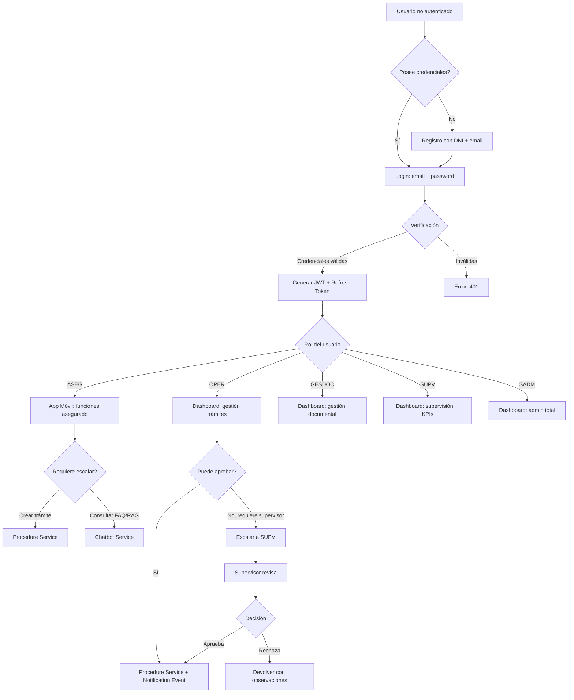

# ROLES Y PERMISOS - RBAC EsSalud v1.0 Empresarial

## 1. Descripción de Roles

### 1.1 Asegurado (ASEG)
**Código:** `ASEG` | **Nivel jerárquico:** 1

El rol base de todo usuario registrado en la plataforma. Representa al afiliado de EsSalud que utiliza la aplicación móvil para realizar consultas, trámites y gestionar su información personal.

**Casos de uso reales:**
- María, asegurada de EsSalud, descarga la app y se registra con su DNI
- Realiza una consulta al chatbot sobre los requisitos para afiliación de su cónyuge
- Inicia un trámite de lactancia y sube los documentos requeridos
- Recibe notificaciones cuando su trámite cambia de estado
- Descarga el certificado de su trámite aprobado

### 1.2 Operador (OPER)
**Código:** `OPER` | **Nivel jerárquico:** 2

Personal administrativo de EsSalud encargado de revisar, aprobar o rechazar trámites. Trabaja exclusivamente en el Dashboard Web.

**Casos de uso reales:**
- Carlos, operador de la oficina de trámites, ingresa al dashboard
- Revisa la lista de trámites pendientes asignados
- Verifica los documentos adjuntos y validaciones automáticas
- Aprueba un trámite de maternidad que cumple todos los requisitos
- Rechaza otro trámite por documentos ilegibles, registrando observaciones

### 1.3 Gestor Documental (GESDOC)
**Código:** `GESDOC` | **Nivel jerárquico:** 3

Responsable de la gestión de contenidos documentales: FAQ, documentos oficiales para RAG, categorización y calidad de fuentes.

**Casos de uso reales:**
- Ana, gestora documental, carga nuevos PDFs oficiales de EsSalud al sistema
- Revisa y categoriza documentos antes de indexarlos en Qdrant
- Crea y actualiza preguntas frecuentes del chatbot
- Monitorea la calidad de las respuestas del RAG

### 1.4 Supervisor (SUPV)
**Código:** `SUPV` | **Nivel jerárquico:** 4

Supervisa las operaciones del sistema, accede a métricas y KPIs, asigna tareas a operadores y revisa logs de auditoría.

**Casos de uso reales:**
- Roberto, jefe de la unidad de trámites, revisa el dashboard de KPIs
- Detecta que hay 15 trámites sin asignar hace más de 3 días
- Asigna los trámites a operadores disponibles
- Exporta un reporte mensual de productividad del equipo

### 1.5 Super Admin (SADM)
**Código:** `SADM` | **Nivel jerárquico:** 5

Administrador técnico del sistema con control total sobre configuración, usuarios, roles y acceso completo a todos los módulos.

**Casos de uso reales:**
- Luis, administrador del sistema, crea cuentas para nuevos operadores
- Configura parámetros globales (tiempos de expiración, umbrales)
- Revisa logs de auditoría ante un incidente de seguridad
- Gestiona la configuración de las APIs externas (OpenAI, RENIEC)

---

## 2. Tabla de Permisos Granulares

### 2.1 Recursos y Acciones

| Recurso | CREATE | READ | UPDATE | DELETE | APPROVE | REJECT | ASSIGN |
|---------|:------:|:----:|:------:|:------:|:-------:|:------:|:------:|
| **user** | ✅ | ✅ | ✅ | ✅ | - | - | - |
| **role** | ✅ | ✅ | ✅ | ✅ | - | - | - |
| **permission** | ✅ | ✅ | ✅ | ✅ | - | - | - |
| **procedure** | ✅ | ✅ | ✅ | ✅ | ✅ | ✅ | ✅ |
| **procedure_type** | ✅ | ✅ | ✅ | ✅ | - | - | - |
| **document** | ✅ | ✅ | ✅ | ✅ | ✅ | ✅ | - |
| **document_category** | ✅ | ✅ | ✅ | ✅ | - | - | - |
| **faq** | ✅ | ✅ | ✅ | ✅ | - | - | - |
| **faq_category** | ✅ | ✅ | ✅ | ✅ | - | - | - |
| **news** | ✅ | ✅ | ✅ | ✅ | - | - | - |
| **news_category** | ✅ | ✅ | ✅ | ✅ | - | - | - |
| **chat_session** | - | ✅ | - | ✅ | - | - | - |
| **chat_message** | - | ✅ | - | - | - | - | - |
| **notification** | - | ✅ | - | - | - | - | - |
| **system_config** | - | ✅ | ✅ | - | - | - | - |
| **audit_log** | - | ✅ | - | - | - | - | - |
| **metrics** | - | ✅ | - | - | - | - | - |
| **rag_source** | ✅ | ✅ | ✅ | ✅ | ✅ | - | - |
| **tag** | ✅ | ✅ | ✅ | ✅ | - | - | - |

---

## 3. Matriz RBAC Completa

| Permiso | ASEG | OPER | GESDOC | SUPV | SADM |
|---------|:----:|:----:|:------:|:----:|:----:|
| **user:CREATE** | ❌ | ❌ | ❌ | ❌ | ✅ |
| **user:READ** | ✅ (propio) | ✅ | ✅ | ✅ | ✅ (todos) |
| **user:UPDATE** | ✅ (propio) | ❌ | ❌ | ❌ | ✅ (todos) |
| **user:DELETE** | ❌ | ❌ | ❌ | ❌ | ✅ (soft) |
| **role:CREATE** | ❌ | ❌ | ❌ | ❌ | ✅ |
| **role:READ** | ❌ | ❌ | ❌ | ✅ | ✅ |
| **role:UPDATE** | ❌ | ❌ | ❌ | ❌ | ✅ |
| **role:DELETE** | ❌ | ❌ | ❌ | ❌ | ✅ |
| **procedure:CREATE** | ✅ | ❌ | ❌ | ❌ | ✅ |
| **procedure:READ** | ✅ (propio) | ✅ (asignados) | ❌ | ✅ (todos) | ✅ (todos) |
| **procedure:UPDATE** | ✅ (borrador) | ✅ | ❌ | ❌ | ✅ |
| **procedure:DELETE** | ❌ | ❌ | ❌ | ❌ | ✅ |
| **procedure:APPROVE** | ❌ | ✅ | ❌ | ❌ | ✅ |
| **procedure:REJECT** | ❌ | ✅ | ❌ | ❌ | ✅ |
| **procedure:ASSIGN** | ❌ | ❌ | ❌ | ✅ | ✅ |
| **document:CREATE** | ✅ | ✅ | ✅ | ❌ | ✅ |
| **document:READ** | ✅ (propio) | ✅ (asignados) | ✅ (todos) | ✅ (todos) | ✅ (todos) |
| **document:UPDATE** | ✅ (propio) | ❌ | ✅ | ❌ | ✅ |
| **document:DELETE** | ❌ | ❌ | ❌ | ❌ | ✅ |
| **document:APPROVE** | ❌ | ❌ | ✅ | ❌ | ✅ |
| **document:REJECT** | ❌ | ❌ | ✅ | ❌ | ✅ |
| **faq:CREATE** | ❌ | ❌ | ✅ | ❌ | ✅ |
| **faq:READ** | ✅ | ✅ | ✅ | ✅ | ✅ |
| **faq:UPDATE** | ❌ | ❌ | ✅ | ❌ | ✅ |
| **faq:DELETE** | ❌ | ❌ | ✅ | ❌ | ✅ |
| **faq_category:CREATE** | ❌ | ❌ | ✅ | ❌ | ✅ |
| **faq_category:READ** | ✅ | ✅ | ✅ | ✅ | ✅ |
| **faq_category:UPDATE** | ❌ | ❌ | ✅ | ❌ | ✅ |
| **faq_category:DELETE** | ❌ | ❌ | ✅ | ❌ | ✅ |
| **news:CREATE** | ❌ | ❌ | ❌ | ❌ | ✅ |
| **news:READ** | ✅ | ✅ | ✅ | ✅ | ✅ |
| **news:UPDATE** | ❌ | ❌ | ❌ | ❌ | ✅ |
| **news:DELETE** | ❌ | ❌ | ❌ | ❌ | ✅ |
| **chat_session:READ** | ✅ (propio) | ❌ | ❌ | ✅ | ✅ |
| **chat_session:DELETE** | ✅ (propio) | ❌ | ❌ | ✅ | ✅ |
| **notification:READ** | ✅ (propio) | ✅ (propio) | ✅ (propio) | ✅ (propio) | ✅ (propio) |
| **system_config:READ** | ❌ | ❌ | ❌ | ✅ | ✅ |
| **system_config:UPDATE** | ❌ | ❌ | ❌ | ❌ | ✅ |
| **audit_log:READ** | ❌ | ❌ | ❌ | ✅ (SUPV) | ✅ (todos) |
| **metrics:READ** | ❌ | ❌ | ❌ | ✅ | ✅ |
| **rag_source:CREATE** | ❌ | ❌ | ✅ | ❌ | ✅ |
| **rag_source:READ** | ❌ | ❌ | ✅ | ✅ | ✅ |
| **rag_source:UPDATE** | ❌ | ❌ | ✅ | ❌ | ✅ |
| **rag_source:DELETE** | ❌ | ❌ | ✅ | ❌ | ✅ |
| **rag_source:APPROVE** | ❌ | ❌ | ✅ | ❌ | ✅ |
| **tag:CREATE** | ❌ | ❌ | ✅ | ❌ | ✅ |
| **tag:READ** | ✅ | ✅ | ✅ | ✅ | ✅ |
| **tag:UPDATE** | ❌ | ❌ | ✅ | ❌ | ✅ |
| **tag:DELETE** | ❌ | ❌ | ✅ | ❌ | ✅ |

---

## 4. Flujo de Escalamiento de Permisos



---

## 5. Reglas de Herencia de Roles

| Regla | Descripción |
|-------|-------------|
| HR-001 | Un usuario puede tener múltiples roles simultáneamente |
| HR-002 | Los permisos se combinan (union): si un rol tiene READ y otro APPROVE, el usuario tiene ambos |
| HR-003 | Los roles de mayor nivel jerárquico heredan permisos de roles inferiores (SUPV hereda de OPER, OPER hereda de ASEG) |
| HR-004 | Los permisos denegados explícitamente (granted=false) tienen prioridad sobre los heredados |
| HR-005 | Un usuario sin roles tiene el rol ASEG por defecto al registrarse |
| HR-006 | Solo SADM puede asignar roles que no sean ASEG |
| HR-007 | El rol SADM no puede ser asignado por ningún otro SADM a sí mismo |

### Jerarquía de Permisos

```
SADM (5) ─── acceso total del sistema
  ↑
SUPV (4) ─── hereda de SUPV + OPER + ASEG, añade metrics + audit
  ↑
GESDOC (3) ─── hereda de ASEG, añade faq + document_category + rag_source
  ↑
OPER (2) ─── hereda de ASEG, añade procedure:APPROVE/REJECT
  ↑
ASEG (1) ─── permisos base
```

---

## 6. Estructura del Token JWT

### 6.1 Payload del JWT

```json
{
  "sub": "12345",
  "email": "maria@example.com",
  "dni": "12345678",
  "full_name": "Maria Perez Lopez",
  "role": "ASEG",
  "roles": ["ASEG"],
  "permissions": [
    "procedure:CREATE",
    "procedure:READ",
    "document:CREATE",
    "document:READ",
    "faq:READ",
    "news:READ"
  ],
  "is_active": true,
  "exp": 1718200000,
  "iat": 1718113600,
  "jti": "550e8400-e29b-41d4-a716-446655440000"
}
```

### 6.2 Claims por Rol

| Claim | ASEG | OPER | GESDOC | SUPV | SADM |
|-------|:----:|:----:|:------:|:----:|:----:|
| sub | ✅ | ✅ | ✅ | ✅ | ✅ |
| email | ✅ | ✅ | ✅ | ✅ | ✅ |
| dni | ✅ | ✅ | ✅ | ✅ | ✅ |
| full_name | ✅ | ✅ | ✅ | ✅ | ✅ |
| role | ✅ (ASEG) | ✅ (OPER) | ✅ (GESDOC) | ✅ (SUPV) | ✅ (SADM) |
| roles | ✅ | ✅ | ✅ | ✅ | ✅ |
| permissions | ✅ (10) | ✅ (18) | ✅ (22) | ✅ (30) | ✅ (45) |
| is_active | ✅ | ✅ | ✅ | ✅ | ✅ |
| hierarchy | 1 | 2 | 3 | 4 | 5 |

### 6.3 Validación de Token

```python
algoritmo: RS256
clave_privada: RSA 2048 bits (solo en auth-service)
clave_publica: Distribuida a otros servicios para validación
expiración_access: 24 horas
expiración_refresh: 30 días
rotación_claves: Cada 90 días con grace period de 7 días
```

---

## 7. Políticas de Contraseña y Sesión por Rol

| Política | ASEG | OPER | GESDOC | SUPV | SADM |
|----------|:----:|:----:|:------:|:----:|:----:|
| Longitud mínima | 8 | 10 | 10 | 12 | 14 |
| Requiere mayúscula | ✅ | ✅ | ✅ | ✅ | ✅ |
| Requiere número | ✅ | ✅ | ✅ | ✅ | ✅ |
| Requiere símbolo | ❌ | ✅ | ✅ | ✅ | ✅ |
| Expiración (días) | 180 | 90 | 90 | 60 | 45 |
| Historial de contraseñas | 3 | 5 | 5 | 8 | 10 |
| 2FA requerido | ❌ | ❌ | ❌ | ✅ | ✅ |
| Sesión simultánea máxima | 3 | 1 | 1 | 2 | 1 |
| Tiempo de inactividad (min) | 120 | 30 | 30 | 15 | 10 |
| Bloqueo por intentos | 5 | 5 | 5 | 3 | 3 |
| Bloqueo temporal (min) | 30 | 60 | 60 | 120 | 240 |

---

## 8. Referencias Cruzadas

| Archivo | Relación |
|---------|----------|
| [[02_SPEC_DETALLADO.md]] | Matriz funcionalidades vs roles |
| [[21_SEGURIDAD_AUDITORIA.md]] | JWT, auditoría y seguridad |
| [[05_MICROSERVICIOS.md]] | Middleware de autorización por servicio |
| [[06_MODELO_ER.md]] | Tablas roles, permissions, user_roles |

---

#roles #permisos #rbac #jwt #essalud #v1.0
