# CASOS DE USO UML - EsSalud v1.0 Empresarial

## 1. Diagrama General de Casos de Uso

```mermaid
graph TD
    subgraph "Sistema EsSalud"
        UC001[Registro de Asegurado]
        UC002[Login con JWT]
        UC013[Recuperación de Contraseña]
        UC003[Consulta Chatbot RAG]
        UC004[Crear Trámite con Documentos]
        UC005[Aprobación/Rechazo de Trámite]
        UC014[Subsanación de Trámite]
        UC006[Carga y Versionado de PDF]
        UC007[Búsqueda Semántica en Documentos]
        UC008[Generación Respuesta RAG con Citación]
        UC009[Panel de Métricas Supervisor]
        UC010[Gestión de FAQ]
        UC011[Notificación de Cambio de Estado]
        UC012[Auditoría de Acciones]
        UC015[Exportar Historial de Chat]
    end

    A[Asegurado] --> UC001
    A --> UC002
    A --> UC013
    A --> UC003
    A --> UC004
    A --> UC014
    A --> UC015
    
    O[Operador] --> UC002
    O --> UC005
    
    G[Gestor Documental] --> UC006
    G --> UC007
    G --> UC010
    
    S[Supervisor] --> UC009
    S --> UC012
    
    SA[Super Admin] --> UC011
```



---

## 2. Casos de Uso Detallados

### CU-001: Registro de Asegurado

| Campo | Valor |
|-------|-------|
| **ID** | CU-001 |
| **Nombre** | Registro de nuevo asegurado |
| **Actores** | Asegurado (no autenticado) |
| **Precondiciones** | El asegurado tiene DNI válido y email accesible |
| **Postcondiciones** | Cuenta creada, email de verificación enviado |

**Flujo Principal:**
1. El asegurado abre la app y selecciona "Registrarse"
2. El sistema solicita: DNI (8 dígitos), email, teléfono, contraseña
3. El asegurado ingresa los datos y acepta términos y condiciones
4. El sistema valida el DNI contra RENIEC
5. El sistema verifica que el email no esté registrado
6. El sistema valida la contraseña (mín 8 chars, 1 mayúscula, 1 número, 1 símbolo)
7. El sistema crea el usuario con rol ASEG
8. El sistema envía email de verificación con link (válido 24h)
9. El sistema muestra mensaje de éxito: "Verifica tu email para activar tu cuenta"

**Flujo Alternativo A1 — Error RENIEC:**
1. En paso 4, la API RENIEC no responde
2. El sistema muestra: "No pudimos validar tu DNI. Sube una foto de tu DNI para validación manual"
3. El asegurado sube foto del DNI (anverso y reverso)
4. El sistema registra el usuario con estado "pendiente_validacion"
5. Se notifica al supervisor para validación manual

**Flujo Alternativo A2 — Email ya registrado:**
1. En paso 5, el sistema encuentra email existente
2. Muestra: "Este email ya está registrado. ¿Deseas iniciar sesión?"
3. Ofrece link a pantalla de login

**Flujo de Excepción E1 — DNI inválido:**
1. En paso 2, el DNI no tiene 8 dígitos
2. El sistema muestra: "El DNI debe tener 8 dígitos"

### CU-002: Login con JWT

| Campo | Valor |
|-------|-------|
| **ID** | CU-002 |
| **Nombre** | Inicio de sesión con JWT |
| **Actores** | Asegurado, Operador, Gestor Documental, Supervisor, Super Admin |
| **Precondiciones** | El usuario tiene cuenta activa y email verificado |
| **Postcondiciones** | Token JWT generado, sesión iniciada |

**Flujo Principal:**
1. El usuario abre la app y selecciona "Iniciar sesión"
2. El sistema solicita: email y contraseña
3. El usuario ingresa sus credenciales
4. El sistema valida email y contraseña contra PostgreSQL
5. El sistema verifica que la cuenta esté activa y no bloqueada
6. El sistema genera JWT access token (24h) + refresh token (30 días)
7. El sistema registra la sesión en Redis
8. El sistema redirige al home según el rol

**Flujo Alternativo A1 — Cuenta bloqueada:**
1. En paso 5, la cuenta está bloqueada por intentos fallidos
2. El sistema muestra: "Cuenta bloqueada temporalmente. Intenta en 30 minutos"
3. Ofrece opción "Restablecer contraseña"

**Flujo Alternativo A2 — Primer login:**
1. En paso 6, si es el primer login del usuario
2. El sistema muestra tutorial de onboarding

### CU-003: Consulta Chatbot RAG

| Campo | Valor |
|-------|-------|
| **ID** | CU-003 |
| **Nombre** | Consulta al chatbot con respuesta RAG |
| **Actores** | Asegurado |
| **Precondiciones** | Usuario autenticado, documentos indexados en Qdrant |
| **Postcondiciones** | Mensaje guardado en historial, respuesta con citas |

**Flujo Principal:**
1. El asegurado abre el chat y escribe una pregunta
2. El sistema recibe la pregunta y genera embedding (OpenAI text-embedding-3-small)
3. El sistema busca en FAQ Engine (Redis): si match > 0.85, responde directamente
4. Si no hay FAQ, busca en Qdrant: top-5 chunks con similitud > 0.75
5. El sistema construye prompt con contexto (chunks) + pregunta
6. El sistema llama a OpenAI Chat (gpt-4o-mini) para generar respuesta
7. El sistema extrae citas de fuentes de los chunks recuperados
8. El sistema guarda mensaje y respuesta en chat_sessions y chat_messages
9. El sistema devuelve respuesta + fuentes citadas
10. El asegurado puede calificar la respuesta como útil/no útil

**Flujo Alternativo A1 — Baja confianza:**
1. En paso 4, la similitud máxima es < 0.75
2. El sistema responde: "No encontré información suficiente. ¿Quieres que te conecte con un operador?"
3. Si el asegurado acepta, se crea ticket de escalamiento

**Flujo Alternativo A2 — Error OpenAI:**
1. En paso 6, la API de OpenAI falla
2. El sistema responde con FAQ Engine únicamente
3. El sistema registra el error y reintenta

### CU-004: Crear Trámite con Documentos

| Campo | Valor |
|-------|-------|
| **ID** | CU-004 |
| **Nombre** | Crear nuevo trámite con documentos adjuntos |
| **Actores** | Asegurado |
| **Precondiciones** | Usuario autenticado, tipo de trámite existe |
| **Postcondiciones** | Trámite creado en estado BORRADOR (o PENDIENTE si se envía) |

**Flujo Principal:**
1. El asegurado selecciona "Nuevo trámite" desde el home
2. El sistema muestra catálogo de tipos de trámite
3. El asegurado selecciona un tipo (ej: Afiliación de Cónyuge)
4. El sistema muestra formulario dinámico con campos requeridos
5. El asegurado completa los datos del formulario
6. El sistema solicita documentos requeridos (lista según tipo)
7. El asegurado sube cada documento (cámara o galería)
8. El sistema valida cada documento: formato, tamaño, legibilidad
9. El asegurado puede guardar como borrador o enviar a revisión
10. Si envía: el sistema cambia estado a PENDIENTE y notifica a operadores
11. El sistema muestra confirmación con número de trámite

**Flujo Alternativo A1 — Documento inválido:**
1. En paso 8, un documento no pasa validación (ej: PDF corrupto)
2. El sistema muestra error específico: "El archivo no es legible. Intenta de nuevo"
3. El asegurado puede re-subir o cancelar

**Flujo Alternativo A2 — Error de red al subir:**
1. En paso 7, la subida falla por conectividad
2. Se muestra: "Error de conexión. ¿Reintentar?"
3. Tras 3 intentos, se guarda el borrador local y se sincroniza después

### CU-005: Aprobación/Rechazo de Trámite

| Campo | Valor |
|-------|-------|
| **ID** | CU-005 |
| **Nombre** | Aprobación o rechazo de trámite por operador |
| **Actores** | Operador |
| **Precondiciones** | Trámite en estado PENDIENTE o EN_REVISION, operador autenticado |
| **Postcondiciones** | Trámite en estado APROBADO o RECHAZADO (o SUBSANACION) |

**Flujo Principal:**
1. El operador ve lista de trámites pendientes
2. El operador selecciona un trámite para revisar
3. El sistema muestra: datos del trámite, documentos adjuntos, validaciones automáticas
4. El operador revisa cada documento y verifica datos
5. El operador decide: Aprobar, Rechazar (definitivo), o Solicitar subsanación
6. **Si Aprobar:** confirma → sistema cambia estado a APROBADO → notifica al asegurado
7. **Si Rechazar:** ingresa motivo obligatorio → sistema cambia a RECHAZADO → notifica
8. **Si Subsanación:** ingresa observaciones → sistema cambia a SUBSANACION → establece plazo 15 días

**Flujo Alternativo A1 — Documentos incompletos:**
1. En paso 4, faltan documentos requeridos
2. El operador selecciona "Solicitar subsanación" con observaciones específicas

### CU-006: Carga y Versionado de PDF

| Campo | Valor |
|-------|-------|
| **ID** | CU-006 |
| **Nombre** | Carga de PDF oficial con versionado |
| **Actores** | Gestor Documental |
| **Precondiciones** | Gestor autenticado, PDF listo para subir |
| **Postcondiciones** | Documento almacenado en MinIO, versión registrada |

**Flujo Principal:**
1. El gestor selecciona "Subir documento oficial"
2. El sistema solicita: archivo PDF, título, categoría, fuente
3. El gestor selecciona el archivo y completa metadatos
4. El sistema calcula checksum SHA-256 del archivo
5. Si el checksum ya existe, el sistema verifica si es nueva versión
6. Es nueva versión: se incrementa version_number, se almacena en MinIO con nuevo path
7. El sistema registra versión en document_versions
8. El sistema inicia pipeline asíncrono: validación → OCR → chunking → embedding
9. El sistema notifica al gestor cuando el procesamiento termine

**Flujo Alternativo A1 — Documento duplicado:**
1. En paso 5, el checksum coincide exactamente con documento existente
2. El sistema muestra: "Este archivo ya existe. ¿Deseas subir otra versión?"
3. El gestor puede cancelar o forzar nueva versión

### CU-007: Búsqueda Semántica en Documentos

| Campo | Valor |
|-------|-------|
| **ID** | CU-007 |
| **Nombre** | Búsqueda semántica en documentos indexados |
| **Actores** | Gestor Documental |
| **Precondiciones** | Documentos indexados en Qdrant |
| **Postcondiciones** | Resultados de búsqueda mostrados |

**Flujo Principal:**
1. El gestor ingresa texto de búsqueda en lenguaje natural
2. El sistema genera embedding de la consulta
3. El sistema busca en Qdrant: top-10 resultados, threshold 0.7
4. El sistema muestra resultados con: nombre documento, fragmento relevante, score
5. El gestor puede filtrar por categoría, fecha, tipo de documento
6. El gestor selecciona un resultado para ver el documento completo

### CU-008: Generación de Respuesta RAG con Citación

| Campo | Valor |
|-------|-------|
| **ID** | CU-008 |
| **Nombre** | Generación de respuesta RAG con citación de fuentes |
| **Actores** | Sistema (Chatbot Service) |
| **Precondiciones** | Pregunta recibida, documentos indexados, OpenAI disponible |
| **Postcondiciones** | Respuesta generada con citas de fuente |

**Flujo Principal:**
1. El sistema recibe pregunta del usuario (desde CU-003)
2. El sistema genera embedding con OpenAI text-embedding-3-small
3. El sistema recupera top-5 chunks de Qdrant con threshold 0.75
4. El sistema construye prompt del sistema:
   ```
   Eres un asistente especializado en EsSalud. Responde basándote exclusivamente
   en el contexto proporcionado. Si no encuentras la respuesta, indícalo claramente.
   Para cada afirmación, cita la fuente usando el formato: [Fuente: nombre_documento, página X]
   ```
5. El sistema construye prompt del usuario con contexto:
   ```
   Contexto:
   [chunk_1_text] (Fuente: doc_A, página 3)
   [chunk_2_text] (Fuente: doc_B, página 7)
   
   Pregunta: [pregunta_usuario]
   ```
6. El sistema llama a OpenAI Chat (gpt-4o-mini, temperatura 0.3, max_tokens 1024)
7. El sistema procesa la respuesta extrayendo las citas de fuentes
8. El sistema estructura la respuesta final con sección de fuentes

### CU-009: Panel de Métricas del Supervisor

| Campo | Valor |
|-------|-------|
| **ID** | CU-009 |
| **Nombre** | Acceso al panel de métricas del supervisor |
| **Actores** | Supervisor |
| **Precondiciones** | Supervisor autenticado |
| **Postcondiciones** | KPIs y gráficos visibles |

**Flujo Principal:**
1. El supervisor accede al dashboard
2. El sistema muestra KPIs principales:
   - Trámites creados hoy / esta semana / este mes
   - Tasa de aprobación / rechazo
   - Consultas chatbot (FAQ vs RAG)
   - Usuarios activos (última hora / 24h)
   - Tiempo promedio de resolución de trámites
3. El supervisor puede filtrar por: fecha, tipo de trámite, operador
4. El supervisor puede hacer clic en cualquier KPI para ver detalle
5. Los datos se actualizan automáticamente cada 60 segundos

### CU-010: Gestión de FAQ

| Campo | Valor |
|-------|-------|
| **ID** | CU-010 |
| **Nombre** | Gestión de preguntas frecuentes |
| **Actores** | Gestor Documental |
| **Precondiciones** | Gestor autenticado |
| **Postcondiciones** | FAQ creada/actualizada/eliminada |

**Flujo Principal:**
1. El gestor accede al módulo FAQ
2. El sistema lista FAQ existentes con búsqueda y filtros
3. El gestor selecciona "Nueva FAQ"
4. El sistema solicita: pregunta, respuesta, categoría, keywords
5. El gestor completa el formulario
6. El gestor puede previsualizar cómo se verá en el chatbot
7. El gestor guarda la FAQ
8. El sistema actualiza el cache de FAQ en Redis

### CU-011: Notificación de Cambio de Estado

| Campo | Valor |
|-------|-------|
| **ID** | CU-011 |
| **Nombre** | Notificación automática de cambio de estado |
| **Actores** | Sistema |
| **Precondiciones** | Procedimiento cambió de estado |
| **Postcondiciones** | Notificación enviada al asegurado |

**Flujo Principal:**
1. El sistema detecta cambio de estado en un trámite
2. El sistema determina el tipo de notificación según el nuevo estado
3. El sistema crea registro en tabla notifications
4. El sistema envía email al asegurado con: estado, fecha, comentario
5. Si el usuario tiene push habilitado, envía notificación push
6. El sistema marca la notificación como enviada

### CU-012: Auditoría de Acciones

| Campo | Valor |
|-------|-------|
| **ID** | CU-012 |
| **Nombre** | Revisión de auditoría de acciones |
| **Actores** | Supervisor, Super Admin |
| **Precondiciones** | Usuario autenticado con permisos audit_log |
| **Postcondiciones** | Logs de auditoría visibles |

**Flujo Principal:**
1. El usuario accede al módulo de auditoría
2. El sistema muestra tabla de eventos con columnas: fecha, usuario, acción, recurso, IP
3. El usuario puede filtrar por: fecha (rango), usuario, acción, recurso
4. El usuario selecciona un evento para ver detalle
5. El sistema muestra el JSON completo de detalles del evento

### CU-013: Recuperación de Contraseña

| Campo | Valor |
|-------|-------|
| **ID** | CU-013 |
| **Nombre** | Recuperación de contraseña olvidada |
| **Actores** | Asegurado (no autenticado) |
| **Precondiciones** | El usuario tiene email registrado |
| **Postcondiciones** | Contraseña restablecida, email de confirmación enviado |

**Flujo Principal:**
1. El usuario selecciona "Olvidé mi contraseña"
2. El sistema solicita email registrado
3. El usuario ingresa su email
4. El sistema verifica que el email exista (sin revelar si existe o no)
5. El sistema genera token de recuperación (UUID, válido 1 hora)
6. El sistema envía email con link de restablecimiento
7. El usuario hace clic en el link
8. El sistema valida el token (no expirado, no usado)
9. El sistema solicita nueva contraseña
10. El usuario ingresa y confirma nueva contraseña
11. El sistema actualiza la contraseña, invalida sesiones activas
12. El sistema muestra mensaje de éxito

### CU-014: Subsanación de Trámite

| Campo | Valor |
|-------|-------|
| **ID** | CU-014 |
| **Nombre** | Subsanación de trámite por el asegurado |
| **Actores** | Asegurado |
| **Precondiciones** | Trámite en estado SUBSANACION |
| **Postcondiciones** | Documentos actualizados, trámite en EN_REVISION |

**Flujo Principal:**
1. El asegurado recibe notificación de subsanación requerida
2. El asegurado abre el trámite desde "Mis trámites"
3. El sistema muestra documentos observados con comentarios del operador
4. El asegurado puede ver claramente qué documentos reemplazar
5. El asegurado sube los documentos corregidos
6. El sistema valida los nuevos documentos
7. El asegurado confirma la subsanación
8. El sistema cambia estado a EN_REVISION
9. El sistema notifica al operador asignado

### CU-015: Exportar Historial de Chat

| Campo | Valor |
|-------|-------|
| **ID** | CU-015 |
| **Nombre** | Exportar historial de conversación del chatbot |
| **Actores** | Asegurado |
| **Precondiciones** | Sesión de chat con mensajes existentes |
| **Postcondiciones** | PDF generado y descargado |

**Flujo Principal:**
1. El asegurado abre una sesión de chat del historial
2. El sistema muestra el historial completo de la sesión
3. El asegurado selecciona "Exportar" (icono de descarga)
4. El sistema genera PDF con: encabezado (fecha, usuario), todos los mensajes en orden cronológico, fuentes citadas
5. El sistema ofrece descargar o compartir el PDF
6. El asegurado descarga el archivo

---

## 3. Tabla Resumen de Casos de Uso

| ID | Nombre | Actor Principal | Complejidad | Prioridad |
|:--:|--------|:---------------:|:-----------:|:---------:|
| CU-001 | Registro de Asegurado | Asegurado | Alta | Alta |
| CU-002 | Login con JWT | Todos | Media | Alta |
| CU-003 | Consulta Chatbot RAG | Asegurado | Alta | Alta |
| CU-004 | Crear Trámite con Documentos | Asegurado | Alta | Alta |
| CU-005 | Aprobación/Rechazo de Trámite | Operador | Media | Alta |
| CU-006 | Carga y Versionado de PDF | Gestor Documental | Alta | Alta |
| CU-007 | Búsqueda Semántica Documentos | Gestor Documental | Media | Media |
| CU-008 | Generación Respuesta RAG | Sistema | Alta | Alta |
| CU-009 | Panel de Métricas Supervisor | Supervisor | Media | Media |
| CU-010 | Gestión de FAQ | Gestor Documental | Baja | Alta |
| CU-011 | Notificación Cambio Estado | Sistema | Baja | Alta |
| CU-012 | Auditoría de Acciones | Supervisor/SADM | Media | Media |
| CU-013 | Recuperación de Contraseña | Asegurado | Baja | Alta |
| CU-014 | Subsanación de Trámite | Asegurado | Media | Alta |
| CU-015 | Exportar Historial Chat | Asegurado | Baja | Baja |

---

## 4. Referencias Cruzadas

| Archivo | Relación |
|---------|----------|
| [[08_HISTORIAS_USUARIO.md]] | Mapeo de HUs a CU |
| [[10_DIAGRAMAS_SECUENCIA.md]] | Diagramas de secuencia UML |
| [[24_REQUISITOS_FUNCIONALES.md]] | RFs detallados |
| [[05_MICROSERVICIOS.md]] | Implementación por servicio |

---

#casos #uso #uml #essalud #v1.0
