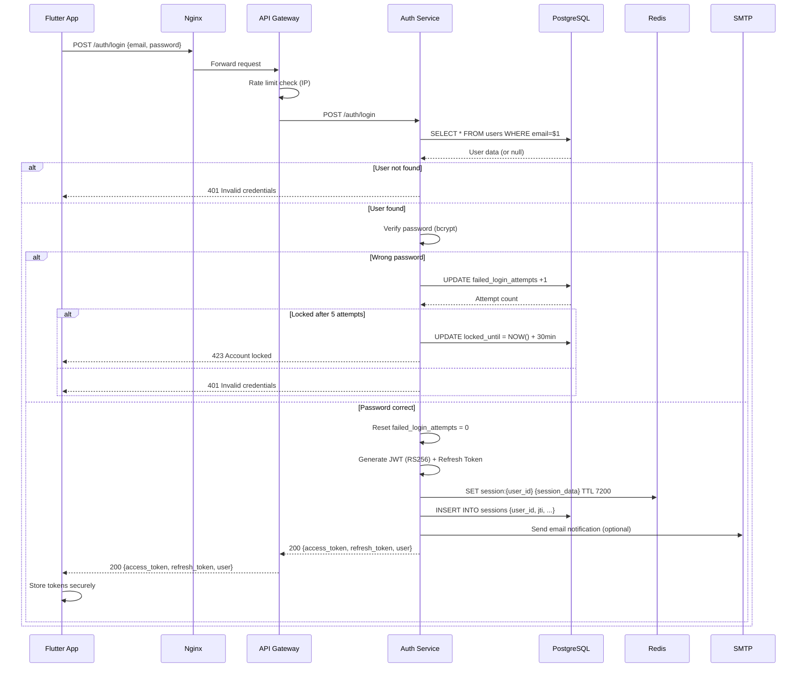
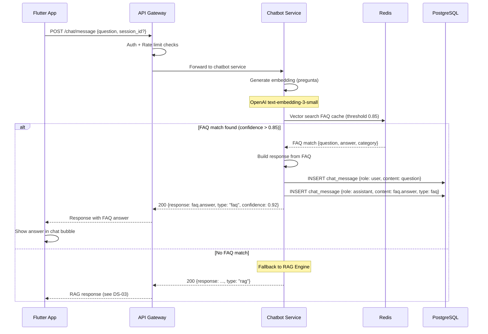
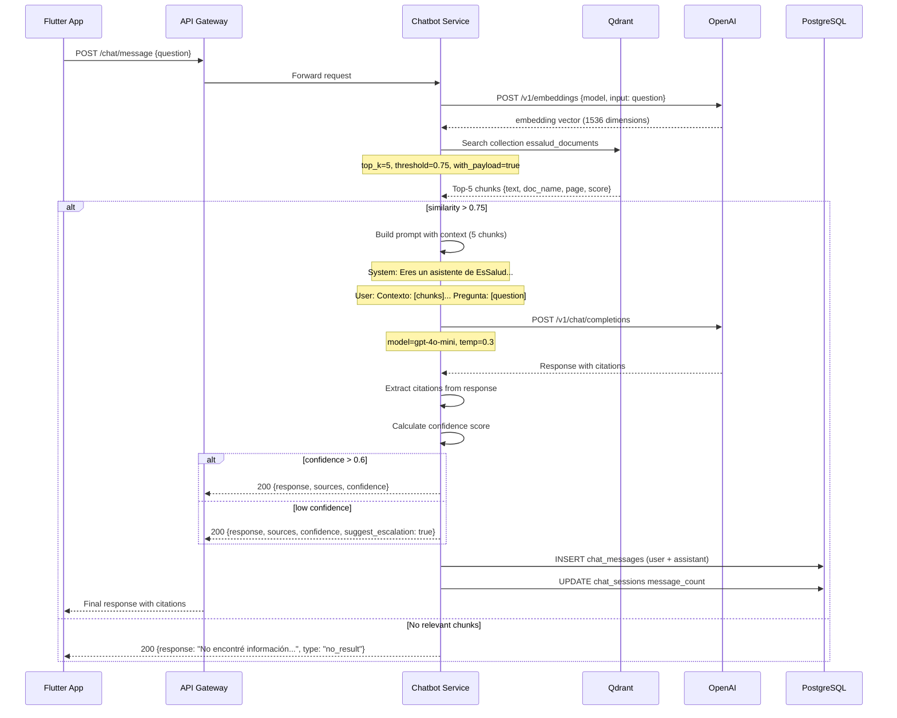
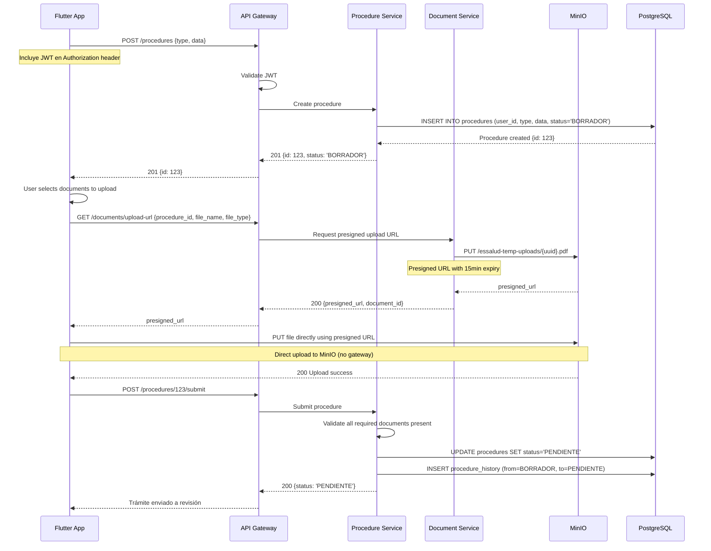
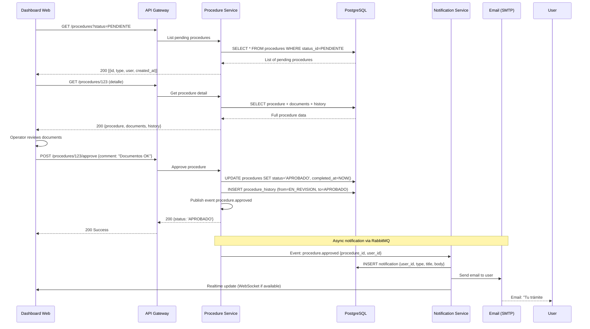
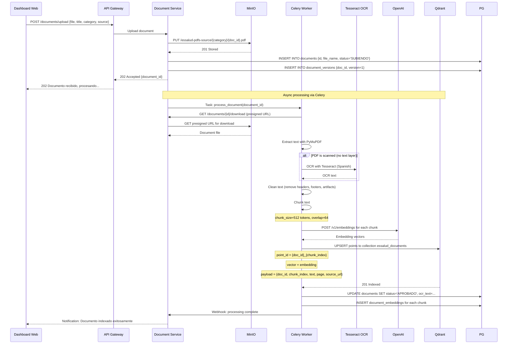
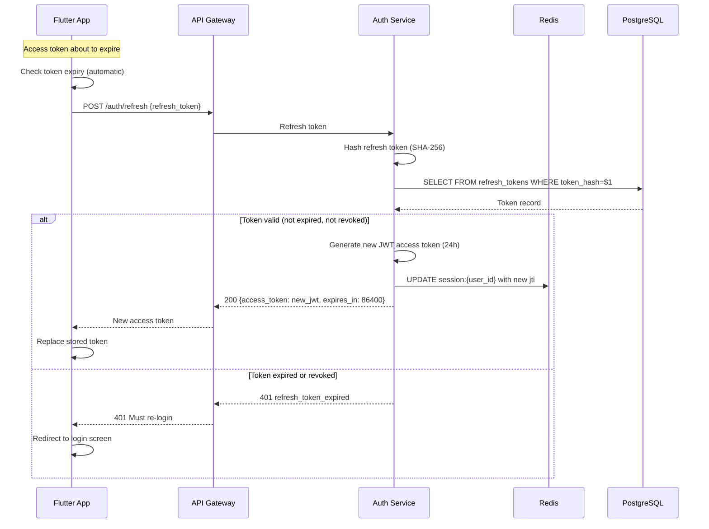
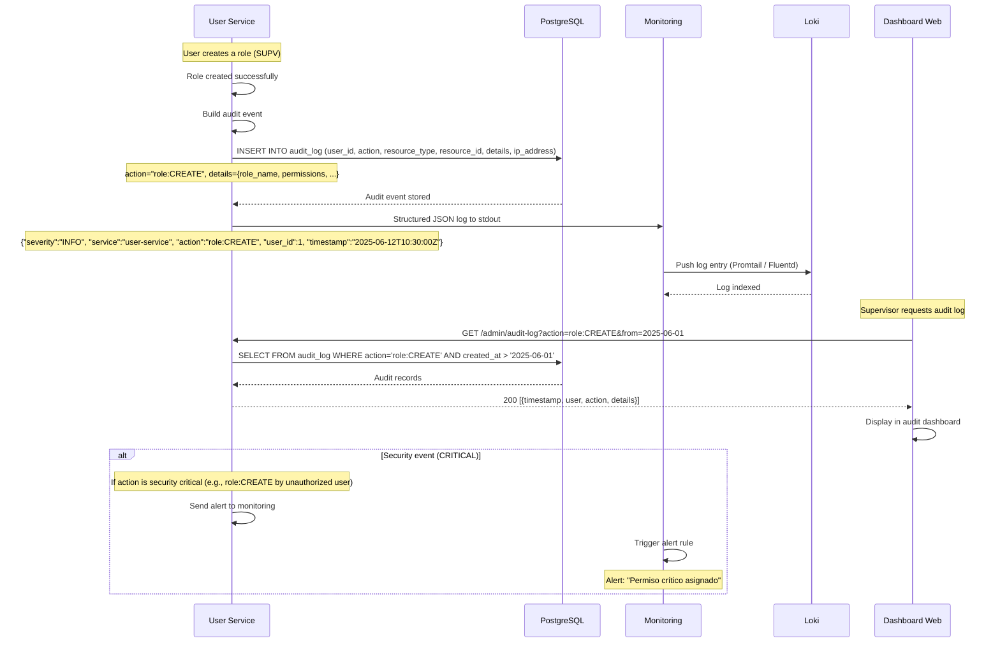

# DIAGRAMAS DE SECUENCIA - EsSalud v1.0 Empresarial

## DS-01: Login Completo

---

## DS-02: Consulta Chatbot vía FAQ

---

## DS-03: Consulta Chatbot vía RAG

---

## DS-04: Creación de Trámite + Subida de Documento a MinIO

---

## DS-05: Aprobación de Trámite por Operador + Notificación

---

## DS-06: Ingestión de PDF (Upload → Chunk → Embed → Qdrant)

---

## DS-07: Refresh Token

---

## DS-08: Flujo de Auditoría (Acción → Audit Log → Loki)

---

## 3. Tabla Resumen de Diagramas

| ID | Diagrama | Actores | Servicios Involucrados | Complejidad |
|:--:|----------|:-------:|:----------------------:|:-----------:|
| DS-01 | Login completo | FA, NG, GW, AS, PG, RE, SM | 6 servicios | Alta |
| DS-02 | Consulta FAQ | FA, GW, CS, RE, PG | 4 servicios | Media |
| DS-03 | Consulta RAG | FA, GW, CS, QD, OP, PG | 5 servicios | Alta |
| DS-04 | Creación trámite + upload | FA, GW, PS, DS, MI, PG | 5 servicios | Alta |
| DS-05 | Aprobación + notificación | DW, GW, PS, PG, NS, EM | 5 servicios | Alta |
| DS-06 | Ingestión PDF | DW, GW, DS, MI, CE, TC, OP, QD | 7 servicios | Muy Alta |
| DS-07 | Refresh token | FA, GW, AS, RE, PG | 4 servicios | Media |
| DS-08 | Auditoría | US, PG, MO, LO, DW | 4 servicios | Media |

---

## 4. Referencias Cruzadas

| Archivo | Relación |
|---------|----------|
| [[09_CASOS_USO_UML.md]] | Casos de uso correspondientes |
| [[05_MICROSERVICIOS.md]] | Servicios participantes |
| [[11_RAG_QDRANT.md]] | Detalle del pipeline RAG (DS-03) |
| [[12_INGESTION_PDFS.md]] | Pipeline de ingestión (DS-06) |
| [[21_SEGURIDAD_AUDITORIA.md]] | Auditoría (DS-08) |

---

#diagramas #secuencia #uml #essalud #v1.0
