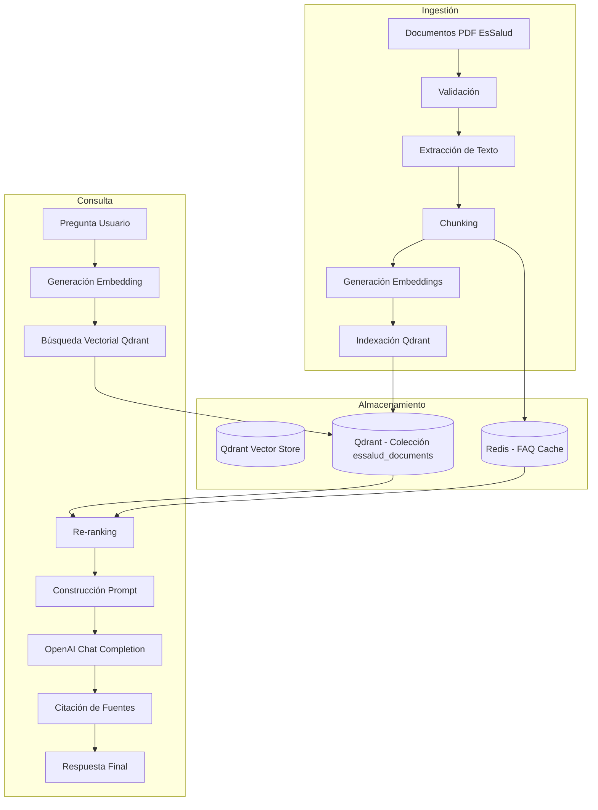

# RAG + QDRANT - Sistema de Búsqueda Semántica EsSalud v1.0

## 1. Arquitectura RAG



---

## 2. Modelo de Embedding

### 2.1 Elección: OpenAI text-embedding-3-small

| Característica | Valor |
|----------------|-------|
| **Modelo** | `text-embedding-3-small` |
| **Dimensiones** | 1536 |
| **Costo** | $0.02/1M tokens |
| **Latencia promedio** | ~200ms |
| **Rendimiento MTEB** | 62.3% |
| **Máximo tokens por input** | 8191 |

### 2.2 Comparación con Alternativas

| Modelo | Dimensiones | Costo/1M tokens | MTEB Score | Self-hosted? | Latencia |
|--------|:-----------:|:---------------:|:----------:|:------------:|:--------:|
| **text-embedding-3-small** | 1536 | $0.02 | 62.3% | No | ~200ms |
| text-embedding-3-large | 3072 | $0.13 | 64.6% | No | ~300ms |
| BAAI/bge-base-en-v1.5 | 768 | $0 (local) | ~58% | Sí | ~500ms |
| all-MiniLM-L6-v2 | 384 | $0 (local) | ~56% | Sí | ~300ms |
| Cohere embed-multilingual | 1024 | $0.10 | ~60% | No | ~250ms |

**Justificación:** text-embedding-3-small ofrece el mejor equilibrio entre calidad (62.3% MTEB), costo (el más bajo de OpenAI), dimensionalidad manejable (1536) y latencia. Para documentos en español, el modelo multilingual de OpenAI supera a los modelos open source en calidad de representación semántica.

---

## 3. Configuración de Qdrant

### 3.1 Colección Principal

```python
from qdrant_client import QdrantClient
from qdrant_client.http.models import (
    VectorParams, Distance, HnswConfigDiff,
    OptimizersConfigDiff, CollectionStatus
)

client = QdrantClient(host="qdrant", port=6333)

# Crear colección
client.recreate_collection(
    collection_name="essalud_documents",
    vectors_config=VectorParams(
        size=1536,
        distance=Distance.COSINE,
        hnsw_config=HnswConfigDiff(
            m=16,           # Número de conexiones por nodo
            ef_construct=100,  # Tamaño de la lista dinámica para construcción
            full_scan_threshold=10000
        )
    ),
    optimizers_config=OptimizersConfigDiff(
        default_segment_number=2,
        memmap_threshold=20000
    )
)
```

### 3.2 Payload Fields

| Campo | Tipo | Indexado | Descripción |
|-------|------|:--------:|-------------|
| `doc_id` | INTEGER | ✅ Keyword | ID del documento en PostgreSQL |
| `document_name` | STRING | ✅ Full-text | Nombre del documento fuente |
| `document_version` | INTEGER | ❌ | Versión del documento |
| `chunk_index` | INTEGER | ❌ | Índice del chunk (0-based) |
| `page_number` | INTEGER | ✅ Range | Página de origen en el PDF |
| `text` | STRING | ❌ | Texto del chunk (hasta 2048 chars) |
| `source_url` | STRING | ❌ | URL oficial del documento |
| `category` | STRING | ✅ Keyword | Categoría (normas, reglamentos, etc.) |
| `created_at` | DATETIME | ✅ Range | Fecha de indexación |
| `token_count` | INTEGER | ❌ | Conteo de tokens del chunk |

### 3.3 Índices Adicionales

```python
# Crear índices en payload fields
client.create_payload_index(
    collection_name="essalud_documents",
    field_name="doc_id",
    field_type=FieldType.INTEGER
)

client.create_payload_index(
    collection_name="essalud_documents",
    field_name="page_number",
    field_type=FieldType.INTEGER
)

client.create_payload_index(
    collection_name="essalud_documents",
    field_name="category",
    field_type=FieldType.KEYWORD
)

client.create_payload_index(
    collection_name="essalud_documents",
    field_name="created_at",
    field_type=FieldType.DATETIME
)
```

### 3.4 Configuración de Optimización

| Parámetro | Valor | Justificación |
|-----------|-------|---------------|
| **Optimizer: memmap_threshold** | 20000 | Usar memmap para segmentos > 20K puntos |
| **HNSW: m** | 16 | Balance entre precisión recall y memoria |
| **HNSW: ef_construct** | 100 | Calidad de construcción del grafo |
| **Distance** | Cosine | Normalizado para embeddings text-embedding-3-small |
| **WAL size limit** | 1024 MB | Prevenir crecimiento excesivo del WAL |

---

## 4. Estrategia de Chunking

### 4.1 Parámetros

| Parámetro | Valor | Justificación |
|-----------|-------|---------------|
| **Chunk size** | 512 tokens | Balance entre contexto y granularidad |
| **Overlap** | 64 tokens (12.5%) | Evitar pérdida de contexto en cortes |
| **Separadores** | ["\n\n", "\n", ".", "!", "?", ",", " "] | Priorizar cortes naturales |
| **Máximo chunks por documento** | Sin límite | Documentos variables (10-200 páginas) |

### 4.2 Pseudocódigo

```python
from langchain.text_splitter import RecursiveCharacterTextSplitter

def chunk_document(text: str, metadata: dict) -> list[dict]:
    splitter = RecursiveCharacterTextSplitter(
        chunk_size=512,
        chunk_overlap=64,
        separators=["\n\n", "\n", ".", "!", "?", ",", " "],
        length_function=num_tokens_from_string,
    )
    
    chunks = splitter.split_text(text)
    
    result = []
    for i, chunk_text in enumerate(chunks):
        result.append({
            "doc_id": metadata["doc_id"],
            "document_name": metadata["document_name"],
            "chunk_index": i,
            "page_number": estimate_page(chunk_text, text),
            "text": chunk_text,
            "source_url": metadata.get("source_url"),
            "category": metadata.get("category"),
            "token_count": num_tokens_from_string(chunk_text),
        })
    
    return result

def num_tokens_from_string(text: str) -> int:
    # Approximation: ~4 chars per token for Spanish
    return len(text) // 4
```

---

## 5. Pipeline de Recuperación

### 5.1 Similarity Search

```python
async def retrieve_chunks(
    question: str,
    top_k: int = 5,
    threshold: float = 0.75,
    category: str = None
) -> list[dict]:
    # 1. Generate embedding
    embedding = await generate_embedding(question)
    
    # 2. Build filter (optional)
    query_filter = None
    if category:
        query_filter = Filter(
            must=[FieldCondition(key="category", match=MatchValue(value=category))]
        )
    
    # 3. Search Qdrant
    search_result = client.search(
        collection_name="essalud_documents",
        query_vector=embedding,
        limit=top_k,
        query_filter=query_filter,
        score_threshold=threshold,
        with_payload=True,
    )
    
    # 4. Format results
    chunks = []
    for result in search_result:
        chunks.append({
            "doc_id": result.payload["doc_id"],
            "document_name": result.payload["document_name"],
            "page_number": result.payload["page_number"],
            "chunk_index": result.payload["chunk_index"],
            "text": result.payload["text"],
            "score": result.score,
        })
    
    return chunks
```

### 5.2 Re-ranking

```python
def rerank_chunks(
    chunks: list[dict],
    question: str,
    method: str = "cross_encoder"
) -> list[dict]:
    if method == "score_only":
        # Sort by Qdrant similarity score (already sorted)
        return chunks
    
    elif method == "cross_encoder":
        # In v2.0: Use cross-encoder for re-ranking
        # For v1.0: Use score from Qdrant + diversity penalty
        pass
    
    # Diversity penalty: penalize chunks from same document
    seen_docs = set()
    reranked = []
    for chunk in chunks:
        if chunk["document_name"] not in seen_docs:
            reranked.append(chunk)
            seen_docs.add(chunk["document_name"])
        else:
            chunk["score"] *= 0.9  # Diversity penalty
            reranked.append(chunk)
    
    return sorted(reranked, key=lambda x: x["score"], reverse=True)
```

---

## 6. Prompt Templates

### 6.1 System Prompt

```
Eres un asistente especializado de la plataforma EsSalud.

INSTRUCCIONES:
- Responde SOLO basándote en el contexto proporcionado.
- Si no encuentras la respuesta en el contexto, di claramente:
  "No encontré información específica sobre [tema] en los documentos oficiales disponibles."
- Para cada afirmación, agrega una cita usando el formato:
  [Fuente: Nombre del Documento, página X]
- Si citas múltiples fuentes, enuméralas al final de la respuesta.
- Responde en español claro y accesible.
- No uses jerga técnica innecesaria.
- Mantén la respuesta concisa (máximo 3 párrafos).

CONTEXTO:
{context}
```

### 6.2 Human Prompt

```
Pregunta del asegurado: {question}

Por favor, responde usando la información del contexto proporcionado.
Recuerda citar las fuentes oficiales usadas.
```

### 6.3 Implementación

```python
from langchain.prompts import ChatPromptTemplate
from langchain.schema import SystemMessage, HumanMessage

SYSTEM_TEMPLATE = """Eres un asistente especializado de la plataforma EsSalud.

INSTRUCCIONES:
- Responde SOLO basándote en el contexto proporcionado.
- Si no encuentras la respuesta, indícalo.
- Para cada afirmación, agrega una cita: [Fuente: Nombre, página X]
- Responde en español claro.
- Máximo 3 párrafos.

CONTEXTO:
{context}"""

HUMAN_TEMPLATE = "Pregunta del asegurado: {question}"

async def generate_response(chunks: list[dict], question: str) -> dict:
    # Build context string
    context_parts = []
    for chunk in chunks:
        context_parts.append(
            f"[Documento: {chunk['document_name']}, Página {chunk['page_number']}]\n"
            f"{chunk['text']}\n"
        )
    context = "\n---\n".join(context_parts)
    
    # Build messages
    messages = [
        SystemMessage(content=SYSTEM_TEMPLATE.format(context=context)),
        HumanMessage(content=HUMAN_TEMPLATE.format(question=question)),
    ]
    
    # Call OpenAI
    response = await openai_client.chat.completions.create(
        model="gpt-4o-mini",
        messages=messages,
        temperature=0.3,
        max_tokens=1024,
    )
    
    answer = response.choices[0].message.content
    
    # Extract citations
    citations = extract_citations(answer, chunks)
    
    # Calculate confidence
    confidence = calculate_confidence(response, chunks)
    
    return {
        "answer": answer,
        "citations": citations,
        "confidence": confidence,
        "model": "gpt-4o-mini",
        "latency_ms": response.usage.completion_time_ms,
    }
```

---

## 7. Estrategia de Citación de Fuentes

### 7.1 Formato de Citación

En la respuesta del chatbot, las fuentes se presentan así:

**Respuesta:**
> Para afiliar a tu cónyuge, debes presentar el DNI de ambos, el acta de matrimonio y un formulario de solicitud firmado [Fuente: Guía de Afiliaciones EsSalud, página 5].
>
> El trámite se resuelve en un plazo máximo de 7 días hábiles [Fuente: Reglamento de Trámites, página 12].

**Fuentes utilizadas:**
1. 📄 Guía de Afiliaciones EsSalud (página 5)
2. 📄 Reglamento de Trámites EsSalud (página 12)

### 7.2 Extracción de Citas

```python
import re

def extract_citations(answer: str, chunks: list[dict]) -> list[dict]:
    """Extract structured citations from the LLM response."""
    citations = []
    
    # Pattern: [Fuente: Name, page X]
    pattern = r'\[Fuente:\s*(.*?),\s*(?:página|pág|pag)\s*(\d+)\]'
    matches = re.findall(pattern, answer, re.IGNORECASE)
    
    for doc_name, page in matches:
        # Find matching chunk
        chunk = next(
            (c for c in chunks 
             if c["document_name"] == doc_name and c["page_number"] == int(page)),
            None
        )
        
        citations.append({
            "document_name": doc_name,
            "page_number": int(page),
            "chunk_index": chunk["chunk_index"] if chunk else None,
            "snippet": chunk["text"][:200] if chunk else None,
            "score": chunk["score"] if chunk else None,
        })
    
    return citations
```

---

## 8. Manejo de Respuestas de Baja Confianza

| Umbral | Acción |
|--------|--------|
| **≥ 0.85** | FAQ directa (sin paso por LLM) |
| **0.75 - 0.85** | Respuesta RAG con alta confianza |
| **0.60 - 0.75** | Respuesta RAG con indicación de verificar |
| **< 0.60** | Sugerir escalar a operador humano |

```python
async def confidence_based_response(question: str, session_id: int) -> dict:
    # 1. Try FAQ first
    faq = await faq_engine.find_answer(question)
    if faq and faq.confidence >= 0.85:
        return {
            "type": "faq",
            "response": faq.answer,
            "confidence": faq.confidence,
        }
    
    # 2. Try RAG
    chunks = await retrieve_chunks(question, top_k=5, threshold=0.60)
    
    if not chunks or chunks[0]["score"] < 0.60:
        return {
            "type": "no_result",
            "response": "No encontré información suficiente en los documentos disponibles. ¿Quieres que te conecte con un operador?",
            "confidence": 0.0,
            "suggest_escalation": True,
        }
    
    # 3. Generate response via LLM
    result = await generate_response(chunks, question)
    
    # 4. Check confidence
    if result["confidence"] < 0.60:
        result["suggest_escalation"] = True
        result["response"] += "\n\n*¿Esta respuesta no resuelve tu duda? Puedes solicitar hablar con un operador.*"
    
    result["type"] = "rag"
    return result
```

---

## 9. Métricas de Calidad RAG

| Métrica | Fórmula | Target | Frecuencia |
|---------|---------|:------:|:----------:|
| **Recall@k** | Documentos relevantes recuperados / total relevantes | >0.85 | Semanal |
| **Precisión@k** | Documentos relevantes recuperados / total recuperados | >0.70 | Semanal |
| **MRR** | Mean Reciprocal Rank | >0.80 | Semanal |
| **NDCG@5** | Normalized Discounted Cumulative Gain | >0.75 | Semanal |
| **Latencia p50** | Mediana de tiempo de respuesta | <2s | Diario |
| **Latencia p95** | Percentil 95 de tiempo de respuesta | <5s | Diario |
| **Tasa de escalamiento** | Consultas que escalan a humano / total | <30% | Diario |
| **Feedback positivo** | Útil / (Útil + No útil) | >80% | Semanal |
| **Cobertura de documentos** | Documentos indexados / documentos totales | >95% | Mensual |

---

## 10. Pseudocódigo del Flujo Completo

```python
async def process_chat_message(
    user_id: int,
    question: str,
    session_id: int | None
) -> ChatMessage:
    
    # 0. Get or create session
    if not session_id:
        session = await chat_repo.create_session(user_id)
        session_id = session.id
    
    # 1. Save user message
    await chat_repo.save_message(
        session_id=session_id,
        role="user",
        content=question
    )
    
    # 2. Try FAQ
    faq_match = await faq_engine.find_answer(question)
    if faq_match and faq_match.confidence >= 0.85:
        response = ChatMessage(
            session_id=session_id,
            role="assistant",
            content=faq_match.answer,
            message_type="faq",
            confidence=faq_match.confidence,
        )
        await chat_repo.save_message(response)
        return response
    
    # 3. Generate embedding
    start_time = time.time()
    embedding = await openai_client.embeddings.create(
        model="text-embedding-3-small",
        input=question
    )
    
    # 4. Retrieve from Qdrant
    chunks = qdrant_client.search(
        collection_name="essalud_documents",
        query_vector=embedding.data[0].embedding,
        limit=5,
        score_threshold=0.60,
        with_payload=True,
    )
    
    if not chunks:
        return ChatMessage(
            session_id=session_id,
            role="assistant",
            content="No encontré información específica en los documentos disponibles.",
            message_type="no_result",
            confidence=0.0,
            suggest_escalation=True,
        )
    
    # 5. Build context
    context = build_context(chunks)
    
    # 6. Call LLM
    llm_response = await openai_client.chat.completions.create(
        model="gpt-4o-mini",
        messages=[
            {"role": "system", "content": SYSTEM_PROMPT.format(context=context)},
            {"role": "user", "content": HUMAN_PROMPT.format(question=question)},
        ],
        temperature=0.3,
        max_tokens=1024,
    )
    
    answer = llm_response.choices[0].message.content
    
    # 7. Extract citations
    citations = extract_citations(answer, chunks)
    
    # 8. Calculate confidence
    confidence = calculate_confidence(llm_response, chunks)
    
    # 9. Build response
    response = ChatMessage(
        session_id=session_id,
        role="assistant",
        content=answer,
        message_type="rag" if confidence >= 0.60 else "low_confidence",
        sources=citations,
        confidence=confidence,
        latency_ms=int((time.time() - start_time) * 1000),
        suggest_escalation=confidence < 0.60,
    )
    
    # 10. Save and return
    await chat_repo.save_message(response)
    return response
```

---

## 11. Referencias Cruzadas

| Archivo | Relación |
|---------|----------|
| [[12_INGESTION_PDFS.md]] | Pipeline de ingestión de documentos |
| [[05_MICROSERVICIOS.md]] | Chatbot Service endpoints |
| [[10_DIAGRAMAS_SECUENCIA.md]] | DS-03: Consulta RAG, DS-06: Ingestión |
| [[06_MODELO_ER.md]] | Tablas: document_embeddings, rag_sources |

---

#rag #qdrant #ia #embeddings #langchain #essalud #v1.0
