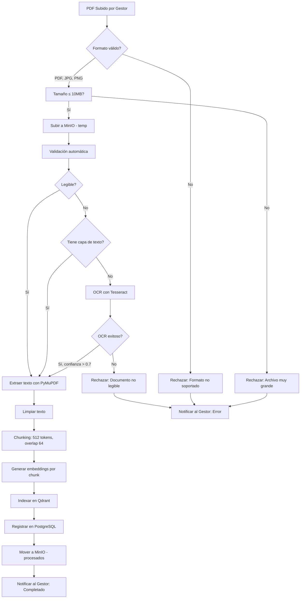

# INGESTIÓN DE PDFs - Pipeline de Procesamiento Documental EsSalud v1.0

## 1. Diagrama del Pipeline



---

## 2. Etapas del Pipeline

### 2.1 Upload y Validación

| Etapa | Descripción | Responsable |
|-------|-------------|-------------|
| Upload | El gestor documental sube el PDF via Dashboard Web | API Gateway |
| Validación de formato | Solo PDF, JPG, PNG — tamaño máximo 10MB | Document Service |
| Checksum | SHA-256 para detectar duplicados | Document Service |
| Almacenamiento temporal | MinIO bucket `essalud-temp-uploads` | Document Service |
| Cola de procesamiento | Celery task encolada en Redis para worker asíncrono | Celery Worker |

### 2.2 Extracción de Texto

**Herramientas comparadas:**

| Herramienta | Precisión | Velocidad | OCR | PDF escaneados | Costo |
|-------------|:---------:|:---------:|:---:|:--------------:|:-----:|
| **PyMuPDF** | Alta | Muy rápida | No | No | Gratis |
| pdfplumber | Alta | Rápida | No | No | Gratis |
| Tesseract OCR | Media | Lenta | Sí | Sí | Gratis |
| Google Vision OCR | Muy alta | Rápida | Sí | Sí | $$ |

**Decisión:** PyMuPDF para PDFs con capa de texto (90% de los documentos), + Tesseract OCR como fallback para PDFs escaneados.

```python
def extract_text(file_path: str, use_ocr: bool = False) -> dict:
    """Extract text from PDF using PyMuPDF, fallback to OCR."""
    import fitz  # PyMuPDF
    
    doc = fitz.open(file_path)
    result = {
        "pages": [],
        "has_text_layer": False,
        "total_pages": len(doc),
    }
    
    for page_num in range(len(doc)):
        page = doc[page_num]
        text = page.get_text()
        
        if text.strip():
            result["has_text_layer"] = True
            result["pages"].append({
                "page_number": page_num + 1,
                "text": text,
                "method": "pymupdf",
            })
        elif use_ocr:
            # Fallback to OCR
            pix = page.get_pixmap(dpi=300)
            img_path = f"/tmp/page_{page_num}.png"
            pix.save(img_path)
            
            import pytesseract
            ocr_text = pytesseract.image_to_string(img_path, lang="spa")
            
            result["pages"].append({
                "page_number": page_num + 1,
                "text": ocr_text,
                "method": "tesseract",
                "ocr_confidence": estimate_ocr_confidence(ocr_text),
            })
        else:
            result["pages"].append({
                "page_number": page_num + 1,
                "text": "",
                "method": "none",
            })
    
    doc.close()
    return result
```

### 2.3 Limpieza de Texto

```python
import re

def clean_text(extracted: dict) -> dict:
    """Clean extracted text from PDF artifacts."""
    for page in extracted["pages"]:
        text = page["text"]
        
        # Remove headers/footers (page numbers, document titles)
        text = re.sub(r'\n\d+\n', '\n', text)  # Page numbers alone
        text = re.sub(r'^Página \d+ de \d+', '', text, flags=re.MULTILINE)
        
        # Remove excessive whitespace
        text = re.sub(r'\n{3,}', '\n\n', text)
        text = re.sub(r' {2,}', ' ', text)
        
        # Fix common OCR errors
        text = text.replace('|', 'I')  # OCR confusion
        text = text.replace('0', 'O')  # Context-dependent
        
        # Remove non-printable characters
        text = ''.join(c for c in text if c.isprintable() or c in '\n\t')
        
        page["text"] = text.strip()
    
    return extracted
```

### 2.4 Chunking

```python
from langchain.text_splitter import RecursiveCharacterTextSplitter

def chunk_document(
    pages: list[dict],
    metadata: dict,
    chunk_size: int = 512,
    chunk_overlap: int = 64
) -> list[dict]:
    """Split document text into overlapping chunks."""
    
    # Combine all pages into single text with page markers
    full_text = ""
    page_map = []
    for page in pages:
        if page["text"]:
            start = len(full_text)
            full_text += f"\n\n--- PAGE {page['page_number']} ---\n\n{page['text']}"
            end = len(full_text)
            page_map.append((page["page_number"], start, end))
    
    # Split into chunks
    splitter = RecursiveCharacterTextSplitter(
        chunk_size=chunk_size,
        chunk_overlap=chunk_overlap,
        separators=["\n\n--- PAGE", "\n\n", "\n", ".", "!", "?", ",", " "],
        length_function=lambda x: len(x) // 4,  # Approx token count
    )
    
    chunks_text = splitter.split_text(full_text)
    
    # Build chunks with metadata
    chunks = []
    for i, chunk_text in enumerate(chunks_text):
        # Estimate page number from position
        chunk_start = full_text.find(chunk_text[:50])
        chunk_end = chunk_start + len(chunk_text)
        
        page_num = 1
        for pn, ps, pe in page_map:
            if chunk_start >= ps and chunk_start < pe:
                page_num = pn
                break
        
        # Find source page for the midpoint of the chunk
        mid_point = (chunk_start + chunk_end) // 2
        for pn, ps, pe in page_map:
            if mid_point >= ps and mid_point < pe:
                page_num = pn
                break
        
        chunks.append({
            "doc_id": metadata["doc_id"],
            "document_name": metadata["document_name"],
            "document_version": metadata.get("version", 1),
            "chunk_index": i,
            "page_number": page_num,
            "text": chunk_text.strip(),
            "source_url": metadata.get("source_url"),
            "category": metadata.get("category"),
            "token_count": len(chunk_text) // 4,
        })
    
    return chunks
```

---

## 3. Worker Asíncrono (Celery)

### 3.1 Configuración

```python
# celery_config.py
from celery import Celery

celery_app = Celery(
    "essalud_worker",
    broker="redis://redis:6379/5",
    backend="redis://redis:6379/6",
    task_serializer="json",
    accept_content=["json"],
    result_serializer="json",
    timezone="America/Lima",
    enable_utc=True,
    task_track_started=True,
    task_soft_time_limit=300,  # 5 minutes soft limit
    task_time_limit=600,       # 10 minutes hard limit
    worker_max_tasks_per_child=10,  # Prevent memory leaks
    worker_concurrency=4,      # 4 concurrent workers
)
```

### 3.2 Tarea de Ingestión

```python
@celery_app.task(bind=True, max_retries=3, default_retry_delay=60)
def process_document(self, document_id: int):
    """Pipeline completo de ingestión de documento."""
    logger.info(f"Processing document {document_id}")
    
    try:
        # 1. Get document metadata from DB
        doc = get_document_metadata(document_id)
        update_document_status(document_id, "VALIDANDO")
        
        # 2. Download from MinIO
        file_path = download_from_minio(doc["storage_path"])
        
        # 3. Extract text
        extracted = extract_text(file_path, use_ocr=True)
        
        if not extracted["has_text_layer"] and not any(p["text"] for p in extracted["pages"]):
            update_document_status(document_id, "RECHAZADO", error="Documento ilegible")
            return {"status": "rejected", "reason": "illegible"}
        
        # 4. Clean text
        cleaned = clean_text(extracted)
        
        # 5. Chunk document
        chunks = chunk_document(cleaned["pages"], {
            "doc_id": document_id,
            "document_name": doc["file_name"],
            "version": doc["current_version"],
            "source_url": doc.get("source_url"),
            "category": doc.get("category"),
        })
        
        # 6. Generate embeddings and index to Qdrant
        index_chunks_to_qdrant(document_id, chunks)
        
        # 7. Save embeddings metadata in PostgreSQL
        save_embeddings_metadata(document_id, chunks)
        
        # 8. Move document to processed bucket
        move_to_processed(document_id, doc["storage_path"])
        
        # 9. Update status
        update_document_status(document_id, "APROBADO")
        
        # 10. Clean temp files
        os.remove(file_path)
        
        logger.info(f"Document {document_id} processed successfully: {len(chunks)} chunks")
        return {
            "status": "completed",
            "document_id": document_id,
            "chunks_count": len(chunks),
        }
        
    except Exception as exc:
        logger.error(f"Error processing document {document_id}: {exc}")
        update_document_status(document_id, "RECHAZADO", error=str(exc))
        
        # Retry with backoff
        raise self.retry(exc=exc, countdown=60 * (2 ** self.request.retries))
```

### 3.3 Indexación a Qdrant

```python
from qdrant_client import QdrantClient
from qdrant_client.http.models import PointStruct, Batch
import openai

qdrant_client = QdrantClient(host="qdrant", port=6333)

def index_chunks_to_qdrant(document_id: int, chunks: list[dict]):
    """Generate embeddings and index chunks to Qdrant."""
    
    # Delete existing embeddings for this document (for re-indexing)
    qdrant_client.delete(
        collection_name="essalud_documents",
        points_selector=FilterSelector(
            filter=Filter(
                must=[FieldCondition(key="doc_id", match=MatchValue(value=document_id))]
            )
        ),
    )
    
    points = []
    for chunk in chunks:
        # Generate embedding
        response = openai.Embedding.create(
            model="text-embedding-3-small",
            input=chunk["text"],
        )
        embedding = response["data"][0]["embedding"]
        
        # Build point
        point = PointStruct(
            id=f"{document_id}_{chunk['chunk_index']}",
            vector=embedding,
            payload={
                "doc_id": document_id,
                "document_name": chunk["document_name"],
                "document_version": chunk["document_version"],
                "chunk_index": chunk["chunk_index"],
                "page_number": chunk["page_number"],
                "text": chunk["text"][:2000],  # Truncate for payload size
                "source_url": chunk.get("source_url"),
                "category": chunk.get("category"),
                "token_count": chunk["token_count"],
                "created_at": datetime.utcnow().isoformat(),
            }
        )
        points.append(point)
    
    # Batch upsert
    qdrant_client.upsert(
        collection_name="essalud_documents",
        points=points,
    )
```

---

## 4. Variables de Entorno

| Variable | Descripción | Default |
|----------|-------------|---------|
| `CELERY_BROKER_URL` | Redis URL para Celery broker | `redis://redis:6379/5` |
| `CELERY_RESULT_BACKEND` | Redis URL para resultados | `redis://redis:6379/6` |
| `MINIO_ENDPOINT` | MinIO endpoint | `minio:9000` |
| `MINIO_ACCESS_KEY` | MinIO access key | - |
| `MINIO_SECRET_KEY` | MinIO secret key | - |
| `OPENAI_API_KEY` | API Key OpenAI | - |
| `QDRANT_HOST` | Qdrant host | `qdrant` |
| `QDRANT_PORT` | Qdrant gRPC port | `6333` |
| `CHUNK_SIZE` | Tamaño de chunk (tokens) | `512` |
| `CHUNK_OVERLAP` | Overlap entre chunks | `64` |
| `OCR_ENABLED` | Habilitar OCR | `true` |
| `TESSERACT_LANG` | Idioma OCR | `spa` |
| `MAX_FILE_SIZE_MB` | Tamaño máximo de archivo | `10` |

---

## 5. Actualización de Documentos (Versionado)

Cuando un documento existente se actualiza (nueva versión):

```python
@celery_app.task
def reindex_document(document_id: int, new_version: int):
    """Re-index a document after version update."""
    
    # 1. Delete old embeddings from Qdrant
    qdrant_client.delete(
        collection_name="essalud_documents",
        points_selector=FilterSelector(
            filter=Filter(
                must=[FieldCondition(key="doc_id", match=MatchValue(value=document_id))]
            )
        ),
    )
    
    # 2. Delete old embedding metadata from PostgreSQL
    delete_old_embeddings(document_id)
    
    # 3. Process new version
    process_document(document_id)
    
    # 4. Update rag_sources with new version info
    update_rag_source_version(document_id, new_version)
```

---

## 6. Metadatos por Chunk

Cada chunk almacena los siguientes metadatos en Qdrant:

```json
{
  "doc_id": 42,
  "document_name": "REGLAMENTO_AFILIACIONES_2024.pdf",
  "document_version": 2,
  "chunk_index": 7,
  "page_number": 3,
  "text": "Para la afiliación del cónyuge se requiere...",
  "source_url": "https://www.essalud.gob.pe/normativa/reglamento-afiliaciones-2024.pdf",
  "category": "normativa",
  "token_count": 128,
  "created_at": "2025-06-12T10:30:00Z"
}
```

## 7. Herramientas Comparadas

| Herramienta | Uso en Pipeline | Ventaja | Desventaja |
|-------------|-----------------|---------|------------|
| PyMuPDF | Extracción de texto | + Rápido (10x vs pdfplumber), + Capa de texto, + Soporte Unicode | No OCR |
| pdfplumber | Validación (alternativa) | + Tablas estructuradas, + Metadatos precisos | Lento en PDFs grandes |
| Tesseract OCR | OCR para PDFs escaneados | + Gratuito, + Open source, + Español | Lento, requiere DPI >= 200 |
| Celery | Worker asíncrono | + Cola persistente, + Retry, + Monitoreo | Complejidad operativa |

---

## 8. Referencias Cruzadas

| Archivo | Relación |
|---------|----------|
| [[11_RAG_QDRANT.md]] | Consumo de chunks indexados |
| [[13_VALIDACION_DOCUMENTOS.md]] | Validación de documentos previa |
| [[10_DIAGRAMAS_SECUENCIA.md]] | DS-06: Diagrama de ingestión |
| [[05_MICROSERVICIOS.md]] | Document Service endpoints |
| [[17_DOCKER_COMPOSE.md]] | Configuración del worker Celery |

---

#ingestión #pdfs #documentos #rag #celery #essalud #v1.0
