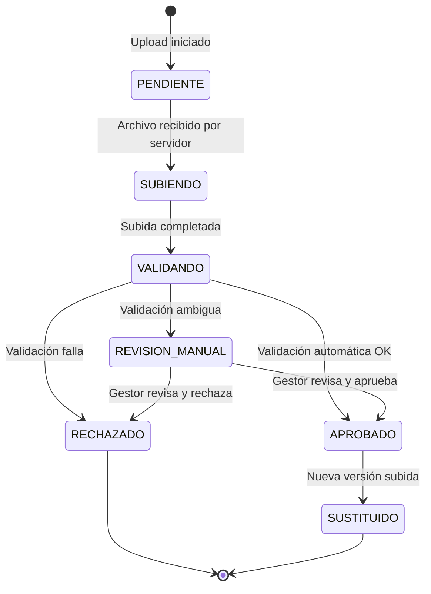

# VALIDACIÓN DE DOCUMENTOS - Sistema de Verificación Documental EsSalud v1.0

## 1. Tipos de Documentos Aceptados por Tipo de Trámite

| Tipo de Trámite | Documentos Requeridos | Formato | Tamaño Máx | Páginas |
|-----------------|----------------------|---------|:----------:|:-------:|
| **Afiliación Cónyuge** | DNI asegurado (anverso/reverso), DNI cónyuge, Acta matrimonio, Formulario solicitud | PDF/JPG/PNG | 10 MB c/u | N/A |
| **Afiliación Hijos** | DNI asegurado, Partida nacimiento hijo, DNI hijo (si tiene), Formulario solicitud | PDF/JPG/PNG | 10 MB c/u | N/A |
| **Lactancia** | DNI asegurada, Partida nacimiento, Certificado nacido vivo, Formulario | PDF/JPG/PNG | 10 MB c/u | N/A |
| **Maternidad** | DNI asegurada, Certificado médico, Formulario solicitud | PDF/JPG/PNG | 10 MB c/u | ≤ 10 |
| **Sepelio** | DNI fallecido, Certificado defunción, DNI solicitante, Comprobante gastos | PDF/JPG/PNG | 10 MB c/u | N/A |
| **Subsidio Enfermedad** | DNI, Certificado médico, Informe médico detallado, Formulario | PDF/JPG/PNG | 10 MB c/u | ≤ 20 |

---

## 2. Reglas de Validación

### 2.1 Validaciones Automáticas

| Regla | Descripción | Acción si falla |
|-------|-------------|-----------------|
| V-001 | El archivo debe ser PDF, JPG o PNG | Rechazar con mensaje: "Formato no soportado" |
| V-002 | Tamaño máximo 10 MB por archivo | Rechazar: "Archivo excede límite de 10 MB" |
| V-003 | PDF no debe estar corrupto (validar estructura) | Rechazar: "PDF corrupto o inválido" |
| V-004 | Mínimo resolución 200 DPI para imágenes | Rechazar: "Resolución demasiado baja" |
| V-005 | Número de páginas máximo según tipo | Rechazar: "Demasiadas páginas" |
| V-006 | Contenido legible detectable | Rechazar: "Documento ilegible" |
| V-007 | No duplicado (checksum SHA-256 único) | Advertencia: "Documento ya existe" |
| V-008 | Nombre de archivo sin caracteres especiales | Sanitizar automáticamente |
| V-009 | Metadatos mínimos (no requiere firma) | Rechazar si no se proporcionan |
| V-010 | Archivo no debe contener macros o scripts | Rechazar: "Contenido no seguro detectado" |

### 2.2 Validaciones Manuales (Operador/Gestor)

| Regla | Descripción |
|-------|-------------|
| V-011 | El documento corresponde al trámite solicitado |
| V-012 | La información en el documento es legible y completa |
| V-013 | El documento no está alterado o modificado |
| V-014 | Las firmas (si aplica) coinciden con el titular |
| V-015 | La fecha del documento es vigente |

---

## 3. Flujo de Validación

```mermaid
flowchart TD
    A[Documento subido] --> B[Validación automática]
    B --> C{Resultado}
    C -->|Todos los checks OK| D[Estado: APROBADO]
    C -->|Falla V-001 a V-010| E[Estado: RECHAZADO]
    C -->|Validación ambigua (OCR dudoso)| F[Estado: REVISION_MANUAL]
    
    D --> G[Disponible para trámite]
    E --> H[Notificar al usuario con error específico]
    F --> I[Cola de revisión para Gestor Documental]
    
    I --> J{Gestor revisa}
    J -->|Documento válido| K[Estado: APROBADO]
    J -->|Documento inválido| L[Estado: RECHAZADO]
    K --> G
    L --> H
```

---

## 4. Estados del Documento



### Descripción de Estados

| Estado | Descripción | Acciones Permitidas |
|--------|-------------|---------------------|
| **PENDIENTE** | Upload iniciado pero no completado | Cancelar upload |
| **SUBIENDO** | Archivo siendo transferido al servidor | Esperar |
| **VALIDANDO** | Pipeline de validación en ejecución | Ninguna (automático) |
| **APROBADO** | Documento válido y listo para usar | Usar en trámite, descargar |
| **RECHAZADO** | Documento no cumplió validaciones | Ver errores, re-subir |
| **REVISION_MANUAL** | Requiere revisión de gestor documental | Gestor revisa |
| **SUSTITUIDO** | Versión anterior reemplazada por nueva | Solo lectura histórica |

---

## 5. Reglas de Subsanación

| Regla | Descripción |
|-------|-------------|
| SR-001 | El asegurado tiene 15 días calendario para subsanar desde la notificación |
| SR-002 | Máximo 3 intentos de subsanación por documento |
| SR-003 | Después del tercer intento fallido, el trámite se cancela automáticamente |
| SR-004 | Cada subsanación debe reemplazar el documento observado (no adicionar) |
| SR-005 | El operador debe especificar exactamente qué corregir en las observaciones |
| SR-006 | Si el plazo de 15 días vence, el trámite se cierra automáticamente |
| SR-007 | El asegurado recibe notificación email + push en cada solicitud de subsanación |
| SR-008 | El gestor documental puede extender el plazo en casos justificados |

---

## 6. Integración con MinIO — Estructura de Buckets por Estado

```
essalud-documents/
├── pending/                        # Documentos en estado PENDIENTE
│   └── {user_id}/
│       └── {uuid}.{ext}
├── validating/                     # Documentos en proceso de validación
│   └── {doc_id}/
│       └── {version}/
│           └── original.{ext}
├── approved/                       # Documentos aprobados
│   └── {procedure_id}/
│       ├── v1_{doc_id}.{ext}
│       ├── v2_{doc_id}.{ext}
│       └── metadata.json
├── rejected/                       # Documentos rechazados
│   └── {user_id}/
│       └── {doc_id}/
│           ├── original.{ext}
│           └── error_report.json
└── manual_review/                  # Documentos que requieren revisión manual
    └── {doc_id}/
        ├── original.{ext}
        └── auto_check_report.json
```

---

## 7. Pseudocódigo del Validador Automático

```python
class DocumentValidator:
    """Automatic document validation pipeline."""
    
    MAX_FILE_SIZE = 10 * 1024 * 1024  # 10 MB
    ALLOWED_EXTENSIONS = {"pdf", "jpg", "jpeg", "png"}
    ALLOWED_MIME_TYPES = {
        "application/pdf",
        "image/jpeg",
        "image/png",
    }
    MIN_DPI = 200
    MAX_PAGES = {
        "maternidad": 10,
        "subsidio_enfermedad": 20,
    }
    
    async def validate(self, file: UploadFile, procedure_type: str) -> ValidationResult:
        errors = []
        warnings = []
        
        # V-001: Format check
        ext = file.filename.split(".")[-1].lower()
        if ext not in self.ALLOWED_EXTENSIONS:
            errors.append(ValidationError("V-001", f"Formato .{ext} no soportado"))
            return ValidationResult(status="REJECTED", errors=errors)
        
        # V-002: Size check
        content = await file.read()
        if len(content) > self.MAX_FILE_SIZE:
            errors.append(ValidationError("V-002", "Archivo excede 10 MB"))
            return ValidationResult(status="REJECTED", errors=errors)
        
        # V-003: PDF structure validation
        if ext == "pdf":
            pdf_valid = self._validate_pdf_structure(content)
            if not pdf_valid:
                errors.append(ValidationError("V-003", "PDF corrupto o inválido"))
                return ValidationResult(status="REJECTED", errors=errors)
        
        # V-005: Page count (PDF only)
        if ext == "pdf":
            page_count = self._get_page_count(content)
            max_pages = self.MAX_PAGES.get(procedure_type, float("inf"))
            if page_count > max_pages:
                errors.append(ValidationError(
                    "V-005",
                    f"Demasiadas páginas ({page_count}). Máximo: {max_pages}"
                ))
                return ValidationResult(status="REJECTED", errors=errors)
        
        # V-006: Legibility check
        text_content = self._extract_text(content, ext)
        legibility = self._check_legibility(text_content)
        if legibility == "illegible":
            errors.append(ValidationError("V-006", "Documento ilegible"))
            return ValidationResult(status="REJECTED", errors=errors)
        elif legibility == "uncertain":
            warnings.append(ValidationWarning("V-006", "Legibilidad dudosa"))
            return ValidationResult(status="MANUAL_REVIEW", errors=[], warnings=warnings)
        
        # V-007: Duplicate check
        checksum = hashlib.sha256(content).hexdigest()
        duplicate = await self._check_duplicate(checksum)
        if duplicate:
            warnings.append(ValidationWarning(
                "V-007", "Este documento ya existe en el sistema"
            ))
        
        # V-008: Sanitize filename
        safe_name = self._sanitize_filename(file.filename)
        
        # All checks passed
        return ValidationResult(
            status="APPROVED",
            errors=[],
            warnings=warnings,
            checksum=checksum,
            page_count=page_count if ext == "pdf" else 1,
            safe_filename=safe_name,
        )
    
    def _validate_pdf_structure(self, content: bytes) -> bool:
        """Check if PDF has valid structure."""
        try:
            import fitz
            doc = fitz.open(stream=content, filetype="pdf")
            valid = len(doc) > 0
            doc.close()
            return valid
        except Exception:
            return False
    
    def _get_page_count(self, content: bytes) -> int:
        """Get number of pages from PDF."""
        import fitz
        doc = fitz.open(stream=content, filetype="pdf")
        count = len(doc)
        doc.close()
        return count
    
    def _check_legibility(self, text: str) -> str:
        """Check if document text is legible.
        Returns: 'legible', 'illegible', 'uncertain'."""
        if not text or len(text.strip()) < 10:
            return "illegible"
        
        # Check ratio of alphanumeric characters
        alnum = sum(c.isalnum() or c.isspace() for c in text)
        if alnum / len(text) < 0.5:
            return "illegible"
        
        # Check for garbled text
        garbled_patterns = [r'[^\w\s\.\,\;\:\!\?\-\(\)\[\]\{\}]', r'\w{50,}']
        for pattern in garbled_patterns:
            if re.search(pattern, text):
                return "uncertain"
        
        return "legible"
    
    def _extract_text(self, content: bytes, ext: str) -> str:
        """Extract text content for legibility check."""
        if ext == "pdf":
            import fitz
            doc = fitz.open(stream=content, filetype="pdf")
            text = ""
            for page in doc:
                text += page.get_text()
            doc.close()
            return text
        else:
            # For images, use OCR
            import pytesseract
            from PIL import Image
            import io
            img = Image.open(io.BytesIO(content))
            return pytesseract.image_to_string(img, lang="spa")
    
    def _sanitize_filename(self, filename: str) -> str:
        """Remove unsafe characters from filename."""
        name, ext = os.path.splitext(filename)
        name = re.sub(r'[^\w\-_\. ]', '_', name)
        name = re.sub(r'\s+', '_', name)
        return f"{name}{ext}"
```

---

## 8. Referencias Cruzadas

| Archivo | Relación |
|---------|----------|
| [[12_INGESTION_PDFS.md]] | Pipeline de procesamiento post-validación |
| [[11_RAG_QDRANT.md]] | Uso de documentos validados para RAG |
| [[05_MICROSERVICIOS.md]] | Document Service endpoints de validación |
| [[10_DIAGRAMAS_SECUENCIA.md]] | DS-04: Flujo de subida de documentos |

---

#validación #documentos #pdf #ocr #essalud #v1.0
