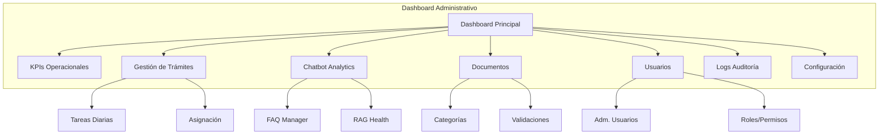

# DASHBOARD ADMINISTRATIVO - Panel de Gestión EsSalud v1.0 Empresarial

## 1. Módulos del Dashboard



---

## 2. Wireframes de Pantallas

### 2.1 Dashboard Principal

```
┌─────────────────────────────────────────────────────────────────┐
│  🔍 Buscar...                          🛡️ Supervisor   👤  📅  │
├─────────────────────────────────────────────────────────────────┤
│                                                                  │
│  ┌──────────┐  ┌──────────┐  ┌──────────┐  ┌──────────┐       │
│  │ 📋       │  │ 🤖      │  │ 📄       │  │ 👥       │       │
│  │ Trámites │  │ Consultas│  │ Document.│  │ Usuarios │       │
│  │ Hoy      │  │ Chatbot  │  │ Subidos  │  │ Activos  │       │
│  │   23     │  │   156    │  │   12     │  │   1,234  │       │
│  │ ▲ +15%   │  │ ▼ -3%   │  │ ▲ +8%    │  │ ▲ +22%   │       │
│  └──────────┘  └──────────┘  └──────────┘  └──────────┘       │
│                                                                  │
│  ┌─────────────────────────────┐  ┌────────────────────────┐   │
│  │ Trámites por Estado         │  │ Consultas Chatbot/H     │   │
│  │ ████████░░ PENDIENTE 80%    │  │ ████████████░░ 156     │   │
│  │ ██░░░░░░░░ EN REVIS. 20%   │  │ ████████░░░░░░ RAG 45 │   │
│  │ ███░░░░░░░ APROBADO 30%    │  │ ██████████░░░░ FAQ 111│   │
│  │ █░░░░░░░░░ RECH. 10%       │  │                        │   │
│  └─────────────────────────────┘  └────────────────────────┘   │
│                                                                  │
│  ┌──────────────────────────────────────────────────────────┐   │
│  │ Tendencias Últimos 7 Días                                │   │
│  │  ▲  │             ▄▄          ▄▄                         │   │
│  │     │     ▄▄     █  █     ▄▄ █  █▄▄                     │   │
│  │     │  ▄▄  █  ▄▄ █  █  ▄▄ █  █  █  █▄                  │   │
│  │     │  █  █  █  █  █  █  █  █  █  █  █                  │   │
│  │  ───┴─────────────────────────────────────────────       │   │
│  │      Lun Mar Mie Jue Vie Sab Dom                          │   │
│  │     ─ Trámites ─ Asistencias chatbot                      │   │
│  └──────────────────────────────────────────────────────────┘   │
│                                                                  │
│  ┌─────────────┐  ┌─────────────┐  ┌────────────────┐          │
│  │ ⏱ Tiempo    │  │ 📊 Tasa de  │  │ 😊 Feedback    │          │
│  │ Prom. Resp. │  │ Resolución  │  │ Chatbot Útil   │          │
│  │   2.3 días  │  │ 73%         │  │ 89%            │          │
│  └─────────────┘  └─────────────┘  └────────────────┘          │
│                                                                  │
└─────────────────────────────────────────────────────────────────┘
```

### 2.2 Gestión de Trámites (Operador)

```
┌─────────────────────────────────────────────────────────────────┐
│  📋 Trámites Pendientes                     Total: 23           │
├─────────────────────────────────────────────────────────────────┤
│  Filtros: [Estado:Todos ▼] [Tipo:Todos ▼] [🔍 Buscar DNI...]   │
├────┬───────────┬──────────┬──────────┬─────────┬───────┬───────┤
│ #  │ Asegurado │ Tipo     │ Creado   │ Estado  │ Días  │ Acc.  │
├────┼───────────┼──────────┼──────────┼─────────┼───────┼───────┤
│ 1  │ 12345678  │ Lactancia│ 10/06/25 │ PEND    │ 2     │ [▶]   │
│    │ M. Perez  │          │          │         │       │       │
│ 2  │ 87654321  │ Cónyuge  │ 08/06/25 │ EN REV  │ 4     │ [▶]   │
│    │ J. López  │          │          │         │       │       │
│ 3  │ 45678912  │ Sepelio  │ 05/06/25 │ SUBSAN  │ 7     │ [▶]   │
│    │ A. García │          │          │         │       │       │
│ ...│ ...       │ ...      │ ...      │ ...     │ ...   │ ...   │
├────┴───────────┴──────────┴──────────┴─────────┴───────┴───────┤
│  Página 1 de 3  [◀ Anterior] [1] [2] [3] [Siguiente ▶]         │
└─────────────────────────────────────────────────────────────────┘
```

### 2.3 Detalle de Trámite (Operador)

```
┌─────────────────────────────────────────────────────────────────┐
│  ◀ Volver a lista          Trámite #1234 - Lactancia            │
├─────────────────────────────────────────────────────────────────┤
│                                                                  │
│  ┌─────────────────────┐  ┌─────────────────────────────────┐  │
│  │ Datos del Trámite   │  │ Timeline                        │  │
│  │ Asegurado: 12345678 │  │ ✅ Creado     10/06 09:00      │  │
│  │ María Pérez López   │  │ 📎 Docs Sub.  10/06 09:15      │  │
│  │ Tipo: Lactancia     │  │ 📤 Enviado    10/06 09:30      │  │
│  │ Creado: 10/06/2025  │  │ 🔍 En Revis.  11/06 08:00      │  │
│  │ Estado: REVISIÓN    │  │ ⏳ Actual     Hace 2h          │  │
│  │ Operador: Carlos R. │  └─────────────────────────────────┘  │
│  └─────────────────────┘                                       │
│                                                                  │
│  ┌──────────────────────────────────────────────────────────┐  │
│  │ Documentos Adjuntos                                      │  │
│  │ [✅] DNI Asegurada.pdf          [👁 Ver] [📥 Descargar]  │  │
│  │ [✅] Partida Nacimiento.pdf     [👁 Ver] [📥 Descargar]  │  │
│  │ [✅] Certif. Nacido Vivo.pdf    [👁 Ver] [📥 Descargar]  │  │
│  │ [✅] Formulario Solicitud.pdf   [👁 Ver] [📥 Descargar]  │  │
│  └──────────────────────────────────────────────────────────┘  │
│                                                                  │
│  ┌──────────────────────────────────────────────────────────┐  │
│  │ Acciones                                                 │  │
│  │                                                          │  │
│  │ [✅ Aprobar]  [❌ Rechazar]  [📝 Solicitar Subsanación] │  │
│  │                                                          │  │
│  │ Comentario:                                              │  │
│  │ ┌────────────────────────────────────────────────────┐  │  │
│  │ │ Los documentos cumplen con todos los requisitos.   │  │  │
│  │ └────────────────────────────────────────────────────┘  │  │
│  └──────────────────────────────────────────────────────────┘  │
│                                                                  │
└─────────────────────────────────────────────────────────────────┘
```

---

## 3. Métricas en Tiempo Real

### 3.1 Decisión: WebSocket vs Polling

| Aspecto | WebSocket | Polling (cada 60s) |
|---------|:---------:|:------------------:|
| Latencia de datos | Tiempo real | Hasta 60s |
| Carga del servidor | Media (conexión persistente) | Baja |
| Complejidad de implementación | Alta | Baja |
| Escalabilidad | Media (conexiones concurrentes) | Alta |
| Compatibilidad con infraestructura actual | Requiere Redis Pub/Sub adicional | Solo HTTP |

**Decisión:** Polling cada 60 segundos para v1.0. La naturaleza del sistema (trámites, no transacciones financieras) no requiere latencia sub-segundo. Simplifica la arquitectura y la escalabilidad. WebSocket se considera para v2.0 para alertas y notificaciones en tiempo real.

---

## 4. Gráficos Requeridos

| Gráfico | Tipo | Datos Fuente | Frecuencia | Módulo |
|---------|------|-------------|:----------:|--------|
| Trámites por estado | Barra horizontal | `procedures` table | Tiempo real | KPIs |
| Consultas chatbot/día | Línea (7 días) | `chat_messages` table | Cada 60s | Chatbot |
| Tasa de resolución FAQ vs RAG | Dona | `chat_messages.type` | Cada 60s | Chatbot |
| Usuarios activos/hora | Área | `sessions` table | Cada 60s | Usuarios |
| Tiempo promedio de resolución | Barra (por tipo) | `procedure_history` | Diario | Trámites |
| Distribución de consultas | Pie | `chat_messages` | Diario | Chatbot |
| Documentos subidos/día | Línea (30 días) | `documents` table | Diario | Documentos |
| Feedback chatbot | Barra | `chat_messages.feedback` | Diario | Chatbot |

---

## 5. Tabla de KPIs Operacionales

| KPI | Fórmula de Cálculo | Unidad | Target | Alerta (Rojo) |
|-----|-------------------|:------:|:------:|:--------------:|
| **Trámites Pendientes** | COUNT WHERE status=PENDIENTE | Número | < 50 | > 100 |
| **Tasa de Aprobación** | Approved / (Approved + Rejected) * 100 | % | > 75% | < 50% |
| **Tiempo Prom. Resolución** | AVG(completed_at - created_at) | Días | < 5 | > 10 |
| **Trámites Vencidos** | COUNT WHERE > 7 días en PENDIENTE | Número | < 10 | > 25 |
| **Consultas Chatbot/día** | COUNT chat_messages WHERE role=user AND today | Número | - | - |
| **Tasa Resolución Chatbot** | (faq + rag) / total * 100 | % | > 70% | < 50% |
| **Feedback Positivo** | helpful / (helpful + not_helpful) * 100 | % | > 80% | < 60% |
| **Tiempo Respuesta RAG** | AVG(latency_ms) WHERE type=rag | ms | < 3000 | > 5000 |
| **Usuarios Activos (24h)** | COUNT DISTINCT user_id en sessions last 24h | Número | > 500 | < 100 |
| **Documentos Indexados** | COUNT WHERE status=APROBADO | Número | > 500 | < 100 |
| **Nuevos Registros/día** | COUNT users WHERE created_at = today | Número | > 50 | < 10 |

---

## 6. Alertas Configurables

| Alerta | Condición | Severidad | Canal | Acción |
|--------|-----------|:---------:|:-----:|--------|
| **Trámites acumulados** | Pendientes > 100 por más de 2h | 🔴 Alta | Email + Push | Revisar asignación |
| **Chatbot baja resolución** | Tasa < 50% por más de 1h | 🟡 Media | Email | Revisar RAG health |
| **Error OpenAI recurrente** | > 10 errores en 5 min | 🔴 Alta | Email + Slack | Activar fallback |
| **Latencia RAG alta** | p95 > 5s por más de 10 min | 🟡 Media | Email | Verificar OpenAI |
| **Subsanaciones vencidas** | > 5 trámites con subsanación vencida | 🟡 Media | Email | Notificar asegurados |
| **CPU alto en servicio** | CPU > 80% por más de 5 min | 🟡 Media | Email | Escalar |
| **Error rate alto** | HTTP 5xx > 1% en 5 min | 🔴 Alta | Email + Slack | Rollback? |

---

## 7. Exportación de Reportes

| Reporte | Formato | Contenido | Periodos | Programable |
|---------|:-------:|-----------|:--------:|:-----------:|
| Trámites del período | PDF, CSV | Lista detallada por estado | Diario, Semanal, Mensual | ✅ |
| Productividad operadores | PDF, XLSX | Trámites revisados por operador | Semanal, Mensual | ✅ |
| Chatbot analytics | PDF, CSV | Consultas, tasa de resolución, feedback | Diario, Semanal | ✅ |
| Documentos indexados | CSV | Lista de documentos procesados | Semanal | ✅ |
| Usuarios registrados | CSV | Nuevos usuarios, activos | Diario, Semanal | ✅ |
| Auditoría de acciones | CSV | Eventos de auditoría filtrados | Rango personalizado | ❌ |

### Formato de Exportación PDF

```python
def generate_report(report_type: str, period: tuple, format: str) -> bytes:
    """Generate report in requested format."""
    data = fetch_report_data(report_type, period)
    
    if format == "csv":
        import csv
        output = io.StringIO()
        writer = csv.DictWriter(output, fieldnames=data["columns"])
        writer.writeheader()
        writer.writerows(data["rows"])
        return output.getvalue().encode("utf-8")
    
    elif format == "xlsx":
        import openpyxl
        wb = openpyxl.Workbook()
        ws = wb.active
        ws.title = data["title"]
        ws.append(data["columns"])
        for row in data["rows"]:
            ws.append([row.get(c) for c in data["columns"]])
        output = io.BytesIO()
        wb.save(output)
        return output.getvalue()
    
    elif format == "pdf":
        from reportlab.lib.pagesizes import A4
        from reportlab.platypus import SimpleDocTemplate, Table, TableStyle, Paragraph
        # ... PDF generation logic
        pass
```

---

## 8. Control de Acceso por Rol

| Módulo del Dashboard | OPER | GESDOC | SUPV | SADM |
|---------------------|:----:|:------:|:----:|:----:|
| KPIs Operacionales | ❌ | ❌ | ✅ | ✅ |
| Lista de Trámites | ✅ (asignados) | ❌ | ✅ (todos) | ✅ (todos) |
| Aprobar/Rechazar | ✅ | ❌ | ❌ | ✅ |
| Asignar Trámites | ❌ | ❌ | ✅ | ✅ |
| Chatbot Analytics | ❌ | ✅ | ✅ | ✅ |
| Gestión FAQ | ❌ | ✅ | ❌ | ✅ |
| Gestión Documentos | ❌ | ✅ | ✅ | ✅ |
| Usuarios | ❌ | ❌ | ❌ | ✅ |
| Roles/Permisos | ❌ | ❌ | ❌ | ✅ |
| Logs Auditoría | ❌ | ❌ | ✅ (SUPV) | ✅ (todos) |
| Configuración | ❌ | ❌ | ❌ | ✅ |
| Reportes Exportables | ❌ | ❌ | ✅ | ✅ |

---

## 9. Referencias Cruzadas

| Archivo | Relación |
|---------|----------|
| [[20_OBSERVABILIDAD.md]] | Métricas y monitoreo de infraestructura |
| [[06_MODELO_ER.md]] | Tablas: metrics_snapshot, audit_events |
| [[07_ROLES_PERMISOS.md]] | Control de acceso al dashboard |
| [[05_MICROSERVICIOS.md]] | Admin endpoints |

---

#dashboard #admin #kpis #gestión #essalud #v1.0
