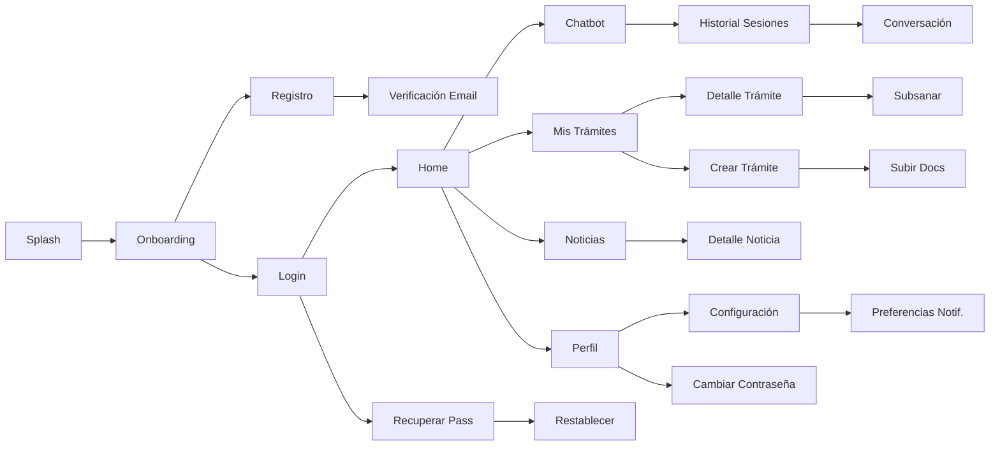

# FLUTTER UI/UX - Diseño de Interfaz EsSalud v1.0 Empresarial

## 1. Design Tokens

### 1.1 Paleta de Colores

| Token | Hex | Uso |
|-------|:---:|-----|
| **`--color-primary`** | `#00703C` | Color institucional EsSalud (verde) |
| **`--color-primary-dark`** | `#00582F` | Hover/Pressed estados |
| **`--color-primary-light`** | `#E8F5E9` | Fondos claros, badges |
| **`--color-secondary`** | `#1565C0` | Azul complementario |
| **`--color-accent`** | `#FF6F00` | Naranja para alertas y CTAs |
| **`--color-success`** | `#2E7D32` | Estados APROBADO |
| **`--color-warning`** | `#F57F17` | Estados PENDIENTE/SUBSANACION |
| **`--color-error`** | `#C62828` | Estados RECHAZADO, errores |
| **`--color-surface`** | `#FFFFFF` | Superficie principal |
| **`--color-background`** | `#F5F5F5` | Fondo general |
| **`--color-text-primary`** | `#212121` | Texto principal |
| **`--color-text-secondary`** | `#757575` | Texto secundario |
| **`--color-border`** | `#E0E0E0` | Bordes y divisores |

### 1.2 Tipografía

| Elemento | Font Size | Weight | Line Height |
|----------|:---------:|:------:|:-----------:|
| **Display** | 32px | Bold | 40px |
| **H1** | 24px | Bold | 32px |
| **H2** | 20px | SemiBold | 28px |
| **H3** | 18px | SemiBold | 24px |
| **Body Large** | 16px | Regular | 24px |
| **Body** | 14px | Regular | 20px |
| **Body Small** | 12px | Regular | 16px |
| **Caption** | 11px | Regular | 16px |
| **Button** | 14px | SemiBold | 20px |

**Font Family:** `Poppins` (títulos), `Inter` (cuerpo)

### 1.3 Spaciado

| Token | Valor |
|-------|:-----:|
| `--spacing-xs` | 4px |
| `--spacing-sm` | 8px |
| `--spacing-md` | 16px |
| `--spacing-lg` | 24px |
| `--spacing-xl` | 32px |
| `--spacing-2xl` | 48px |

### 1.4 Border Radius

| Token | Valor | Uso |
|-------|:-----:|-----|
| `--radius-sm` | 4px | Inputs, badges |
| `--radius-md` | 8px | Cards, dialogs |
| `--radius-lg` | 12px | Bottom sheets, modales |
| `--radius-full` | 50% | Avatares, iconos |

---

## 2. Componentes de Diseño

### 2.1 AppBar
- Color de fondo: `--color-primary` (#00703C)
- Título: white, H2
- Back button: white
- Actions icons: white
- Altura: 56px
- Elevation: none (flat design)

### 2.2 Bottom Navigation Bar
- 4 íconos: Inicio, Chatbot, Trámites, Perfil
- Color activo: `--color-primary`
- Color inactivo: `--color-text-secondary`
- Badge con contador de trámites pendientes
- Altura: 64px

### 2.3 Cards
- Border radius: `--radius-md` (8px)
- Sombra sutil (elevation 2)
- Padding: `--spacing-md`
- Color de fondo: `--color-surface`
- Borde: `--color-border`

### 2.4 Buttons

```dart
// Primary Button
ElevatedButton(
  style: ElevatedButton.styleFrom(
    backgroundColor: AppColors.primary,       // #00703C
    foregroundColor: Colors.white,
    minimumSize: Size(double.infinity, 48),
    shape: RoundedRectangleBorder(
      borderRadius: BorderRadius.circular(8),
    ),
  ),
  onPressed: () {},
  child: Text("Continuar"),
)

// Outlined Button
OutlinedButton(
  style: OutlinedButton.styleFrom(
    foregroundColor: AppColors.primary,
    side: BorderSide(color: AppColors.primary),
    minimumSize: Size(double.infinity, 48),
    shape: RoundedRectangleBorder(
      borderRadius: BorderRadius.circular(8),
    ),
  ),
  onPressed: () {},
  child: Text("Cancelar"),
)
```

### 2.5 Forms
- Labels: Body Small, `--color-text-secondary`
- Input field: altura 48px, borde `--color-border`, focus `--color-primary`
- Error message: Body Small, `--color-error`
- Helper text: Body Small, `--color-text-secondary`
- Validation icon: check/cross animado

### 2.6 Chat Bubble
- Usuario: alineación derecha, fondo `--color-primary`, texto blanco
- Chatbot: alineación izquierda, fondo `--color-background`, texto `--color-text-primary`
- Citación de fuente: texto azul subrayado, Body Small
- Typing indicator: 3 dots animados

---

## 3. Flujo de Navegación



---

## 4. Pantallas Detalladas

### 4.1 Splash
- Logo institucional EsSalud centrado
- Fondo verde (#00703C)
- Animación fade-in del logo
- Auto-navega a Login o Home según sesión activa
- Duración: 2 segundos

### 4.2 Onboarding (Primera vez)
- 3 slides:
  1. "Bienvenido a EsSalud Digital" (icono: app + salud)
  2. "Realiza tus trámites desde casa" (icono: documentos)
  3. "Consulta con IA inteligente" (icono: chatbot)
- Indicadores de página (dots)
- Botón "Saltar" y "Siguiente" / "Comenzar"

### 4.3 Login
- Campo email
- Campo contraseña (obscured)
- Botón "Iniciar Sesión" (primary)
- Link "¿Olvidaste tu contraseña?"
- Link "¿No tienes cuenta? Regístrate"
- Validación en tiempo real
- Loading spinner durante login

### 4.4 Registro
- Paso 1: DNI (8 dígitos, numérico)
- Paso 2: Email, teléfono
- Paso 3: Contraseña + confirmar
- Paso 4: Aceptar términos y condiciones
- Botón "Crear Cuenta"
- Validación RENIEC en backend

### 4.5 Home (Dashboard Asegurado)
- AppBar: logo + notificaciones icon
- Saludo personalizado: "¡Hola, María!"
- Tarjetas de resumen:
  - Trámites activos (con contador)
  - Última noticia
  - Acceso rápido a chatbot
- Botón flotante: "Nuevo Trámite" (FAB)
- Últimos trámites (lista compacta)
- Sección de noticias recientes (horizontal scroll)

### 4.6 Chatbot
- AppBar: "Chat EsSalud" + historial icon
- Mensajes en burbujas (usuario derecha, bot izquierda)
- Typing indicator al procesar
- Citación de fuentes: tap para expandir
- Preguntas sugeridas al inicio (chips)
- Campo de texto + botón enviar
- Feedback: thumbs up/down después de respuesta
- Scroll automático al último mensaje

### 4.7 Trámites — Lista
- AppBar: "Mis Trámites"
- Pestañas: "Activos" | "Completados"
- Cada item: tipo, fecha, estado (con color), operador
- Pull to refresh
- Filtro por tipo de trámite
- Botón FAB: "Nuevo Trámite"

### 4.8 Trámites — Detalle
- Header: tipo + estado (badge color)
- Timeline vertical de cambios
- Documentos adjuntos (lista con iconos)
- Observaciones (si las hay)
- Botones de acción según estado:
  - BORRADOR: "Editar" + "Enviar"
  - SUBSANACION: "Subsanar"
  - APROBADO: "Ver Certificado"

### 4.9 Trámites — Crear
- Step indicator (1-4)
- Paso 1: Seleccionar tipo de trámite (grid de opciones)
- Paso 2: Completar formulario (dinámico según tipo)
- Paso 3: Subir documentos (cámara / galería / archivos)
- Paso 4: Revisar y confirmar
- Botón "Guardar Borrador" / "Enviar a Revisión"

### 4.10 Documentos — Subida
- Selección: cámara o galería
- Preview del documento seleccionado
- Barra de progreso de subida
- Indicador de validación (check / error)
- Re-intentar si falla

### 4.11 Noticias — Feed
- Lista vertical con cards
- Cada card: imagen, título, fecha, resumen
- Pull to refresh
- Búsqueda por texto
- Categorías (chips horizontales)

### 4.12 Perfil
- Foto de perfil (inciales si no hay)
- Nombre, DNI, email, teléfono
- Editar email/teléfono
- Cambiar contraseña
- Preferencias de notificación
- Cerrar sesión
- Versión de app

---

## 5. Accesibilidad

| Requisito | Implementación | Estándar |
|-----------|---------------|----------|
| Contraste mínimo | Relación de contraste ≥ 4.5:1 para texto normal | WCAG AA |
| Tamaño de fuente mínimo | 14px para body text | WCAG AA |
| Touch targets | Mínimo 48x48px para todos los botones | Material Design |
| Descripciones semánticas | `Semantics()` en Flutter para lectores de pantalla | WCAG AA |
| Orden de tabulación | `focusTraversalGroup` lógico | WCAG AA |
| Indicadores de foco | Visible en todos los elementos interactivos | WCAG AA |
| Textos alternativos | En todas las imágenes | WCAG AA |
| Modo alto contraste | Soporte para configuración del sistema | WCAG AAA |

---

## 6. Modo Oscuro

**Decisión:** No incluido en v1.0.

| Razón | Detalle |
|-------|---------|
| Esfuerzo de implementación | Requiere duplicar paleta de colores y probar cada pantalla |
| Prioridad baja | Baja demanda en usuarios de salud pública |
| Complejidad de testing | Validación de contraste en ambos modos |
| Postergado a v2.0 | Se implementará con diseño system-based (sigue configuración del OS) |

---

## 7. Referencias Cruzadas

| Archivo | Relación |
|---------|----------|
| [[16_FLUTTER_ESTRUCTURA.md]] | Implementación de componentes |
| [[08_HISTORIAS_USUARIO.md]] | HUs de UI/UX |
| [[05_MICROSERVICIOS.md]] | APIs que consume la UI |

---

#flutter #ui #ux #diseno #mobile #essalud #v1.0
