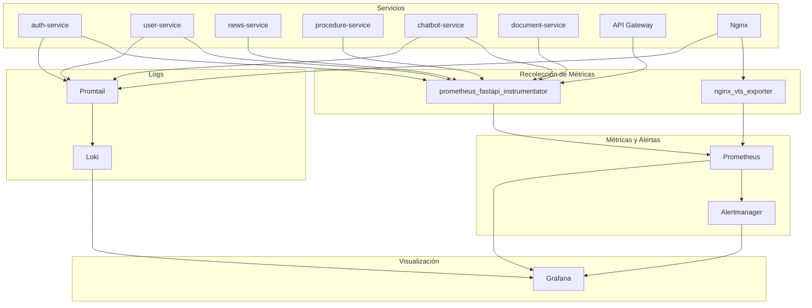

# OBSERVABILIDAD - Monitoreo, Métricas y Logs EsSalud v1.0

## 1. Arquitectura de Observabilidad



---

## 2. Métricas a Recolectar por Servicio

### 2.1 Métricas Técnicas (todos los servicios)

| Métrica | Tipo | Descripción | Alerta |
|---------|:----:|-------------|:------:|
| `http_requests_total` | Counter | Total de requests HTTP | - |
| `http_request_duration_seconds` | Histogram | Latencia de requests (bucket: 0.1, 0.5, 1, 2, 5) | p95 > 3s |
| `http_requests_in_progress` | Gauge | Requests en curso | - |
| `http_response_size_bytes` | Summary | Tamaño de respuestas | - |
| `http_requests_total{status="5xx"}` | Counter | Errores HTTP 5xx | Rate > 1% |
| `cpu_usage_percent` | Gauge | Uso de CPU del contenedor | > 80% por 5min |
| `memory_usage_bytes` | Gauge | Uso de memoria | > 80% de límite |
| `db_connection_pool_size` | Gauge | Conexiones activas a DB | > 90% del pool |
| `db_query_duration_seconds` | Histogram | Latencia de queries DB | p95 > 500ms |
| `redis_operation_duration` | Histogram | Latencia de operaciones Redis | p95 > 100ms |

### 2.2 Métricas por Servicio

**Auth Service:**
| Métrica | Tipo | Descripción | Alerta |
|---------|:----:|-------------|:------:|
| `auth_login_attempts_total` | Counter | Intentos de login totales | - |
| `auth_login_failures_total` | Counter | Intentos fallidos | Rate > 10/min |
| `auth_registrations_total` | Counter | Nuevos registros | - |
| `auth_token_refreshes_total` | Counter | Refrescos de token | - |
| `reniec_api_duration_seconds` | Histogram | Latencia de API RENIEC | p95 > 3s |
| `reniec_api_errors_total` | Counter | Errores RENIEC | > 5/min |

**Chatbot Service:**
| Métrica | Tipo | Descripción | Alerta |
|---------|:----:|-------------|:------:|
| `chat_messages_total` | Counter | Total de mensajes procesados | - |
| `chat_messages_by_type` | Counter | Por tipo (faq, rag, no_result) | - |
| `chat_rag_latency_seconds` | Histogram | Latencia total RAG | p95 > 8s |
| `chat_embedding_latency` | Histogram | Latencia de embedding | p95 > 1s |
| `chat_llm_latency` | Histogram | Latencia de OpenAI Chat | p95 > 5s |
| `chat_qdrant_latency` | Histogram | Latencia de búsqueda Qdrant | p95 > 500ms |
| `chat_feedback_positive` | Counter | Feedback útil | Ratio > 80% |
| `chat_feedback_negative` | Counter | Feedback no útil | - |
| `chat_escalation_suggested` | Counter | Escalamientos sugeridos | - |
| `openai_api_errors_total` | Counter | Errores OpenAI API | > 5/min |

**Procedure Service:**
| Métrica | Tipo | Descripción | Alerta |
|---------|:----:|-------------|:------:|
| `procedures_created_total` | Counter | Trámites creados | - |
| `procedures_by_status` | Gauge | Trámites por estado | - |
| `procedures_approval_time_hours` | Histogram | Tiempo hasta aprobación | p95 > 7 días |
| `procedures_subsanacion_count` | Counter | Subsanaciones solicitadas | - |

**Document Service:**
| Métrica | Tipo | Descripción | Alerta |
|---------|:----:|-------------|:------:|
| `documents_uploaded_total` | Counter | Documentos subidos | - |
| `documents_validation_duration` | Histogram | Tiempo de validación | p95 > 5s |
| `documents_ocr_duration` | Histogram | Tiempo de OCR | p95 > 30s |
| `documents_indexed_total` | Counter | Documentos indexados | - |
| `minio_operation_duration` | Histogram | Latencia MinIO | p95 > 2s |

---

## 3. Dashboards de Grafana

### 3.1 Dashboard Operacional

| Panel | Tipo | Métrica | Fuente |
|-------|------|---------|--------|
| RPM por servicio | Stat + Time series | `rate(http_requests_total[5m])` | Prometheus |
| Latencia p95/p99 | Time series | `histogram_quantile(0.95, ...)` | Prometheus |
| Error rate 5xx | Time series | `rate(http_requests_total{status=~"5.."}[5m])` | Prometheus |
| CPU/Memoria por servicio | Time series | `container_cpu_usage_seconds_total` | cAdvisor |
| Conexiones DB activas | Stat | `pg_stat_activity_count` | postgres_exporter |
| Redis hits/misses | Time series | `redis_keyspace_hits_total` | redis_exporter |

### 3.2 Dashboard de Negocio

| Panel | Tipo | Métrica | Fuente |
|-------|------|---------|--------|
| Trámites creados/hoy | Stat | `increase(procedures_created_total[24h])` | Prometheus |
| Trámites por estado | Pie chart | `procedures_by_status` | Prometheus |
| Consultas chatbot/día | Time series | `increase(chat_messages_total[24h])` | Prometheus |
| FAQ vs RAG ratio | Bar chart | `chat_messages_by_type` | Prometheus |
| Usuarios activos | Time series | `increase(auth_login_attempts_total[1h])` | Prometheus |
| Tiempo promedio resolución | Stat + Gauge | `avg(procedures_approval_time_hours)` | Prometheus |
| Feedback chatbot | Stat | `chat_feedback_positive / (chat_feedback_positive + chat_feedback_negative)` | Prometheus |

### 3.3 Dashboard de Infraestructura

| Panel | Tipo | Métrica | Fuente |
|-------|------|---------|--------|
| CPU por servicio | Time series | `rate(process_cpu_seconds_total[1m])` | Prometheus |
| Memoria por servicio | Time series | `process_resident_memory_bytes` | Prometheus |
| Disco (volúmenes Docker) | Gauge | `container_fs_usage_bytes` | cAdvisor |
| Red (bytes in/out) | Time series | `rate(container_network_receive_bytes_total[1m])` | cAdvisor |
| Uptime servicios | Stat | `time() - process_start_time_seconds` | Prometheus |
| Health checks | Status grid | `up{job=~".+"}` | Prometheus |

---

## 4. Alertas Críticas

| Alerta | Condición PromQL | Severidad | Canal | Cooldown |
|--------|------------------|:---------:|:-----:|:--------:|
| **ServiceDown** | `up{job="auth-service"} == 0` | 🔴 Critical | PagerDuty + Email | 5 min |
| **HighErrorRate** | `rate(http_requests_total{status=~"5.."}[5m]) > 0.01` | 🔴 Critical | PagerDuty + Email | 10 min |
| **HighLatency** | `histogram_quantile(0.95, rate(http_request_duration_seconds_bucket[5m])) > 3` | 🟡 Warning | Email | 15 min |
| **HighCPUService** | `rate(process_cpu_seconds_total[1m]) > 0.8` | 🟡 Warning | Email | 5 min |
| **OpenAIErrors** | `rate(openai_api_errors_total[5m]) > 0.1` | 🟡 Warning | Email + Slack | 5 min |
| **HighLoginFailures** | `rate(auth_login_failures_total[5m]) > 10` | 🟡 Warning | Email | 10 min |
| **RateLimitExceeded** | `rate(http_requests_total{status="429"}[5m]) > 0` | 🟢 Info | Log only | - |
| **DiskFull** | `container_fs_usage_percent > 0.9` | 🟡 Warning | Email | 30 min |
| **DBPoolExhausted** | `db_connection_pool_size / db_connection_pool_max > 0.9` | 🔴 Critical | PagerDuty | 5 min |
| **RAGQualityDrop** | `rate(chat_escalation_suggested[1h]) / rate(chat_messages_total[1h]) > 0.3` | 🟡 Warning | Email + Slack | 1h |

### Configuración de Alertmanager

```yaml
# alertmanager.yml
route:
  receiver: 'default'
  group_by: ['alertname', 'severity']
  group_wait: 30s
  group_interval: 5m
  repeat_interval: 4h
  
  routes:
    - match:
        severity: critical
      receiver: 'pagerduty'
      repeat_interval: 30m
    
    - match:
        severity: warning
      receiver: 'email-slack'
      repeat_interval: 2h

receivers:
  - name: 'pagerduty'
    pagerduty_configs:
      - routing_key: '{{ .ExternalURL }}/pagerduty-key'
        severity: 'critical'
  
  - name: 'email-slack'
    slack_configs:
      - api_url: 'https://hooks.slack.com/services/...'
        channel: '#essalud-alerts'
        title: '{{ .GroupLabels.alertname }}'
        text: '{{ .CommonAnnotations.description }}'
    
    email_configs:
      - to: 'ops@essalud.gob.pe'
        from: 'alerts@essalud.gob.pe'
        smarthost: 'smtp.sendgrid.net:587'
```

---

## 5. Configuración de Loki

### 5.1 Logs Estructurados (desde FastAPI)

```python
# logging_config.py
import logging
import json
from datetime import datetime

class JSONFormatter(logging.Formatter):
    def format(self, record):
        log_entry = {
            "timestamp": datetime.utcnow().isoformat() + "Z",
            "service": record.name,
            "level": record.levelname,
            "message": record.getMessage(),
            "module": record.module,
            "function": record.funcName,
            "line": record.lineno,
        }
        
        if hasattr(record, "request_id"):
            log_entry["request_id"] = record.request_id
        if hasattr(record, "user_id"):
            log_entry["user_id"] = record.user_id
        if hasattr(record, "duration_ms"):
            log_entry["duration_ms"] = record.duration_ms
        
        if record.exc_info:
            log_entry["exception"] = self.formatException(record.exc_info)
        
        return json.dumps(log_entry)

# Setup
logger = logging.getLogger("auth-service")
handler = logging.StreamHandler()
handler.setFormatter(JSONFormatter())
logger.addHandler(handler)
logger.setLevel(logging.INFO)
```

### 5.2 Log Exports

```yaml
# promtail-config.yml
scrape_configs:
  - job_name: essalud-logs
    docker_sd_configs:
      - host: unix:///var/run/docker.sock
        refresh_interval: 5s
        filters:
          - name: label
            values: ["com.docker.compose.project=essalud"]
    
    pipeline_stages:
      - json:
          expressions:
            timestamp: timestamp
            service: service
            level: level
            message: message
            request_id: request_id
      
      - timestamp:
          source: timestamp
          format: RFC3339Nano
      
      - labels:
          service: service
          level: level
      
      - output:
          source: message
    
    relabel_configs:
      - source_labels: ['__meta_docker_container_name']
        regex: 'essalud-(.*)'
        target_label: 'service'
      
      - action: replace
        source_labels: ['__meta_docker_container_name']
        target_label: 'container'
```

### 5.3 Loki Config

```yaml
# loki-config.yml
auth_enabled: false

server:
  http_listen_port: 3100

ingester:
  lifecycler:
    address: 127.0.0.1
    ring:
      kvstore:
        store: inmemory
      replication_factor: 1
  chunk_idle_period: 5m
  chunk_retain_period: 30s

schema_config:
  configs:
    - from: 2024-01-01
      store: boltdb-shipper
      object_store: filesystem
      schema: v11
      index:
        prefix: index_
        period: 24h

storage_config:
  boltdb_shipper:
    active_index_directory: /loki/boltdb-shipper-active
    cache_location: /loki/boltdb-shipper-cache
    cache_ttl: 24h
    shared_store: filesystem
  
  filesystem:
    directory: /loki/chunks

compactor:
  working_directory: /loki/compactor
  shared_store: filesystem

limits_config:
  reject_old_samples: true
  reject_old_samples_max_age: 168h
  retention_period: 2160h  # 90 days
```

---

## 6. Instrumentación en Python

```python
# app/monitoring.py
from prometheus_fastapi_instrumentator import Instrumentator
from prometheus_client import Counter, Histogram, Gauge
import time

# Custom metrics
login_attempts = Counter(
    "auth_login_attempts_total",
    "Total login attempts",
    ["status"]  # success, failure
)

chat_messages = Counter(
    "chat_messages_total",
    "Total chat messages processed",
    ["type"]  # faq, rag, no_result
)

rag_latency = Histogram(
    "chat_rag_latency_seconds",
    "RAG pipeline latency",
    buckets=(1, 2, 3, 5, 8, 10, 15)
)

active_users = Gauge(
    "auth_active_users",
    "Currently active users",
    ["role"]
)

# FastAPI instrumentation
def setup_monitoring(app):
    instrumentator = Instrumentator(
        should_group_status_codes=True,
        should_ignore_untemplated=True,
        should_respect_env_var="ENABLE_METRICS",
    )
    instrumentator.instrument(app).expose(app)
    
    @app.middleware("http")
    async def track_request_id(request, call_next):
        request_id = request.headers.get("X-Request-Id", str(uuid.uuid4()))
        request.state.request_id = request_id
        response = await call_next(request)
        response.headers["X-Request-Id"] = request_id
        return response
```

---

## 7. Retención de Datos

| Tipo de Dato | Almacenamiento | Período de Retención | Política de Limpieza |
|-------------|----------------|:--------------------:|----------------------|
| Métricas Prometheus | TSDB local | 30 días | Limpieza automática |
| Logs Loki | Loki storage | 90 días | Compactor automático |
| Trazas (v2.0) | Jaeger | 7 días | - |
| Audit Logs | PostgreSQL | 90 días, luego archivo | Job programado |
| Chat Messages | PostgreSQL | 90 días | Job programado |
| Métricas de negocio | metrics_snapshot | 1 año | Archive |
| Alertas resueltas | Alertmanager | 30 días | - |

---

## 8. Referencias Cruzadas

| Archivo | Relación |
|---------|----------|
| [[14_DASHBOARD_ADMIN.md]] | Dashboard de negocio |
| [[19_CICD.md]] | Monitoreo post-deploy |
| [[17_DOCKER_COMPOSE.md]] | Servicios de monitoreo |
| [[21_SEGURIDAD_AUDITORIA.md]] | Logs de auditoría |

---

#observabilidad #prometheus #grafana #loki #monitoreo #essalud #v1.0
