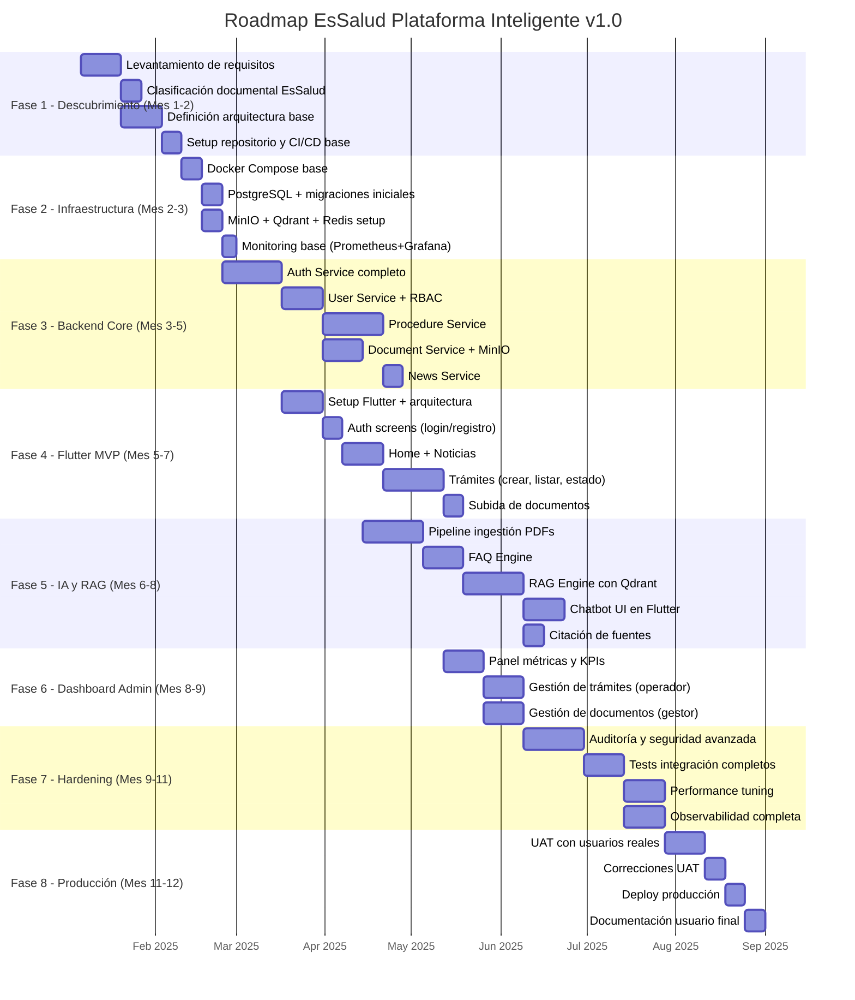

# ROADMAP - Hoja de Ruta EsSalud v1.0 Empresarial

## 1. Diagrama Gantt



---

## 2. Tabla Resumen de Fases

| Fase | Nombre | Duración | Semanas | Inicio | Fin | Entregables Clave | Responsable |
|:----:|--------|:--------:|:-------:|:------:|:---:|-------------------|:-----------:|
| 1 | Descubrimiento | 42 días | 6 | Ene 6 | Feb 14 | Documento requisitos v1.0, taxonomía documental, ADR | PM + Arquitecto |
| 2 | Infraestructura | 28 días | 4 | Feb 17 | Mar 14 | Docker Compose, servicios base operativos, monitoreo | DevOps |
| 3 | Backend Core | 84 días | 12 | Mar 3 | May 23 | 6 microservicios implementados, 35+ endpoints | Backend Team |
| 4 | Flutter MVP | 70 días | 10 | Abr 14 | Jun 27 | App con auth, home, trámites, documentos | Frontend Team |
| 5 | IA y RAG | 91 días | 13 | May 5 | Ago 1 | Pipeline ingestión, FAQ, RAG, chatbot UI | IA Engineer |
| 6 | Dashboard Admin | 49 días | 7 | Jul 21 | Sep 5 | Dashboard KPIs, gestión trámites, docs admin | Full-stack |
| 7 | Hardening | 63 días | 9 | Sep 1 | Oct 31 | Seguridad, tests, performance, observabilidad | Todo el equipo |
| 8 | Producción | 63 días | 9 | Oct 27 | Dic 26 | UAT, deploy producción, documentación | Todo el equipo |

---

## 3. Hitos (Milestones)

| Hito | Fecha | Criterios de Aceptación | Dependencia |
|------|:-----:|-------------------------|:-----------:|
| **M1: Documentación aprobada** | Feb 14 | Documentos firmados por stakeholders | F1 |
| **M2: Infraestructura base lista** | Mar 14 | Docker Compose funcional, health checks OK | F2 |
| **M3: Backend MVP completo** | May 23 | Todos los endpoints REST operativos, tests pasando | F3 |
| **M4: App Flutter funcional** | Jun 27 | Auth, home, trámites, documentos — flujo completo | F4 |
| **M5: Chatbot con RAG operativo** | Ago 1 | FAQ + RAG con citación, tasa resolución > 60% | F5 |
| **M6: Dashboard admin operativo** | Sep 5 | KPIs, gestión trámites, gestión docs | F6 |
| **M7: Hardening completado** | Oct 31 | OWASP, 80% cobertura, performance OK | F7 |
| **M8: Go-live producción** | Dic 19 | UAT aprobado, deploy exitoso, monitoreo activo | F8 |

---

## 4. Estrategia de Releases

| Release | Versión | Fecha Estimada | Contenido | Tipo |
|---------|:-------:|:--------------:|-----------|:----:|
| **MVP** | v0.1.0 | Jun 30 | Auth + Flutter base + Noticias | Interna |
| **Alpha** | v0.2.0 | Jul 30 | Trámites + documentos + procedimientos | Interna |
| **Beta** | v0.3.0 | Sep 15 | Chatbot FAQ + RAG + Dashboard | Cerrada (testers) |
| **RC** | v0.4.0 | Nov 15 | Hardening + auditoría + seguridad | UAT |
| **Production** | v1.0.0 | Dic 19 | Release final | Pública |

### Versionamiento Semántico
```
v{major}.{minor}.{patch}
- Major: Cambios breaking en API (no esperado para v1.x)
- Minor: Nuevas funcionalidades (ej: v1.1.0, v1.2.0)
- Patch: Bug fixes, seguridad (ej: v1.0.1, v1.0.2)
```

---

## 5. Plan v2.0 (2026)

| Funcionalidad | Prioridad | Dependencia Técnica |
|---------------|:---------:|---------------------|
| Integración con historia clínica electrónica | Alta | APIs EsSalud legacy |
| Módulo de citas médicas en línea | Alta | Sistema de agenda EsSalud |
| Pasarela de pagos integrada | Media | Contrato con proveedor |
| Biometría facial + huella dactilar | Media | SDK externo |
| BI y analytics avanzados con ML | Media | Data warehouse |
| Versión web completa (responsive) | Media | Flutter Web |
| Chatbot en quechua y aymara | Baja | Modelo NLP multilingüe |
| Modo offline completo | Baja | Flutter offline sync |
| Notificaciones WhatsApp | Baja | API WhatsApp Business |
| Kubernetes (orquestación) | Alta | Docker Compose → K8s migration |
| ISO 27001 certificación | Alta | Proceso de certificación |

---

## 6. Referencias Cruzadas

| Archivo | Relación |
|---------|----------|
| [[01_PLAN_DETALLADO.md]] | Plan estratégico detallado |
| [[26_KANBAN_GANTT.md]] | Gestión de tareas y sprints |
| [[23_MATRIZ_RIESGOS.md]] | Riesgos del roadmap |
| [[08_HISTORIAS_USUARIO.md]] | HUs planificadas por sprint |

---

#roadmap #gantt #cronograma #hitos #essalud #v1.0
