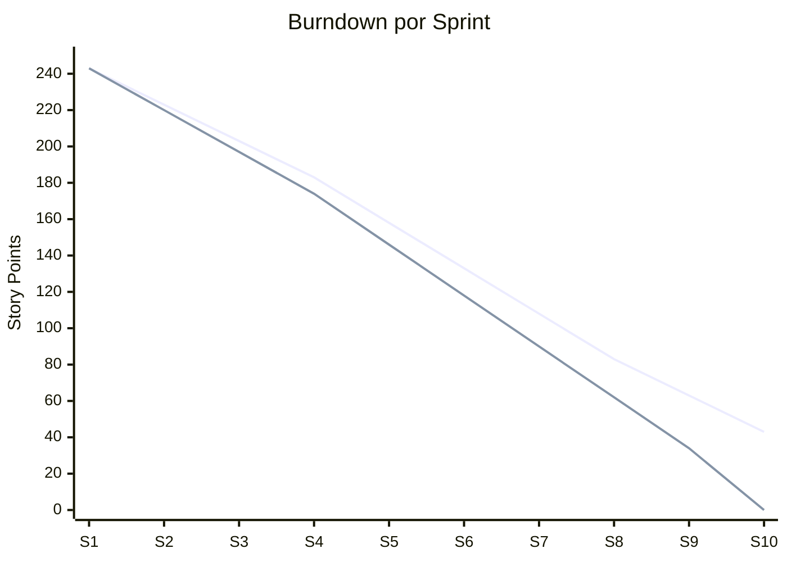
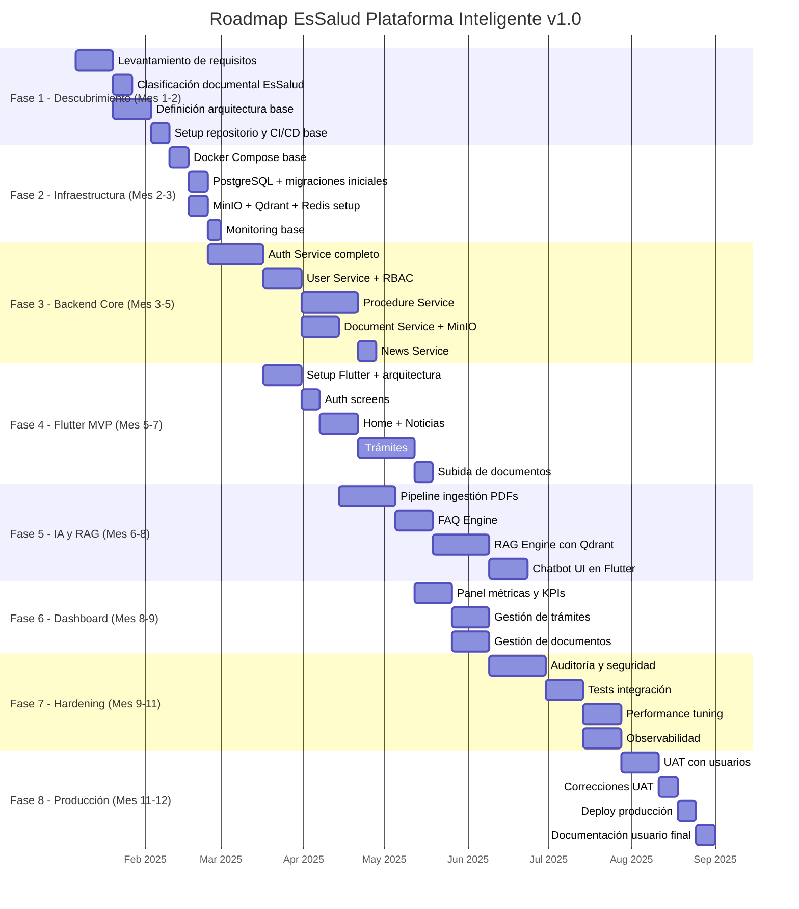

# KANBAN + GANTT - Gestión de Proyecto EsSalud v1.0

## 1. Dashboard de Estado del Proyecto

### 1.1 Métricas del Proyecto

| Métrica | Valor | Tendencia |
|---------|:-----:|:---------:|
| **Total Historias de Usuario** | 38 | 📊 |
| **Completadas** | 0 | 📊 |
| **En Progreso** | 0 | 📊 |
| **Pendientes** | 38 | 📊 |
| **Total Requisitos Funcionales** | 70 | 📊 |
| **Completados (v1.0)** | 0 | 📊 |
| **Velocidad Estimada** | 20-25 pts/sprint | 🎯 |
| **Story Points Totales** | 243 pts | 📊 |
| **Sprints Planificados** | 10 | 📅 |
| **Duración Total** | 52 semanas | 📅 |

### 1.2 Burndown por Fase

---

## 2. Sección Kanban

### 📋 Backlog
- [ ] RF-001 Setup infraestructura Docker base
- [ ] RF-002 Configurar PostgreSQL con migraciones
- [ ] RF-015 Implementar FAQ Engine
- [ ] RF-031 Catálogo de tipos de trámite
- [ ] RF-043 Sistema de subida de documentos
- [ ] RF-051 Feed de noticias público
- [ ] RF-056 Sistema de notificaciones
- [ ] RF-060 Dashboard de KPIs
- [ ] RF-067 Registro de auditoría
- [ ] RF-010 CRUD de usuarios (admin)
- [ ] RF-011 Asignación de roles
- [ ] RF-025 Indexación automática de documentos
- [ ] RF-007 Verificación de email
- [ ] HU-006 Chatbot con FAQ
- [ ] HU-012 Crear trámite

### 🔄 En Progreso
- [ ] Diseño arquitectura C4 (en revisión)
- [ ] Documentación técnica v1.0 (95%)
- [ ] Setup CI/CD pipeline (en progreso)

### ✅ Completado
- [x] Levantamiento de requisitos inicial
- [x] Clasificación de documentos EsSalud
- [x] Definición de stack tecnológico
- [x] Plan detallado v1.0
- [x] Especificación funcional v1.0
- [x] Documentación técnica completa (27 archivos)
- [x] Modelo entidad-relación (33 tablas)
- [x] Historias de usuario (38 HU)
- [x] Casos de uso (15 CU)
- [x] Diagramas de secuencia (8 DS)
- [x] Arquitectura RAG completa
- [x] Docker Compose multi-entorno
- [x] OpenAPI spec (20+ endpoints)
- [x] CI/CD pipeline design
- [x] Seguridad y auditoría

---

## 3. Sección Gantt

---

## 4. Plan de Sprints

### Sprint 1: Infraestructura Base (Semanas 1-2)
**Capacidad:** 20 pts | **Fecha:** Ene 6 - Ene 17

| ID | Tarea | Tipo | Puntos | Responsable |
|:--:|-------|:----:|:------:|:-----------:|
| T-001 | Setup repositorio GitHub | Infraestructura | 3 | DevOps |
| T-002 | Configurar Docker Compose base | Infraestructura | 5 | DevOps |
| T-003 | CI/CD pipeline base | Infraestructura | 5 | DevOps |
| T-004 | PostgreSQL setup + migraciones | Infraestructura | 4 | Backend |
| T-005 | Redis + MinIO + Qdrant setup | Infraestructura | 3 | DevOps |

### Sprint 2: Autenticación (Semanas 3-4)
**Capacidad:** 20 pts | **Fecha:** Ene 20 - Ene 31

| ID | Tarea | Tipo | Puntos | Responsable |
|:--:|-------|:----:|:------:|:-----------:|
| T-006 | HU-001 Registro de asegurado | Feature | 8 | Backend |
| T-007 | HU-002 Inicio de sesión | Feature | 5 | Backend |
| T-008 | HU-003 Recuperación de contraseña | Feature | 5 | Backend |
| T-009 | HU-004 Cierre de sesión | Feature | 2 | Backend |

### Sprint 3: Usuarios y Roles (Semanas 5-6)
**Capacidad:** 20 pts | **Fecha:** Feb 3 - Feb 14

| ID | Tarea | Tipo | Puntos | Responsable |
|:--:|-------|:----:|:------:|:-----------:|
| T-010 | HU-029 Gestión de usuarios | Feature | 8 | Backend |
| T-011 | HU-030 Gestión de roles/permisos | Feature | 8 | Backend |
| T-012 | HU-037 Expiración de sesión | Feature | 3 | Backend |
| T-013 | Middleware RBAC | Feature | 1 | Backend |

### Sprint 4: Noticias y Perfil (Semanas 7-8)
**Capacidad:** 20 pts | **Fecha:** Feb 17 - Feb 28

| ID | Tarea | Tipo | Puntos | Responsable |
|:--:|-------|:----:|:------:|:-----------:|
| T-014 | HU-005 Perfil de usuario | Feature | 5 | Backend + Frontend |
| T-015 | HU-023 Feed de noticias | Feature | 5 | Backend + Frontend |
| T-016 | HU-024 Búsqueda de noticias | Feature | 3 | Backend + Frontend |
| T-017 | HU-025 CRUD noticias admin | Feature | 8 | Backend + Frontend |

### Sprint 5: Trámites y Documentos Core (Semanas 9-11)
**Capacidad:** 25 pts | **Fecha:** Mar 3 - Mar 21

| ID | Tarea | Tipo | Puntos | Responsable |
|:--:|-------|:----:|:------:|:-----------:|
| T-018 | HU-011 Lista de trámites | Feature | 3 | Backend |
| T-019 | HU-012 Crear trámite | Feature | 13 | Backend + Frontend |
| T-020 | HU-013 Estado del trámite | Feature | 5 | Backend + Frontend |
| T-021 | HU-019 Subir documentos | Feature | 8 | Backend + Frontend |
| T-022 | HU-022 Indexar documentos RAG | Feature | 13 | IA Engineer |
| T-023 | HU-010 Gestión de FAQ | Feature | 8 | Backend + Frontend |

### Sprint 6: Workflow Trámites (Semanas 12-14)
**Capacidad:** 25 pts | **Fecha:** Mar 24 - Abr 11

| ID | Tarea | Tipo | Puntos | Responsable |
|:--:|-------|:----:|:------:|:-----------:|
| T-024 | HU-014 Subsanar trámite | Feature | 8 | Backend + Frontend |
| T-025 | HU-015 Ver trámites asignados | Feature | 5 | Backend + Frontend |
| T-026 | HU-016 Aprobar trámite | Feature | 8 | Backend + Frontend |
| T-027 | HU-017 Rechazar trámite | Feature | 5 | Backend + Frontend |
| T-028 | HU-031 Notificaciones cambio estado | Feature | 5 | Backend |

### Sprint 7: Chatbot y RAG UI (Semanas 15-18)
**Capacidad:** 25 pts | **Fecha:** Abr 14 - May 9

| ID | Tarea | Tipo | Puntos | Responsable |
|:--:|-------|:----:|:------:|:-----------:|
| T-029 | HU-006 Chatbot FAQ + RAG | Feature | 13 | IA + Frontend |
| T-030 | HU-007 Preguntas sugeridas | Feature | 3 | Frontend |
| T-031 | HU-008 Historial de chat | Feature | 5 | Frontend |
| T-032 | HU-009 Feedback chatbot | Feature | 3 | Frontend |
| T-033 | HU-033 Citación de fuentes | Feature | 8 | IA Engineer |
| T-034 | HU-035 Lenguaje natural | Feature | 8 | IA Engineer |
| T-035 | HU-018 Asignar trámites | Feature | 5 | Backend + Frontend |
| T-036 | HU-021 Búsqueda semántica docs | Feature | 8 | IA Engineer |
| T-037 | HU-032 Preferencias notificaciones | Feature | 3 | Frontend |

### Sprint 8: Dashboard Admin (Semanas 19-21)
**Capacidad:** 25 pts | **Fecha:** May 12 - May 30

| ID | Tarea | Tipo | Puntos | Responsable |
|:--:|-------|:----:|:------:|:-----------:|
| T-038 | HU-026 Dashboard KPIs | Feature | 13 | Full-stack |
| T-039 | HU-027 Métricas chatbot | Feature | 8 | Full-stack |
| T-040 | HU-034 Documentos indexados | Feature | 5 | Full-stack |

### Sprint 9: Seguridad y Reportes (Semanas 22-24)
**Capacidad:** 20 pts | **Fecha:** Jun 2 - Jun 20

| ID | Tarea | Tipo | Puntos | Responsable |
|:--:|-------|:----:|:------:|:-----------:|
| T-041 | HU-028 Exportar reportes | Feature | 5 | Full-stack |
| T-042 | HU-036 Log de auditoría | Feature | 5 | Backend + Frontend |
| T-043 | HU-038 Rate limiting | Feature | 5 | Backend |
| T-044 | Pruebas de penetración | QA | 5 | Security |

### Sprint 10: QA y Producción (Semanas 25-26)
**Capacidad:** 20 pts | **Fecha:** Jun 23 - Jul 4

| ID | Tarea | Tipo | Puntos | Responsable |
|:--:|-------|:----:|:------:|:-----------:|
| T-045 | UAT con usuarios | QA | 8 | PM + QA |
| T-046 | Correcciones UAT | Bugfix | 5 | Todo el equipo |
| T-047 | Deploy producción | Infraestructura | 5 | DevOps |
| T-048 | Documentación final | Documentación | 2 | Todo el equipo |

---

## 5. Tabla de Velocidad del Equipo

| Sprint | Story Points Planeados | Story Points Completados | Velocity |
|:------:|:---------------------:|:------------------------:|:--------:|
| Sprint 1 | 20 | - | - |
| Sprint 2 | 20 | - | - |
| Sprint 3 | 20 | - | - |
| Sprint 4 | 20 | - | - |
| Sprint 5 | 25 | - | - |
| Sprint 6 | 25 | - | - |
| Sprint 7 | 25 | - | - |
| Sprint 8 | 25 | - | - |
| Sprint 9 | 20 | - | - |
| Sprint 10 | 20 | - | - |
| **Total** | **220** | **-** | **22 pts/sprint (est.)** |

---

## 6. Referencias Cruzadas

| Archivo | Relación |
|---------|----------|
| [[22_ROADMAP.md]] | Roadmap Gantt completo |
| [[01_PLAN_DETALLADO.md]] | Plan estratégico |
| [[08_HISTORIAS_USUARIO.md]] | Backlog detallado |
| [[24_REQUISITOS_FUNCIONALES.md]] | RFs vinculados a tareas |

---

#kanban #gantt #gestión #sprints #essalud #v1.0
