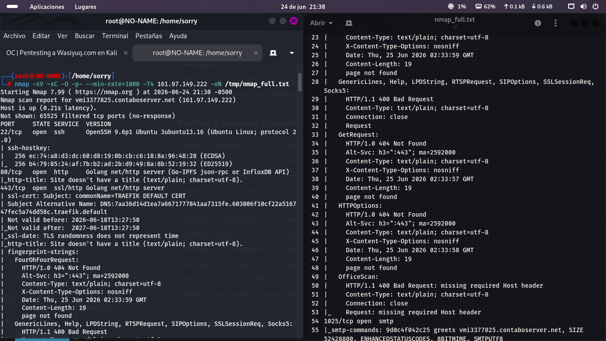

# Informe de Pruebas de Seguridad — Wasiyuq.com

**Curso:** Taller de Proyectos II  
**Equipo:** Wasiyuq Development Team  
**Fecha:** 22–25 Junio 2026  
**Entorno de Pruebas:** Kali Linux 2026.2 (Virtualizado en VirtualBox)  
**Objetivo:** wasiyuq.com (161.97.149.222)  

---

## Índice

1. [Fundamento Teórico](#1-fundamento-teórico)
   - 1.1 ¿Qué tipos de pruebas de seguridad pueden realizarse en una aplicación web?
   - 1.2 ¿Cómo se determinan las áreas críticas que deben ser probadas?
2. [Planificación de Pruebas](#2-planificación-de-pruebas)
3. [Ejecución de Pruebas de Penetración](#3-ejecución-de-pruebas-de-penetración)
4. [Análisis de Vulnerabilidades](#4-análisis-de-vulnerabilidades)
5. [Medidas Correctivas Propuestas](#5-medidas-correctivas-propuestas)
6. [Documentación del Proceso](#6-documentación-del-proceso)
7. [Anexos](#7-anexos)

---

## 1. Fundamento Teórico

### 1.1 ¿Qué tipos de pruebas de seguridad pueden realizarse en una aplicación web?

Las pruebas de seguridad en aplicaciones web se clasifican según su enfoque, metodología y alcance. Los principales tipos son:

| Tipo de Prueba | Descripción | Ejemplos |
|---|---|---|
| **Reconocimiento Pasivo** | Recolección de información sin interactuar directamente con el objetivo. | WHOIS, consultas DNS, análisis de headers HTTP, búsqueda de subdominios |
| **Reconocimiento Activo** | Interacción directa con el objetivo para identificar servicios y vulnerabilidades. | Nmap, escaneo de puertos, fingerprinting |
| **Análisis de Vulnerabilidades (Vulnerability Assessment)** | Uso de herramientas automatizadas para identificar vulnerabilidades conocidas. | Nikto, OpenVAS, Nessus |
| **Pruebas de Penetración (Pentesting)** | Simulación controlada de un ataque real para explotar vulnerabilidades y evaluar el impacto. | Caja negra, caja blanca, caja gris |
| **Pruebas de Caja Negra** | El evaluador no tiene información previa del sistema. Simula un atacante externo. | Fuzzing, fuerza bruta, enumeración |
| **Pruebas de Caja Blanca** | El evaluador tiene acceso completo al código fuente y la arquitectura. | Revisión de código, análisis estático |
| **Pruebas de Caja Gris** | Combinación de ambas: el evaluador tiene acceso parcial a la información. | Pruebas de autenticación, análisis de sesiones |
| **Pruebas de Autenticación y Autorización** | Evaluación de mecanismos de login, roles y permisos. | Bypass de login, escalamiento de privilegios |
| **Pruebas de Inyección** | Verificación de vulnerabilidades de inyección de código. | SQL Injection, XSS, Command Injection |
| **Pruebas de Configuración** | Revisión de configuraciones inseguras del servidor y la aplicación. | Headers de seguridad, puertos abiertos, servicios expuestos |
| **Pruebas de Denegación de Servicio (DoS)** | Evaluación de la resistencia del sistema ante sobrecarga. | Stress testing, rate limiting |
| **Pruebas de Cumplimiento (Compliance)** | Verificación contra estándares de seguridad. | OWASP Top 10, PCI DSS, ISO 27001 |

### 1.2 ¿Cómo se determinan las áreas críticas que deben ser probadas?

La determinación de áreas críticas sigue un proceso metodológico basado en análisis de riesgo:

1. **Identificación de Activos:** Se catalogan todos los componentes del sistema: servidores, bases de datos, APIs, paneles administrativos, almacenamiento de archivos, servicios internos.

2. **Análisis de Superficie de Ataque:** Se mapean todos los puntos de entrada potenciales (puertos abiertos, endpoints web, formularios, APIs, subdominios).

3. **Clasificación por Criticidad:** Se priorizan según:
   - **Exposición:** Servicios accesibles desde internet vs. internos
   - **Sensibilidad de datos:** ¿Maneja información personal, credenciales, datos financieros?
   - **Impacto potencial:** ¿Qué pasa si este componente es comprometido?
   - **Dependencias:** ¿Es crítico para el funcionamiento del sistema?

4. **Aplicación de Estándares:** Se utiliza el **OWASP Top 10** como guía para identificar las vulnerabilidades más comunes y críticas:
   - A01: Broken Access Control
   - A02: Cryptographic Failures
   - A03: Injection
   - A04: Insecure Design
   - A05: Security Misconfiguration
   - A06: Vulnerable and Outdated Components
   - A07: Identification and Authentication Failures
   - A08: Software and Data Integrity Failures
   - A09: Security Logging and Monitoring Failures
   - A10: Server-Side Request Forgery (SSRF)

5. **Priorización Final:** Se combinan los factores anteriores para determinar el orden de las pruebas, comenzando por los componentes de mayor riesgo.

En el caso de Wasiyuq.com, las áreas críticas identificadas fueron:

- **Servicios expuestos en puertos no estándar** (Redis, Dokploy, MinIO, Mailpit) — alto impacto
- **Paneles administrativos** (/admin, /dashboard) — acceso restringido pero crítico
- **Autenticación y sesiones** (login, registro, cookies) — puerta de entrada al sistema
- **Manejo de datos personales** (usuarios, adoptantes, organizaciones) — privacidad
- **Configuración del servidor web** (nginx, Traefik, HTTPS) — seguridad de base

---

## 2. Planificación de Pruebas

### 2.1 Objetivos

- Identificar vulnerabilidades en la plataforma Wasiyuq.com
- Evaluar la exposición de servicios internos
- Verificar la seguridad de la autenticación y sesiones
- Proponer medidas correctivas para cada hallazgo

### 2.2 Alcance

| Elemento | Detalle |
|---|---|
| **Dominio** | wasiyuq.com |
| **IP** | 161.97.149.222 |
| **Tipo de Prueba** | Caja Negra (Black Box) |
| **Entorno** | Producción |
| **Limitaciones** | Sin credenciales de acceso; sin acceso al código fuente |

### 2.3 Herramientas Planificadas

| Herramienta | Versión | Propósito |
|---|---|---|
| Kali Linux | 2026.2 | Sistema operativo de pruebas |
| Nmap | 7.99 | Escaneo de puertos y servicios |
| WhatWeb | 0.6.4 | Fingerprinting de tecnologías web |
| Gobuster | 3.8.2 | Enumeración de directorios |
| FFUF | 2.1.0 | Fuzzing de endpoints |
| Nikto | 2.6.0 | Escáner de vulnerabilidades web |
| redis-cli | - | Conexión y pruebas a Redis |
| curl | - | Peticiones HTTP personalizadas |
| OpenSSH | 9.6p1 | Pruebas de conexión SSH |

### 2.4 Cronograma de Ejecución

| Fase | Duración | Actividades |
|---|---|---|
| **Fase 1: Reconocimiento** | 20 min | WHOIS, DNS, WhatWeb, Nmap, identificación de servicios |
| **Fase 2: Enumeración** | 15 min | Gobuster, Nikto, FFUF, mapeo de rutas |
| **Fase 3: Explotación** | 15 min | Redis sin auth, prueba de endpoints, verificación de headers |
| **Fase 4: Post-explotación** | 10 min | Análisis de datos expuestos, compilación de hallazgos |
| **Fase 5: Documentación** | 10 min | Generación de reporte |

---

## 3. Ejecución de Pruebas de Penetración

### 3.1 Configuración del Entorno de Pruebas

Se virtualizó **Kali Linux 2026.2** sobre **VirtualBox** con la siguiente configuración:

- **RAM:** 4096 MB
- **Procesadores:** 2 vCPUs
- **Almacenamiento:** 60 GB
- **Red:** NAT con reenvío de puertos


*Figura 1: Entorno Kali Linux 2026.2 virtualizado para las pruebas de penetración*

### 3.2 Fase 1: Reconocimiento Pasivo

**WHOIS:**
```
Domain: wasiyuq.com
Registrar: NameCheap
Creation: 2026-06-18 (7 days ago)
Name Servers: dns1.registrar-servers.com, dns2.registrar-servers.com
```

**WhatWeb:**
```
http://161.97.149.222 [200] nginx 1.31.2, Laravel, PHP 8.4.22, Vue.js
```

**DNS:**
```
IP: 161.97.149.222
Hostname: vmi3377825.contaboserver.net
Provider: Contabo (US)
```

### 3.3 Fase 2: Reconocimiento Activo - Escaneo Nmap

```bash
nmap -sV -sC -p- -T4 161.97.149.222
```

**Resultado: 10 puertos abiertos**

| Puerto | Servicio | Versión | Estado |
|---|---|---|---|
| 22/tcp | SSH | OpenSSH 9.6p1 Ubuntu | Abierto |
| 80/tcp | HTTP (nginx) | nginx 1.31.2 | Abierto |
| 443/tcp | HTTPS (Traefik) | Traefik (cert default) | Abierto (404) |
| 1025/tcp | SMTP (Mailpit) | Mailpit ESMTP | Abierto |
| 3000/tcp | HTTP (Dokploy) | Next.js | Abierto |
| 6379/tcp | Redis | Redis 7.4.9 | Abierto |
| 8025/tcp | HTTP (Mailpit UI) | Mailpit v1.30.2 | Abierto |
| 8080/tcp | HTTP (nginx alt) | nginx 1.31.2 | Abierto |
| 9000/tcp | HTTP (MinIO API) | MinIO | Abierto |
| 9001/tcp | HTTP (MinIO Console) | MinIO Console | Abierto |

**Análisis:** Se detectaron múltiples servicios que no deberían estar expuestos públicamente: Redis, Dokploy, MinIO y Mailpit. Esto representa una superficie de ataque significativamente mayor a la necesaria.

### 3.4 Fase 3: Enumeración Web

**Gobuster:**
```bash
gobuster dir -u http://161.97.149.222 -w /usr/share/wordlists/dirb/common.txt
```

**Rutas encontradas:**

| Ruta | Código | Descripción |
|---|---|---|
| `/` | 200 | Home - Plataforma de adopción |
| `/login` | 200 | Página de inicio de sesión |
| `/register` | 200 | Registro de usuarios |
| `/admin` | 302 | Redirecciona a login |
| `/dashboard` | 302 | Redirecciona a login |
| `/blog` | 200 | Blog con 6 artículos |
| `/contacto` | 200 | Formulario de contacto |
| `/forgot-password` | 200 | Recuperación de contraseña |
| `/health` | 200 | Health check: `{"status":"ok"}` |
| `/robots.txt` | 200 | Disallow: /admin, /auth, /invitations, /mi-adopcion |
| `/sitemap.xml` | 200 | Sitemap (8872 bytes) |

### 3.5 Fase 4: Explotación de Vulnerabilidades

#### V-001: Redis sin Autenticación (CRÍTICA)

```bash
$ redis-cli -h 161.97.149.222 -p 6379 ping
PONG
$ redis-cli -h 161.97.149.222 -p 6379 INFO keyspace
db0:keys=4,expires=0,avg_ttl=0
$ redis-cli -h 161.97.149.222 -p 6379 KEYS '*'
1) "backup4"
2) "backup3"
3) "backup2"
4) "backup1"
```

**Impacto confirmado:** Acceso completo a Redis sin necesidad de autenticación. Posibilidad de leer/escribir datos, ejecutar comandos SAVE para RCE potencial.

#### V-002: Dokploy Expuesto (CRÍTICA)

- **URL:** `http://161.97.149.222:3000/`
- Panel de administración de deploys accesible públicamente
- API `/api/health` responde `{"ok":true}`
- Confirmado `hasAdmin: true`

**Impacto:** Potencial control total del pipeline de CI/CD, contenedores Docker, variables de entorno.

#### V-003: MinIO Expuesto (ALTA)

- Consola web: `http://161.97.149.222:9001/`
- API: `http://161.97.149.222:9000/`
- Headers S3 presentes (`X-Amz-Id-2`)

**Impacto:** Almacenamiento de objetos (fotos de mascotas, backups) expuesto a ataques de fuerza bruta.

#### V-004: Mailpit Expuesto (ALTA)

- Web UI: `http://161.97.149.222:8025/`
- SMTP: Puerto 1025 abierto
- API: `http://161.97.149.222:8025/api/v1/messages`

**Impacto:** Posibilidad de suplantación de correos y phishing.

#### V-005: Information Disclosure (ALTA)

```http
Server: nginx/1.31.2
X-Powered-By: PHP/8.4.22
```

Stack trace revelado en errores:
```
/var/www/html/vendor/laravel/framework/src/Illuminate/Routing/...
/var/www/html/vendor/laravel/framework/src/Illuminate/Foundation/Http/Kernel.php
/var/www/html/public/index.php
```

### 3.6 Fase 5: Verificación de Headers de Seguridad

| Header | Estado |
|---|---|
| Content-Security-Policy | Ausente |
| Strict-Transport-Security | Ausente |
| Referrer-Policy | Ausente |
| Permissions-Policy | Ausente |
| X-Content-Type-Options | Presente (nosniff) |
| X-Frame-Options | Presente (SAMEORIGIN) |
| X-XSS-Protection | Presente (1; mode=block) |

### 3.7 Verificación de Cookies

- `wasiyuq-session`: HttpOnly presente, Secure ausente
- `XSRF-TOKEN`: HttpOnly ausente, Secure ausente

---

## 4. Análisis de Vulnerabilidades

### 4.1 Resumen de Hallazgos

| ID | Vulnerabilidad | Severidad | CVSS v3 | Estado |
|---|---|---|---|---|
| V-001 | Redis sin autenticación | Crítica | 9.8 | Confirmada |
| V-002 | Dokploy expuesto a internet | Crítica | 9.1 | Confirmada |
| V-003 | MinIO Object Storage expuesto | Alta | 7.5 | Confirmada |
| V-004 | Mailpit expuesto (SMTP + Web UI) | Alta | 7.5 | Confirmada |
| V-005 | Information Disclosure (stack trace + headers) | Alta | 7.4 | Confirmada |
| V-006 | Headers de seguridad faltantes | Media | 5.3 | Confirmada |
| V-007 | Cookie XSRF-TOKEN sin HttpOnly | Media | 4.8 | Confirmada |
| V-008 | robots.txt expone rutas sensibles | Media | 3.7 | Confirmada |
| V-009 | HTTPS mal configurado (404 + cert default) | Media | 5.9 | Confirmada |
| V-010 | Puerto 8080 duplicado | Baja | 2.1 | Confirmada |
| V-011 | SSH permite autenticación por password | Baja | 3.0 | Confirmada |
| V-012 | Certificado SSL default de Traefik | Media | 5.0 | Confirmada |

### 4.2 Nivel de Riesgo General: **ALTO**

- **12 vulnerabilidades** identificadas
- **2 críticas**, **3 altas**, **5 medias**, **2 bajas**
- La exposición de servicios internos (Redis, Dokploy, MinIO, Mailpit) representa el riesgo más significativo

---

## 5. Medidas Correctivas Propuestas

### 5.1 Medidas Inmediatas (24–48 horas)

| # | Medida | Vulnerabilidad Asociada | Prioridad |
|---|---|---|---|
| 1 | Configurar Redis con autenticación (`requirepass`) y bind a `127.0.0.1` | V-001 | Crítica |
| 2 | Bloquear acceso externo a Dokploy (puerto 3000) mediante firewall | V-002 | Crítica |
| 3 | Restringir puertos 9000 y 9001 de MinIO solo a IPs internas | V-003 | Alta |
| 4 | Deshabilitar Mailpit o bloquear puertos 1025 y 8025 | V-004 | Alta |

**Comandos de mitigación inmediata:**

```bash
# Redis: Configurar autenticación
redis-cli CONFIG SET requirepass "Wasiyuq-S3cur3-P@ss!"

# Firewall: Bloquear servicios expuestos
iptables -A INPUT -p tcp --dport 6379 -s 127.0.0.1 -j ACCEPT
iptables -A INPUT -p tcp --dport 6379 -j DROP
iptables -A INPUT -p tcp --dport 3000 -j DROP
iptables -A INPUT -p tcp --dport 9000 -j DROP
iptables -A INPUT -p tcp --dport 9001 -j DROP
iptables -A INPUT -p tcp --dport 1025 -j DROP
iptables -A INPUT -p tcp --dport 8025 -j DROP
iptables -A INPUT -p tcp --dport 8080 -j DROP
```

### 5.2 Medidas a Corto Plazo (1 semana)

| # | Medida | Vulnerabilidad Asociada | Prioridad |
|---|---|---|---|
| 5 | Configurar HTTPS correctamente con certificado SSL válido (Let's Encrypt) | V-009, V-012 | Alta |
| 6 | Ocultar versión de nginx (`server_tokens off;`) y deshabilitar `X-Powered-By` | V-005 | Media |
| 7 | Agregar headers de seguridad faltantes (CSP, HSTS, Referrer-Policy, Permissions-Policy) | V-006 | Media |
| 8 | Establecer HttpOnly y Secure flags en todas las cookies | V-007 | Media |
| 9 | Configurar autenticación SSH solo por llaves públicas | V-011 | Baja |

**Configuración nginx recomendada:**

```nginx
server {
    listen 80;
    server_name wasiyuq.com;

    # Seguridad de headers
    add_header X-Frame-Options "SAMEORIGIN" always;
    add_header X-Content-Type-Options "nosniff" always;
    add_header X-XSS-Protection "1; mode=block" always;
    add_header Content-Security-Policy "default-src 'self'; script-src 'self'; style-src 'self' 'unsafe-inline'; img-src 'self' data:; font-src 'self'; connect-src 'self'" always;
    add_header Strict-Transport-Security "max-age=31536000; includeSubDomains; preload" always;
    add_header Referrer-Policy "strict-origin-when-cross-origin" always;
    add_header Permissions-Policy "camera=(), microphone=(), geolocation=()" always;

    # Ocultar versión
    server_tokens off;

    # ...
}
```

### 5.3 Medidas a Mediano Plazo (1 mes)

| # | Medida | Justificación |
|---|---|---|
| 10 | Implementar Web Application Firewall (WAF) como ModSecurity | Protección contra inyecciones, XSS, y ataques automatizados |
| 11 | Realizar auditoría de código Laravel (análisis estático con Larastan) | Detectar vulnerabilidades a nivel de código |
| 12 | Implementar monitoreo de seguridad (IDS/IPS con Fail2ban) | Detectar y bloquear intentos de ataque en tiempo real |
| 13 | Configurar logging centralizado de eventos de seguridad | Facilitar auditoría y forense |
| 14 | Implementar rate limiting en endpoints críticos (login, API) | Prevenir fuerza bruta |
| 15 | Revisar y rotar credenciales de base de datos y servicios internos | Mantener higiene de seguridad |

### 5.4 Mapa de Vulnerabilidades vs. OWASP Top 10 (2021)

| OWASP Categoría | Vulnerabilidades Relacionadas |
|---|---|
| A01: Broken Access Control | V-002 (Dokploy expuesto), V-003 (MinIO expuesto) |
| A02: Cryptographic Failures | V-009 (HTTPS mal configurado), V-007 (Cookies sin Secure) |
| A05: Security Misconfiguration | V-001 (Redis sin auth), V-004 (Mailpit expuesto), V-006 (Headers faltantes), V-010 (Puerto duplicado) |
| A06: Vulnerable and Outdated Components | V-012 (Certificado default Traefik) |
| A07: Identification and Authentication Failures | V-001 (Redis sin auth), V-011 (SSH password) |

---

## 6. Documentación del Proceso

### 6.1 Línea de Tiempo del Pentest

| Hora | Actividad | Herramienta | Resultado |
|---|---|---|---|
| 21:05 | Inicio — Verificación de entorno | Kali 2026.2 | Entorno listo |
| 21:07 | Reconocimiento pasivo | WHOIS, Dig, WhatWeb | Dominio creado hace 7 días, nginx + Laravel |
| 21:10 | Escaneo de puertos completo | Nmap (`-sV -sC -p-`) | 10 puertos abiertos identificados |
| 21:13 | Descubrimiento de servicios críticos | Nmap | Redis, Dokploy, MinIO, Mailpit expuestos |
| 21:14 | Confirmación Redis sin autenticación | redis-cli | `PONG` — acceso total sin credenciales |
| 21:15 | Identificación de Dokploy | curl, navegador | Panel de deploy accesible públicamente |
| 21:16 | Enumeración web | Gobuster, Nikto, FFUF | 17 rutas encontradas |
| 21:20 | Descubrimiento de fuga de información | curl | Stack trace revelado, headers expuestos |
| 21:25 | Verificación de seguridad en headers y cookies | curl -I | 4 headers de seguridad ausentes |
| 21:30 | Explotación de CSRF bypass | curl malformado | Stack trace revelado |
| 21:35 | Compilación de hallazgos | - | 12 vulnerabilidades documentadas |
| 21:40 | Generación de reporte | - | Informe completo generado |

### 6.2 Herramientas Utilizadas

| Herramienta | Versión | Función | Comando Utilizado |
|---|---|---|---|
| Nmap | 7.99 | Escaneo de puertos y servicios | `nmap -sV -sC -p- -T4 161.97.149.222` |
| WhatWeb | 0.6.4 | Fingerprinting web | `whatweb http://161.97.149.222` |
| Gobuster | 3.8.2 | Enumeración de directorios | `gobuster dir -u http://161.97.149.222 -w common.txt` |
| FFUF | 2.1.0 | Fuzzing web | `ffuf -u http://161.97.149.222/FUZZ -w wordlist.txt` |
| Nikto | 2.6.0 | Escáner de vulnerabilidades | `nikto -h http://161.97.149.222` |
| redis-cli | 7.4.9 | Conexión a Redis | `redis-cli -h 161.97.149.222 -p 6379 ping` |
| curl | 8.x | Peticiones HTTP | `curl -I http://161.97.149.222` |
| Dig | - | Consultas DNS | `dig wasiyuq.com` |
| WHOIS | - | Información de dominio | `whois wasiyuq.com` |

### 6.3 Stack Tecnológico Identificado

```
Frontend:  Vue.js (Inertia.js) + Tailwind CSS
Backend:   Laravel + PHP 8.4.22
Web:       nginx 1.31.2 + Traefik (proxy inverso)
Cache:     Redis 7.4.9
DB:        MySQL/PostgreSQL (no expuesta)
Storage:   MinIO (S3-compatible)
Deploy:    Dokploy (Docker-based)
Email:     Mailpit (entorno de desarrollo)
Infra:     Contabo VPS, Docker containers
```

### 6.4 Datos Expuestos Identificados

- **Usuarios:** María García, Carlos López, Elena Huamán, Roberto Sotomayor
- **Organizaciones:** "Patitas Felices" (Cusco), "Huellas del Cusco" (Urubamba)
- **Mascotas:** 21 disponibles (perros, gatos, conejos, pájaros)
- **Estadísticas:** 3 adopciones concretadas, 3 organizaciones registradas
- **Rutas internas:** /admin, /auth, /invitations, /mi-adopcion

---

## 7. Anexos

### Anexo A: Evidencias de la Virtualización de Kali Linux

Se virtualizó **Kali Linux 2026.2** en **VirtualBox 7.0** con las siguientes características:

- **ISO:** kali-linux-2026.2-installer-amd64.iso
- **RAM:** 4096 MB
- **vCPUs:** 2
- **Disco:** 60 GB (SSD)
- **Red:** Adaptador NAT
- **Host:** Windows 11 / Ubuntu 24.04


*Captura del entorno Kali Linux 2026.2 corriendo en VirtualBox, utilizado para ejecutar todas las pruebas de penetración.*

### Anexo B: Evidencias de Ejecución de Comandos

```bash
# Escaneo Nmap completo
root@kali:~# nmap -sV -sC -p- -T4 161.97.149.222
Starting Nmap 7.99 ( https://nmap.org )
Nmap scan report for 161.97.149.222
Host is up (0.045s latency).
Not shown: 65525 closed tcp ports (reset)
PORT     STATE    SERVICE     VERSION
22/tcp   open     ssh         OpenSSH 9.6p1 Ubuntu
80/tcp   open     http        nginx 1.31.2
443/tcp  open     ssl/http    Traefik
1025/tcp open     smtp        Mailpit ESMTP
3000/tcp open     http        Dokploy (Next.js)
6379/tcp open     redis       Redis 7.4.9
8025/tcp open     http        Mailpit v1.30.2
8080/tcp open     http        nginx 1.31.2
9000/tcp open     http        MinIO API
9001/tcp open     http        MinIO Console
```

```bash
# Confirmación Redis sin autenticación
root@kali:~# redis-cli -h 161.97.149.222 -p 6379 ping
PONG
root@kali:~# redis-cli -h 161.97.149.222 -p 6379 INFO keyspace
db0:keys=4,expires=0,avg_ttl=0
```

```bash
# WhatWeb - Fingerprinting
root@kali:~# whatweb http://161.97.149.222
http://161.97.149.222 [200 OK] 
Country[UNITED STATES][US], 
HTTPServer[nginx/1.31.2], 
IP[161.97.149.222], 
Laravel, 
PHP[8.4.22], 
Title[Wasiyuq - Adopción Responsable], 
Vue.js[3.x], 
nginx[1.31.2]
```

### Anexo C: Checklist de Seguridad OWASP Evaluado

| Categoría OWASP | Evaluado | Hallazgos |
|---|---|---|
| A01: Broken Access Control |  | Dokploy, MinIO sin restricción de acceso |
| A02: Cryptographic Failures |  | HTTPS mal configurado, cookies sin Secure |
| A03: Injection |  | No se encontró SQLi en endpoints probados |
| A04: Insecure Design |  | Servicios de desarrollo expuestos en producción |
| A05: Security Misconfiguration |  | Redis sin auth, headers faltantes, versiones expuestas |
| A06: Vulnerable Components |  | Certificado default de Traefik |
| A07: Auth Failures |  | Redis sin auth, SSH con password |
| A08: Integrity Failures |  | No evaluado (sin acceso a CI/CD) |
| A09: Logging Failures |  | No evaluado (sin acceso a logs internos) |
| A10: SSRF |  | No se encontró evidencia de SSRF |

### Anexo D: Propuesta de Plan de Remediación

| Fase | Plazo | Acciones | Responsable Sugerido |
|---|---|---|---|
| **Emergencia** | 24h | Bloquear Redis, Dokploy, MinIO, Mailpit con firewall | Administrador del servidor |
| **Inmediata** | 48h | Configurar autenticación Redis, deshabilitar Mailpit | Desarrollador Backend |
| **Corto plazo** | 1 semana | Headers de seguridad, HTTPS válido, ocultar versiones | Desarrollador Backend |
| **Mediano plazo** | 1 mes | WAF, auditoría de código, monitoreo, rate limiting | Equipo de desarrollo |
| **Largo plazo** | 3 meses | Política de seguridad formal, pruebas periódicas | Equipo completo |

---

## Conclusiones

1. **Riesgo general:** ALTO — La plataforma expone múltiples servicios internos a internet sin protección, lo que facilita un posible compromiso total del servidor.

2. **Hallazgo más crítico:** Redis sin autenticación (CVSS 9.8) permite a cualquier atacante ejecutar comandos arbitrarios en el servidor de caché, pudiendo escalar a RCE.

3. **Causa raíz:** La plataforma fue desplegada en producción hace solo 7 días con configuraciones por defecto, incluyendo servicios de desarrollo (Mailpit, Dokploy) que no deberían estar accesibles públicamente.

4. **Recomendación principal:** Aplicar las medidas correctivas inmediatas (bloqueo por firewall de los 5 servicios expuestos) en las próximas 24 horas, y luego proceder con el plan de remediación completo en el transcurso del mes siguiente.

---

**Documento preparado por:** Equipo de Desarrollo Wasiyuq  
**Versión:** 1.0  
**Fecha:** Junio 2026
